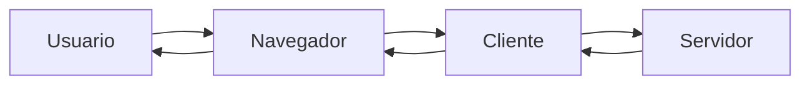
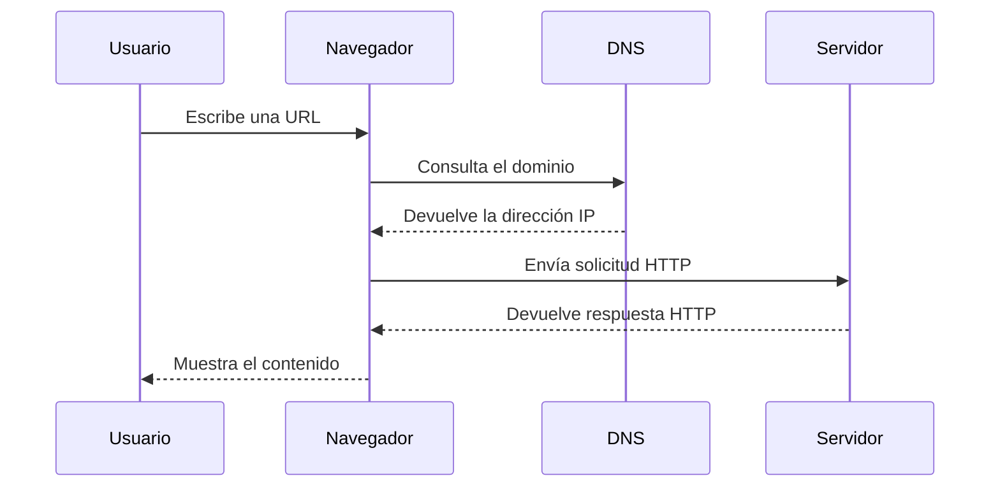
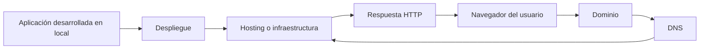
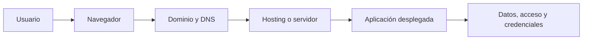

# Clase 01 - Semana 01 - El Origen y la Estructura: ¿Cómo funciona Internet?

- Unidad 01: Fundamentos y la Web Estática
- Fecha: Lunes 16 de marzo de 2026
- Duración: 3 horas (10:00 - 13:00)
- Modalidad: Presencial en Laboratorio PC
- Docente: Diego Obando

---

# Objetivos de la Clase

## Objetivo General

Al terminar esta clase, el estudiante podrá explicar, con sus propias palabras, cómo funciona Internet a nivel general y cómo se relacionan conceptos como cliente, servidor, HTTP, DNS, hosting, despliegue y seguridad básica dentro de una aplicación web.

## Objetivos Específicos

Al finalizar la sesión, el estudiante será capaz de:

1. Distinguir Internet de la Web y reconocer los actores principales que intervienen en una interacción web.
2. Describir el recorrido básico de una solicitud desde el navegador hasta el servidor, utilizando vocabulario técnico inicial de forma correcta.
3. Diferenciar dominio, hosting y despliegue, comprendiendo su rol en la publicación de un sitio o aplicación.
4. Identificar prácticas mínimas de seguridad al navegar, desarrollar y publicar aplicaciones en la web.

## Competencias Transversales

- Pensamiento sistémico: comprender la web como un conjunto de componentes que trabajan de manera coordinada.
- Comunicación técnica: explicar procesos digitales con claridad, orden y terminología básica adecuada.
- Criterio profesional inicial: reconocer por qué estos fundamentos siguen siendo relevantes incluso en una época de desarrollo asistido por agentes de IA.

---

# BLOQUE 1: La Web No Es Magia

- Duración: 35 minutos
- Objetivo del bloque: construir un mapa mental inicial de cómo funciona Internet y distinguir los actores principales que participan cuando una persona accede a una página web.
- Modalidad: expositiva y conversada

## Desarrollo

### 1.1 Pregunta de apertura: ¿qué pasa cuando escribimos una URL?

Cuando escribes una dirección como `www.aiep.cl` o `www.youtube.com` en el navegador y presionas Enter, ocurre mucho más que simplemente "abrir una página".

Detrás de esa acción existe una cadena de procesos y componentes que trabajan de forma coordinada para que puedas ver contenido, enviar información o interactuar con una aplicación.

La idea central de este bloque es entender que:

- abrir una página web no es "entrar a Internet";
- detrás de esa acción hay varios componentes que se coordinan;
- durante el módulo vamos a aprender a entender y construir sistemas que dependen de esa coordinación.

### 1.2 Internet no es lo mismo que la Web

Aunque en la vida diaria muchas veces se usan como si fueran lo mismo, **Internet** y **la Web** no significan exactamente lo mismo:

- **Internet** es la infraestructura global de redes conectadas.
- **La Web** es uno de los servicios que funciona sobre Internet.
- También existen otros servicios sobre Internet, como correo, mensajería, videollamadas o transferencia de archivos.

Una forma simple de entender esta diferencia es la siguiente:

- Internet es como la red de carreteras.
- La Web es uno de los tipos de vehículos que circula por esas carreteras.

Lo importante aquí es dejar de usar ambos conceptos como sinónimos. La Web forma parte de Internet, pero no agota todo lo que Internet permite hacer.

### 1.3 Actores principales de una interacción web

En una interacción web básica participan varios actores que aparecerán constantemente en el resto del módulo:

- **Usuario:** quien necesita acceder a un recurso o realizar una acción.
- **Navegador:** la herramienta que interpreta y muestra la información.
- **Cliente:** el lado que realiza la solicitud.
- **Servidor:** el equipo o servicio que responde a la solicitud.
- **Sitio o aplicación web:** el producto que finalmente consume el usuario.

Se puede sintetizar con este diagrama:



Una idea importante en este punto es la siguiente:

> El navegador no "contiene Internet"; el navegador actúa como intermediario entre el usuario y servicios remotos.

### 1.4 Arquitectura cliente-servidor como base del curso

La arquitectura cliente-servidor será una de las bases conceptuales del curso.

- El **cliente** pide algo.
- El **servidor** recibe la solicitud, procesa y responde.
- La aplicación web existe gracias a esa conversación constante.

Una vez que identificamos **quiénes participan**, la siguiente pregunta aparece de manera natural:

> "¿Cómo se comunican esos actores?"

Ese puente nos llevará en el siguiente bloque a revisar HTTP, DNS y el recorrido técnico de una solicitud web.

### Preguntas guía

- ¿Qué diferencia hay entre Internet y la Web?
- ¿Quién hace la solicitud en una arquitectura cliente-servidor?
- ¿Por qué decimos que abrir una página no es un acto mágico, sino un proceso?

### Cierre del bloque

- Idea clave: la Web funciona gracias a la interacción coordinada entre usuario, navegador, cliente y servidor.
- Puente: en el siguiente bloque veremos cómo ocurre esa comunicación en la práctica y qué papel cumplen HTTP y DNS en ese recorrido.

---

# BLOQUE 2: Cómo se Comunican los Actores

- Duración: 35 minutos
- Objetivo del bloque: comprender cómo viaja una solicitud web desde el navegador hasta un servidor, identificando el rol de HTTP y DNS en ese proceso.
- Modalidad: expositiva y conversada

## Desarrollo

### 2.1 La comunicación en la Web: solicitud y respuesta

Una vez que identificamos a los actores principales de una interacción web, aparece una pregunta fundamental:

> ¿Cómo se comunican realmente el cliente y el servidor?

La respuesta general es que se comunican mediante **solicitudes** y **respuestas**.

Cuando una persona escribe una URL, hace clic en un enlace o envía un formulario, el navegador actúa como cliente y envía una solicitud a un servidor. Ese servidor recibe la petición, la interpreta, busca o genera la información necesaria y devuelve una respuesta.

Esta lógica se repite una y otra vez en la Web moderna:

- cuando abrimos una página;
- cuando iniciamos sesión;
- cuando cargamos una imagen;
- cuando enviamos un mensaje;
- cuando consultamos datos desde una aplicación.

Por eso, entender la lógica **request / response** no es un detalle técnico aislado: es una de las bases más importantes para comprender cómo funcionan las aplicaciones web.

### 2.2 HTTP: el protocolo que organiza la conversación

La Web no funciona con mensajes improvisados. Para que cliente y servidor puedan entenderse, necesitan reglas compartidas. Ahí aparece **HTTP**.

**HTTP** significa **HyperText Transfer Protocol** y es el protocolo que organiza gran parte de la comunicación en la Web.

En términos simples, HTTP define:

- cómo el cliente pide un recurso;
- cómo el servidor responde;
- qué tipo de información se envía;
- y en qué formato se describe esa interacción.

Una forma inicial de pensarlo es esta:

- el cliente dice: "necesito este recurso";
- el servidor responde: "aquí está", "no existe", o "no tienes permiso".

En una interacción muy básica, la conversación se puede representar así:

```text
Cliente  -> GET /index.html
Servidor -> 200 OK + contenido HTML
```

No es necesario memorizar todavía todos los métodos o códigos de estado, pero sí conviene reconocer algunas ideas iniciales:

- **GET** suele usarse para solicitar información.
- **POST** suele usarse para enviar datos.
- **200** indica que la solicitud fue procesada correctamente.
- **404** indica que el recurso no fue encontrado.

Lo importante en esta etapa es comprender que HTTP no es "Internet", sino una de las reglas que hacen posible la Web.

### 2.3 DNS: cómo la red sabe a dónde ir

Ahora bien, aunque el navegador sepa que debe enviar una solicitud, todavía queda una pregunta importante:

> ¿Cómo sabe la red a qué servidor tiene que llegar?

Aquí entra en juego **DNS**, que significa **Domain Name System**.

Los seres humanos usamos nombres fáciles de recordar, como `www.aiep.cl`, `www.google.com` o `www.youtube.com`. Sin embargo, las máquinas se identifican en la red mediante direcciones numéricas llamadas **direcciones IP**.

El trabajo de DNS consiste en traducir un nombre legible por personas en una dirección que la red pueda utilizar.

Una analogía útil es pensar en DNS como una agenda o directorio:

- tú recuerdas el nombre del contacto;
- el sistema busca el número asociado;
- recién ahí puede establecerse la comunicación.

Gracias a DNS no necesitamos memorizar direcciones numéricas para cada sitio o aplicación que usamos.

En este punto también conviene evitar una confusión frecuente:

- DNS no "crea" Internet;
- DNS no "es" una página web;
- DNS es un sistema que ayuda a localizar el destino correcto dentro de la red.

### 2.4 El recorrido completo de una solicitud web

Si reunimos todo lo anterior, podemos describir un recorrido inicial de una solicitud web de la siguiente forma:

1. El usuario escribe una URL en el navegador.
2. El navegador identifica el dominio que debe resolver.
3. DNS traduce ese nombre a una dirección IP.
4. El cliente envía una solicitud HTTP al servidor correspondiente.
5. El servidor procesa la solicitud y genera una respuesta.
6. El navegador recibe la respuesta y representa el contenido para el usuario.

Este flujo se puede visualizar así:



Este diagrama es útil porque muestra que la experiencia de "abrir una página" en realidad contiene varias etapas que suelen ocurrir en pocos segundos o incluso en fracciones de segundo.

Además, permite entender por qué una página puede fallar por distintas razones:

- el dominio no se resuelve correctamente;
- el servidor no responde;
- el recurso solicitado no existe;
- la red está interrumpida;
- o la respuesta llega, pero con errores.

Comprender este recorrido es importante no solo para programar, sino también para analizar errores, diagnosticar problemas y comunicarse con mayor precisión en contextos técnicos.

### Preguntas guía

- ¿Qué función cumple HTTP dentro de la Web?
- ¿Por qué necesitamos DNS si ya existen los servidores?
- ¿Qué diferencia hay entre una URL, un dominio y una dirección IP?
- ¿En qué parte del recorrido se produce la respuesta que luego vemos en pantalla?

### Cierre del bloque

- Idea clave: la comunicación web ocurre mediante solicitudes y respuestas organizadas por HTTP, mientras DNS permite localizar el servidor correcto.
- Puente: en el siguiente bloque profundizaremos en dominio, hosting y despliegue para entender dónde vive realmente una aplicación web y qué significa publicarla en Internet.

---

# BLOQUE 3: Dónde Vive una Aplicación Web

- Duración: 35 minutos
- Objetivo del bloque: diferenciar con claridad los conceptos de dominio, hosting y despliegue, entendiendo cómo se relacionan entre sí cuando una aplicación pasa desde el computador del desarrollador a Internet.
- Modalidad: expositiva y conversada

## Desarrollo

### 3.1 Tener una aplicación no es lo mismo que tenerla publicada

Una aplicación puede existir y funcionar correctamente en el computador de quien la desarrolla, pero eso no significa que ya esté disponible para otras personas.

Esta distinción es importante porque, en el trabajo real, una parte del desarrollo ocurre en un entorno local y otra parte ocurre en infraestructura conectada a Internet.

Por ejemplo:

- un estudiante puede crear una página en su propio equipo;
- puede abrirla en el navegador y comprobar que funciona;
- pero si nadie más puede acceder a ella desde otro computador, todavía no está realmente publicada en la Web.

Aquí aparece una idea clave:

> Desarrollar una aplicación y publicarla son procesos relacionados, pero no son exactamente lo mismo.

Para que una aplicación pueda ser utilizada por otras personas, normalmente intervienen al menos estas piezas:

- un **dominio**, para identificarla con un nombre legible;
- un **hosting** o infraestructura, para alojar sus archivos o servicios;
- un **despliegue**, para mover una versión de la aplicación a ese entorno publicado;
- y, como vimos en el bloque anterior, **DNS** y **HTTP**, para que la comunicación pueda ocurrir.

Este bloque se centra justamente en esa transición: pasar de "mi aplicación funciona en mi máquina" a "mi aplicación está disponible en Internet".

### 3.2 Dominio: el nombre con el que encontramos un sitio o aplicación

Un **dominio** es el nombre que permite identificar un sitio o aplicación en la red de una manera más fácil de recordar que una dirección IP.

Ejemplos de dominios son:

- `aiep.cl`
- `google.com`
- `github.com`

El dominio cumple una función de identificación y acceso. En lugar de pedir a las personas que memoricen una secuencia numérica compleja, se utiliza un nombre reconocible.

En este punto conviene distinguir varios conceptos que suelen confundirse:

| Concepto | Ejemplo | Función principal |
| --- | --- | --- |
| Dominio | `example.com` | Nombre principal del sitio o servicio |
| Subdominio | `campus.example.com` | Sección o servicio dentro del dominio principal |
| URL | `https://campus.example.com/cursos` | Dirección completa de un recurso |
| Dirección IP | `192.0.2.10` | Identificador numérico del destino en la red |

Esta distinción ayuda a evitar errores frecuentes. Por ejemplo:

- decir que "la URL y el dominio son lo mismo" no es correcto;
- decir que "el dominio es el servidor" tampoco es correcto;
- decir que "comprar un dominio equivale a tener un sitio funcionando" también es incorrecto.

Un dominio, por sí solo, no contiene la aplicación. Más bien actúa como una puerta de entrada con nombre legible para los usuarios.

Una analogía útil es la siguiente:

- el dominio se parece a la dirección o al nombre público de un local;
- el hosting se parece al espacio físico o infraestructura donde ese local realmente existe;
- el despliegue se parece al proceso de instalar, organizar y dejar operativo ese local para atender público.

Por eso, tener un dominio registrado puede ser un paso importante, pero no basta para que una aplicación esté realmente en funcionamiento.

### 3.3 Hosting: el lugar donde vive la aplicación

El **hosting** es el servicio o la infraestructura donde se alojan los archivos, recursos o procesos que permiten que una aplicación esté disponible en Internet.

Dependiendo del tipo de proyecto, ese hosting puede contener:

- archivos HTML, CSS y JavaScript;
- imágenes, videos o documentos;
- un servidor de aplicaciones;
- una base de datos;
- variables de entorno y configuraciones;
- certificados de seguridad;
- procesos que se mantienen ejecutándose para responder solicitudes.

En términos simples, si el dominio es el nombre con el que encontramos un sitio, el hosting es el lugar donde ese sitio realmente está corriendo o almacenado.

También es importante evitar otra confusión común:

- **hosting** no significa solamente "subir archivos por FTP", como era frecuente en modelos más antiguos;
- hoy el hosting puede involucrar plataformas modernas, servicios cloud, contenedores, despliegues automáticos y múltiples componentes conectados entre sí.

En una visión inicial, podemos distinguir al menos dos escenarios habituales:

#### Hosting de sitios estáticos

Se usa cuando el proyecto consiste principalmente en archivos que el navegador puede interpretar directamente, como:

- HTML;
- CSS;
- JavaScript del lado del cliente;
- imágenes y recursos estáticos.

En este caso, el servidor entrega archivos ya preparados al navegador.

#### Hosting de aplicaciones dinámicas

Se usa cuando además de entregar archivos, el sistema debe ejecutar lógica en el servidor, por ejemplo:

- autenticar usuarios;
- consultar o modificar una base de datos;
- consumir APIs;
- generar respuestas distintas según cada solicitud;
- integrarse con servicios externos o agentes.

Aquí ya no basta con "guardar archivos"; se necesita infraestructura capaz de ejecutar procesos y manejar lógica de aplicación.

Por eso, cuando hablamos de hosting en 2026, conviene pensarlo como un concepto más amplio: no solo un espacio de almacenamiento, sino un entorno técnico donde una aplicación puede existir, responder y mantenerse disponible.

### 3.4 Despliegue: publicar una versión utilizable

El **despliegue** es el proceso mediante el cual una versión de una aplicación se instala, actualiza o publica en un entorno accesible para otras personas.

Dicho de otro modo:

- desarrollar es construir o modificar la aplicación;
- desplegar es llevar esa versión a un entorno donde pueda ser usada.

Este concepto también suele simplificarse demasiado. Muchas veces se piensa que desplegar es solamente "subir archivos", pero en realidad puede implicar varias tareas:

- compilar o preparar una versión del proyecto;
- mover archivos al servidor o plataforma;
- instalar dependencias;
- configurar variables de entorno;
- conectar servicios externos;
- activar el dominio correcto;
- comprobar que la aplicación quedó disponible y estable.

En contextos modernos, el despliegue puede realizarse de forma manual o automática. En muchos equipos, una actualización del repositorio puede activar una cadena de pasos que termina publicando una nueva versión sin intervención manual directa.

En este módulo no necesitamos dominar todavía todas esas herramientas, pero sí comprender el principio general:

> Una aplicación no llega sola a Internet. Existe un proceso técnico que la publica, la conecta y la deja disponible para recibir tráfico real.

También conviene introducir una diferencia básica entre entornos:

- **desarrollo local:** donde programamos y probamos inicialmente;
- **staging** o prueba: donde se valida una versión antes de publicarla completamente;
- **producción:** donde acceden los usuarios reales.

Aunque no todos los proyectos usan exactamente la misma estructura, esta separación ayuda a trabajar con más orden y a disminuir errores.

### 3.5 Cómo se conectan dominio, DNS, hosting y despliegue

Si reunimos lo que hemos visto hasta ahora, el proceso general se puede resumir así:

1. Un equipo desarrolla una aplicación en local.
2. Luego despliega una versión en una infraestructura accesible desde Internet.
3. Esa infraestructura corresponde al hosting o entorno donde la aplicación queda alojada.
4. El dominio se configura para que las personas puedan acceder usando un nombre fácil de recordar.
5. DNS resuelve ese nombre hacia el destino correcto.
6. El navegador realiza la solicitud HTTP y la aplicación responde.

Este flujo puede representarse de la siguiente manera:



Este esquema permite comprender algo fundamental: una aplicación publicada en la Web no depende de una sola pieza, sino de la coordinación entre varias capas.

Si una de esas capas falla, el usuario puede experimentar problemas distintos:

- si el dominio no está bien configurado, la aplicación puede no encontrarse;
- si DNS no resuelve correctamente, el tráfico no llega al destino esperado;
- si el hosting presenta fallas, el sitio puede quedar caído;
- si el despliegue salió mal, la nueva versión puede quedar incompleta o inestable.

Por eso, en desarrollo web profesional, no basta con "saber programar". También es necesario entender el camino que sigue una aplicación hasta llegar a producción.

### 3.6 Caso simple: publicar un portafolio personal

Imaginemos el caso de una estudiante que crea un portafolio web con HTML, CSS y JavaScript.

Para que otras personas puedan verlo, tendría que resolver al menos estas preguntas:

- ¿dónde se alojarán los archivos del proyecto?
- ¿qué nombre tendrá el sitio?
- ¿cómo se conectará ese nombre con el lugar donde está publicado?
- ¿qué pasos se deben repetir cada vez que haya cambios?

Una respuesta posible sería esta:

1. Desarrolla su portafolio en su computador.
2. Publica los archivos en una plataforma de hosting.
3. Asocia un dominio como `miportafolio.dev`.
4. Configura DNS para que ese dominio apunte al hosting.
5. Verifica que al ingresar al dominio el navegador cargue el sitio correcto.
6. Cada vez que actualiza el proyecto, vuelve a desplegar una nueva versión.

Este ejemplo es simple, pero contiene la lógica general de muchísimos proyectos reales. La escala cambia, las herramientas cambian y la complejidad aumenta, pero la relación entre nombre, infraestructura y publicación sigue siendo esencial.

### Preguntas guía

- ¿Por qué una aplicación puede funcionar en local y aun así no estar publicada?
- ¿Qué diferencia hay entre un dominio y una URL completa?
- ¿Por qué no basta con comprar un dominio para tener una aplicación funcionando?
- ¿Qué papel cumple el hosting dentro de la publicación de un proyecto?
- ¿Qué significa desplegar una aplicación y por qué no debería reducirse a la idea de "subir archivos"?
- ¿Qué problema podría ocurrir si una aplicación está bien desarrollada, pero el dominio o DNS están mal configurados?

### Cierre del bloque

- Idea clave: dominio, hosting y despliegue no son sinónimos; son piezas distintas que hacen posible que una aplicación exista públicamente en Internet.
- Puente: en el siguiente bloque abordaremos seguridad básica para entender cómo proteger esa aplicación, cómo navegar y publicar con más criterio, y por qué no todo lo que funciona debería ponerse en línea sin precauciones.

---

# BLOQUE 4: Seguridad Básica y Criterio al Publicar

- Duración: 35 minutos
- Objetivo del bloque: reconocer prácticas mínimas de seguridad al navegar, desarrollar y publicar aplicaciones web, comprendiendo que la seguridad no es un agregado opcional, sino una condición básica de trabajo profesional.
- Modalidad: expositiva, conversada y de análisis de casos

## Desarrollo

### 4.1 La seguridad no aparece al final: acompaña todo el proceso

Cuando una aplicación pasa desde un entorno local a Internet, cambia completamente su nivel de exposición.

Mientras un proyecto vive solo en el computador del desarrollador, sus riesgos están relativamente acotados. Sin embargo, cuando ese proyecto se publica, entra en contacto con usuarios reales, tráfico real, errores reales y también con intentos de acceso no deseado.

Por eso, en desarrollo web, la seguridad no debería entenderse como un “parche” que se agrega al final, una vez que todo ya está construido. Más bien, debería pensarse como un criterio transversal que acompaña cada decisión técnica.

Esto significa que la seguridad se relaciona con preguntas como estas:

- ¿qué datos maneja la aplicación?
- ¿quién puede acceder a ciertas funciones?
- ¿cómo se protegen las credenciales?
- ¿qué ocurre si alguien usa mal un formulario o intenta entrar donde no corresponde?
- ¿qué tan confiable es el entorno donde se publicó el proyecto?

Una idea importante en este punto es la siguiente:

> Publicar una aplicación significa hacerla visible y utilizable, pero también hacerla vulnerable si no se toman precauciones básicas.

La seguridad, entonces, no se opone al desarrollo: forma parte del desarrollo.

### 4.2 HTTP, HTTPS y confianza mínima al navegar

En el bloque 2 vimos que HTTP organiza gran parte de la comunicación entre cliente y servidor. Ahora conviene agregar una distinción esencial: no es lo mismo **HTTP** que **HTTPS**.

- **HTTP** permite intercambiar información entre cliente y servidor.
- **HTTPS** agrega una capa de protección para que esa comunicación viaje cifrada y sea más difícil de interceptar o manipular.

En términos simples, cuando una aplicación utiliza HTTPS:

- la información viaja con mayor protección;
- el navegador puede verificar mejor la identidad del sitio;
- y disminuye el riesgo de exposición de datos sensibles durante la comunicación.

Aquí también conviene evitar simplificaciones excesivas.

Ver un candado en el navegador no significa que un sitio sea “perfecto” o “totalmente seguro”. Lo que indica, de manera general, es que la conexión tiene una capa de protección y que existe un certificado asociado al sitio.

Eso ya es importante, porque ayuda a:

- proteger contraseñas;
- reducir riesgos al enviar formularios;
- evitar ciertos tipos de interceptación de tráfico;
- y construir una experiencia mínima de confianza para el usuario.

Cuando una aplicación no usa HTTPS, aparecen señales de alerta:

- el navegador puede marcar el sitio como no seguro;
- los usuarios pueden desconfiar;
- y la información intercambiada queda más expuesta.

Por eso, incluso en proyectos pequeños o académicos, conviene instalar desde temprano esta regla mental:

> Si una aplicación va a circular por Internet, la seguridad de la conexión importa.

### 4.3 Credenciales, autenticación y secretos: lo que no debería quedar expuesto

Uno de los errores más frecuentes en proyectos iniciales es tratar con demasiada liviandad los datos de acceso.

En desarrollo web, no toda la información tiene el mismo nivel de sensibilidad. No es lo mismo publicar una imagen o una hoja de estilos que exponer:

- una contraseña;
- una clave de API;
- un token;
- una cadena de conexión a base de datos;
- o credenciales de administración.

Por eso es importante distinguir al menos tres ideas:

- **credenciales:** datos que permiten identificarse o acceder;
- **autenticación:** proceso mediante el cual un sistema verifica quién eres;
- **autorización:** decisión sobre lo que puedes o no puedes hacer una vez autenticado.

Aunque más adelante veremos estos conceptos con mayor profundidad, desde ya conviene instalar una práctica mínima:

- no compartir contraseñas por canales inseguros;
- no dejar claves visibles en capturas, presentaciones o repositorios públicos;
- no subir secretos incrustados en el código si el proyecto será publicado;
- y no asumir que “nadie lo va a ver” solo porque el proyecto es pequeño.

Ese tipo de descuidos es más común de lo que parece, especialmente cuando alguien está aprendiendo y prioriza que “funcione rápido”. Sin embargo, desde una mirada profesional, un proyecto que expone secretos deja de ser confiable aunque técnicamente funcione.

### 4.4 Riesgos comunes al publicar proyectos iniciales

Cuando una persona publica su primera aplicación, suele concentrarse en que el dominio responda, que la interfaz cargue y que los botones funcionen. Eso es comprensible, pero no basta.

Existen riesgos básicos que conviene aprender a detectar desde el inicio:

| Situación | Riesgo | Práctica mínima recomendable |
| --- | --- | --- |
| Sitio sin HTTPS | Exposición de información y pérdida de confianza | Usar conexión segura y revisar el certificado |
| Contraseñas débiles o repetidas | Acceso no autorizado | Usar contraseñas robustas y distintas |
| Claves visibles en el código o repositorio | Compromiso de servicios externos o datos | Guardar secretos fuera del código público |
| Rutas de prueba o paneles expuestos | Acceso a funciones no destinadas a usuarios finales | Revisar qué queda realmente publicado |
| Permisos mal configurados | Exposición accidental de archivos o recursos | Verificar la configuración antes de publicar |

Este cuadro no agota todos los problemas posibles, pero sirve para formar un criterio inicial. La seguridad web es un campo mucho más amplio, pero incluso una primera aproximación ayuda a evitar errores muy costosos.

### 4.5 Higiene técnica básica para estudiantes y proyectos pequeños

En esta etapa del módulo no se espera que resolvamos problemas avanzados de ciberseguridad, pero sí que incorporemos hábitos mínimos de trabajo responsable.

Entre las prácticas básicas más importantes se encuentran las siguientes:

- usar HTTPS siempre que el proyecto esté disponible en Internet;
- emplear contraseñas seguras y, cuando sea posible, autenticación multifactor;
- no reutilizar la misma contraseña en todos los servicios;
- evitar publicar credenciales, tokens o claves de acceso;
- revisar qué archivos y configuraciones se están subiendo realmente;
- mantener orden entre desarrollo local, pruebas y producción;
- y desconfiar de la idea “es solo un proyecto pequeño, así que no importa”.

Estas medidas no eliminan todos los riesgos, pero sí reducen errores evitables y mejoran el estándar profesional del trabajo.

En otras palabras, una buena práctica inicial no consiste en “paranoia técnica”, sino en desarrollar criterio.

### 4.6 Seguridad como parte del recorrido completo de una aplicación web

Si conectamos este bloque con todo lo visto durante la clase, podemos observar que la seguridad atraviesa varias capas del proceso:

1. El usuario accede desde un navegador.
2. El dominio y DNS orientan la solicitud hacia el destino correcto.
3. La aplicación se encuentra publicada en un hosting o infraestructura.
4. El servidor responde a través de HTTP o HTTPS.
5. La aplicación procesa datos, formularios, sesiones y credenciales.
6. Cada una de esas capas puede convertirse en un punto de cuidado o en un punto de riesgo.

Este recorrido se puede resumir así:



Lo importante aquí no es memorizar todavía una lista extensa de amenazas, sino comprender que la seguridad no está concentrada en un solo lugar. No depende solo del servidor, ni solo del navegador, ni solo de la contraseña. Surge de cómo se relacionan todas las piezas.

### 4.7 Caso breve: publicar rápido no es publicar bien

Imaginemos la siguiente situación:

Una estudiante termina su primer proyecto web, lo publica con entusiasmo y comparte el enlace. La aplicación carga correctamente, pero ocurren varios problemas:

- el sitio usa una configuración incompleta;
- existe una ruta de prueba que no fue eliminada;
- una clave de acceso quedó visible en el proyecto;
- y la publicación se hizo sin revisar qué archivos estaban realmente expuestos.

Desde fuera, puede parecer que “el proyecto funciona”. Sin embargo, desde una mirada técnica más seria, ese proyecto fue publicado sin suficiente criterio.

La lección aquí es importante:

- que una aplicación funcione no significa automáticamente que esté bien publicada;
- que una interfaz se vea bien no garantiza que el sistema sea confiable;
- y que una persona logre desplegar algo no implica todavía que comprenda los riesgos mínimos de ponerlo en Internet.

Por eso, aprender desarrollo web no consiste solo en producir pantallas. También implica aprender a decidir qué publicar, cómo publicarlo y bajo qué condiciones mínimas de seguridad.

### Preguntas guía

- ¿Por qué la seguridad no debería pensarse como un tema “para después”?
- ¿Qué diferencia práctica existe entre HTTP y HTTPS?
- ¿Qué tipo de información nunca debería quedar expuesta en un repositorio o proyecto público?
- ¿Qué riesgos pueden aparecer aunque una aplicación “funcione bien” a simple vista?
- ¿Por qué publicar rápido no siempre significa publicar correctamente?
- ¿Qué hábitos mínimos deberían incorporarse desde el inicio al trabajar con aplicaciones web?

### Cierre del bloque

- Idea clave: una aplicación web no solo debe funcionar; también debe publicarse con un nivel mínimo de seguridad, criterio y responsabilidad técnica.
- Cierre de la clase: con este bloque completamos una visión inicial de cómo funciona la web, cómo se comunican sus actores, dónde vive una aplicación y por qué publicarla exige algo más que hacer que cargue en un navegador.
