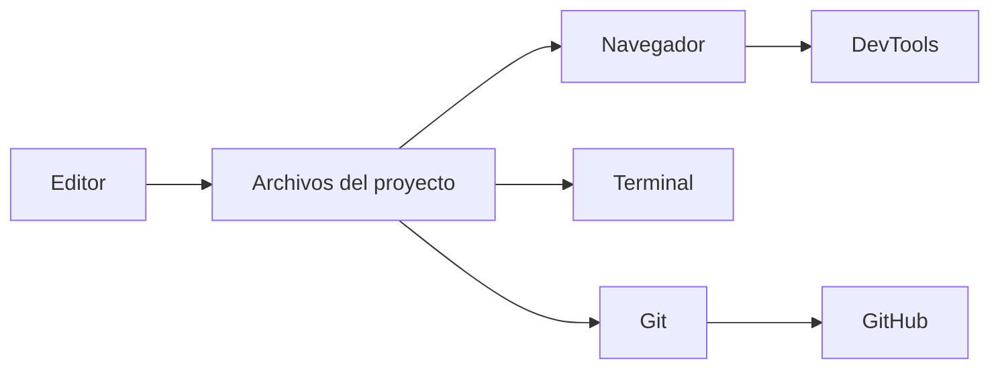
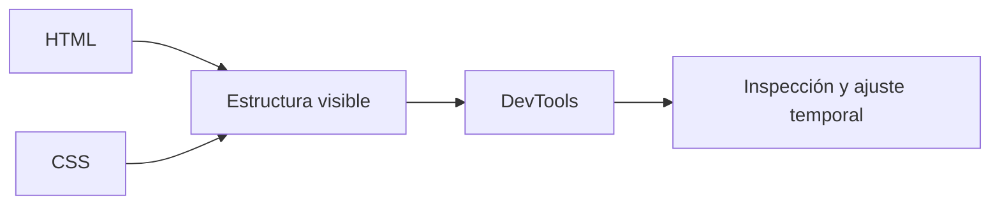
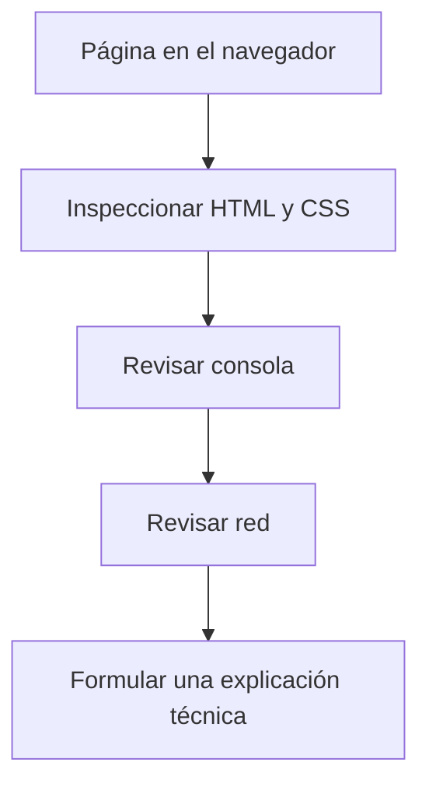
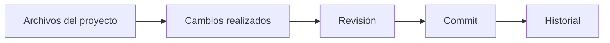
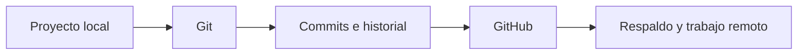
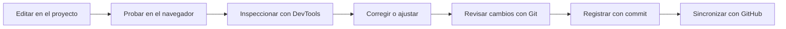

# Clase 02 - Semana 01 - Las Herramientas del Taller: Git, DevTools y Flujo de Trabajo Moderno

- Unidad 01: Fundamentos y la Web Estática
- Fecha: Martes 17 de marzo de 2026
- Duración: 3 horas (10:00 - 13:00)
- Modalidad: Presencial en Laboratorio PC
- Docente: Diego Obando

---

# Objetivos de la Clase

## Objetivo General

Al terminar esta clase, el estudiante podrá reconocer y utilizar, a nivel inicial, las herramientas básicas del entorno moderno de desarrollo web, comprendiendo cómo se articulan el editor, el navegador, DevTools, Git, GitHub y el flujo de trabajo técnico de una aplicación.

## Objetivos Específicos

Al finalizar la sesión, el estudiante será capaz de:

1. Identificar las principales herramientas de trabajo utilizadas en desarrollo web actual y explicar la función general de cada una.
2. Utilizar DevTools para inspeccionar una página web y observar elementos clave del HTML, CSS, consola y red.
3. Distinguir Git de GitHub, comprendiendo conceptos básicos como repositorio, historial, commit y remoto.
4. Describir un flujo inicial de trabajo que incluya edición, prueba, inspección, corrección y registro de cambios.

## Competencias Transversales

- Organización del trabajo técnico: comprender que desarrollar aplicaciones web exige orden en herramientas, archivos, versiones y procesos.
- Observación y análisis: usar el navegador y sus herramientas como medio para leer, interpretar y diagnosticar el comportamiento de una página.
- Criterio profesional inicial: reconocer que un desarrollo serio no depende solo de escribir código, sino también de mantener un flujo de trabajo claro, verificable y trazable.

---

# BLOQUE 1: El Entorno del Desarrollador Web

- Duración: 35 minutos
- Objetivo del bloque: reconocer las herramientas básicas que componen el entorno moderno de desarrollo web y comprender por qué trabajar en la web implica algo más que escribir código en un editor.
- Modalidad: expositiva y conversada

## Desarrollo

### 1.1 Desarrollar web no es solo escribir código

Cuando una persona empieza a aprender programación web, suele imaginar que el trabajo consiste principalmente en abrir un editor y escribir código. Esa idea contiene una parte de verdad, pero resulta insuficiente para describir cómo se trabaja realmente.

En la práctica, desarrollar una aplicación web implica interactuar con varias herramientas al mismo tiempo. El código se escribe en un editor, pero también:

- se organiza dentro de carpetas y archivos;
- se prueba en un navegador;
- se inspecciona con herramientas de análisis;
- se ejecutan comandos en terminal;
- y se registran cambios para no perder el historial del trabajo.

Esto significa que el desarrollo web no depende solo de un lenguaje, sino también de un **entorno de trabajo**. Ese entorno reúne herramientas distintas que cumplen funciones específicas y que, usadas de manera coordinada, permiten construir, probar, corregir y mantener una aplicación.

Una idea importante en este punto es la siguiente:

> Un desarrollador no trabaja únicamente con código; trabaja también con archivos, herramientas, versiones, errores, pruebas y decisiones técnicas.

### 1.2 Herramientas básicas del entorno moderno

Aunque más adelante profundizaremos en varias de estas herramientas, conviene instalar desde ya un mapa general de las piezas que suelen aparecer en una jornada normal de desarrollo web.

Entre las más importantes se encuentran:

- **editor de código:** espacio principal donde se crean y modifican archivos;
- **sistema de archivos:** estructura de carpetas, nombres, rutas y organización del proyecto;
- **terminal o línea de comandos:** medio para ejecutar tareas, instalar dependencias, levantar proyectos o automatizar pasos;
- **navegador:** lugar donde se visualiza y prueba el resultado del trabajo;
- **DevTools:** conjunto de herramientas del navegador para inspeccionar HTML, CSS, consola, red y comportamiento de la aplicación;
- **Git y GitHub:** herramientas para registrar cambios, mantener historial y respaldar el trabajo.

No todas estas piezas se usan con la misma profundidad en una sola clase, pero sí es importante entender que pertenecen al mismo ecosistema de trabajo.

### 1.3 Cómo se conectan estas herramientas en una tarea real

Si pensamos en una situación simple, como modificar el título de una página web, podemos observar que varias herramientas entran en juego al mismo tiempo.

Un flujo básico podría verse así:

1. Se abre el proyecto en el editor.
2. Se ubica el archivo que debe modificarse.
3. Se guarda el cambio realizado.
4. Se revisa el resultado en el navegador.
5. Si algo no se ve como se esperaba, se inspecciona con DevTools.
6. Cuando el cambio ya es correcto, se registra en el historial del proyecto con Git.

Ese recorrido muestra algo fundamental: las herramientas no están aisladas entre sí. Forman parte de un mismo proceso.

Se puede sintetizar de la siguiente manera:



Lo importante aquí no es memorizar todavía todos los comandos o posibilidades de cada herramienta. Lo importante es comprender que el trabajo web moderno se apoya en una cadena de acciones coordinadas.

### 1.4 El entorno también expresa criterio técnico

En esta etapa inicial del módulo conviene desarrollar una mirada más amplia sobre lo que significa “trabajar bien”.

Trabajar bien no consiste solo en lograr que algo funcione una vez. También implica:

- mantener el proyecto ordenado;
- saber dónde está cada archivo;
- probar cambios de manera sistemática;
- revisar errores en vez de adivinar;
- y conservar un registro del proceso realizado.

Por eso, aprender herramientas no debería entenderse como una tarea secundaria o decorativa. En realidad, forma parte del desarrollo profesional de cualquier persona que construye software para la web.

Este bloque nos deja instaladas dos ideas base:

- el entorno de desarrollo es parte del trabajo técnico;
- y cada herramienta resuelve un problema específico dentro del proceso.

Con ese mapa inicial, en el siguiente bloque podremos mirar con más detalle una de las herramientas más importantes del curso: el navegador como laboratorio de observación e inspección.

### Preguntas guía

- ¿Por qué desarrollar web no se reduce a escribir código en un editor?
- ¿Qué diferencia existe entre el editor, el navegador y la terminal dentro del flujo de trabajo?
- ¿Por qué conviene pensar las herramientas como un sistema y no como piezas aisladas?

### Cierre del bloque

- Idea clave: el desarrollo web moderno se apoya en un entorno de trabajo compuesto por varias herramientas que cumplen funciones distintas y complementarias.
- Puente: en el siguiente bloque abordaremos el navegador y DevTools para entender cómo observar una página desde una mirada más técnica.

---

# BLOQUE 2: El Navegador como Laboratorio

- Duración: 35 minutos
- Objetivo del bloque: comprender que el navegador no solo sirve para visualizar una página, sino también para inspeccionar su estructura, observar su comportamiento y diagnosticar errores iniciales mediante DevTools.
- Modalidad: expositiva, demostrativa y conversada

## Desarrollo

### 2.1 El navegador no es solo una ventana para mirar páginas

En la experiencia cotidiana, muchas personas entienden el navegador como una herramienta de consumo: un programa para abrir sitios, leer contenido, ver videos, completar formularios o acceder a plataformas. Esa descripción no es falsa, pero resulta insuficiente cuando miramos el navegador desde el trabajo de desarrollo.

Para un desarrollador web, el navegador cumple al menos dos funciones al mismo tiempo:

- **mostrar** el resultado visible de una aplicación;
- y **permitir analizar** qué está ocurriendo detrás de esa interfaz.

Esto es importante porque una página puede “verse bien” y aun así tener problemas técnicos. También puede ocurrir lo contrario: una página puede verse mal, pero el problema no estar en el HTML, sino en una regla CSS, en un error de JavaScript o en una solicitud que nunca llegó correctamente.

Por eso, en desarrollo web, el navegador no debería entenderse solo como pantalla final. También debe entenderse como un espacio de observación técnica.

Una idea central de este bloque es la siguiente:

> El navegador no solo muestra una página; también permite leerla, inspeccionarla y diagnosticarla.

### 2.2 DevTools: observar la estructura y los estilos

La mayoría de los navegadores modernos incorpora un conjunto de herramientas para desarrolladores conocido como **DevTools**. Estas herramientas permiten mirar una página desde una perspectiva mucho más técnica que la que tiene un usuario común.

Entre las primeras funciones que conviene reconocer se encuentran las siguientes:

- inspeccionar el **HTML** que compone la estructura de la página;
- revisar el **CSS** que afecta su apariencia;
- identificar clases, etiquetas, atributos y estilos aplicados;
- modificar temporalmente elementos para observar qué cambia;
- y detectar si ciertas reglas están siendo aplicadas, sobrescritas o ignoradas.

Este punto es especialmente importante en clases iniciales, porque muchos errores de frontend no se entienden solo “mirando la página”. Se entienden cuando el estudiante logra responder preguntas como estas:

- ¿qué elemento estoy viendo realmente?
- ¿qué clase o selector le está dando ese estilo?
- ¿qué propiedad está afectando su tamaño, color o posición?
- ¿la regla que escribí sí se está aplicando o quedó anulada por otra?

En ese sentido, DevTools no reemplaza el conocimiento de HTML y CSS, pero sí lo vuelve visible. Permite conectar el código con el resultado que aparece en pantalla.

Una forma simple de pensar esta relación es la siguiente:



El diagrama ayuda a instalar una idea importante: la interfaz visible no aparece “porque sí”. Es el resultado de una estructura y un conjunto de estilos que pueden ser observados y analizados.

### 2.3 Consola y red: mirar lo que no siempre se ve

El trabajo técnico con el navegador no termina en inspeccionar etiquetas o estilos. Existen otras dos áreas iniciales de DevTools que son especialmente útiles para aprender a diagnosticar problemas: la **consola** y la pestaña de **red**.

La **consola** permite observar mensajes que entrega el navegador durante la ejecución de una página o aplicación. Allí pueden aparecer:

- errores de JavaScript;
- advertencias;
- mensajes de depuración;
- resultados de instrucciones simples;
- o señales de que algo esperado no se ejecutó correctamente.

La pestaña de **red**, en cambio, permite mirar las solicitudes que una página realiza al cargarse o al interactuar con el usuario. Eso incluye, por ejemplo:

- documentos HTML;
- hojas de estilo CSS;
- archivos JavaScript;
- imágenes;
- fuentes;
- y solicitudes a APIs u otros servicios.

Esto resulta muy valioso porque una falla visible puede tener causas distintas:

- el archivo no se cargó;
- la ruta no existe;
- el servidor respondió con error;
- un script se interrumpió;
- o la página recibió menos recursos de los que necesitaba.

Aquí aparece una diferencia importante entre usar el navegador como usuario y usarlo como desarrollador:

- el usuario ve que “algo no funciona”;
- el desarrollador busca **evidencias** para entender por qué no funciona.

Aprender esa diferencia es un paso importante en la formación técnica, porque enseña a dejar de adivinar y empezar a observar.

### 2.4 Leer una página como desarrollador

Una misma página puede ser observada de dos maneras muy distintas.

Desde la mirada de un usuario, lo importante suele ser:

- si carga o no carga;
- si el contenido se entiende;
- si un botón responde;
- si el diseño se ve bien;
- si una tarea puede completarse.

Desde la mirada de un desarrollador, en cambio, aparecen otras preguntas:

- ¿qué estructura HTML sostiene esta interfaz?
- ¿qué estilos están afectando este elemento?
- ¿qué archivos se cargaron realmente?
- ¿hay errores en consola?
- ¿qué solicitudes se hicieron y cómo respondieron?

Esta segunda mirada no reemplaza la primera, pero la complementa y la profundiza. De hecho, en el trabajo real ambas conviven: primero vemos un comportamiento visible y luego tratamos de explicarlo con datos técnicos.

Un recorrido inicial de observación podría representarse así:

1. Se abre una página en el navegador.
2. Se identifica el problema o comportamiento que queremos entender.
3. Se inspecciona el elemento afectado en DevTools.
4. Se observan estilos, estructura o atributos relacionados.
5. Se revisa la consola si existen errores o advertencias.
6. Se revisa la red si sospechamos una falla de carga o comunicación.

Ese flujo puede sintetizarse de esta manera:



Lo importante aquí no es dominar todavía todas las pestañas o posibilidades de DevTools. Lo importante es instalar el hábito de observar antes de modificar y de diagnosticar antes de adivinar.

### Preguntas guía

- ¿Por qué el navegador no debería entenderse solo como una herramienta para “ver páginas”?
- ¿Qué diferencia existe entre mirar una página como usuario y leerla como desarrollador?
- ¿Qué tipo de problemas puede ayudarnos a detectar la consola?
- ¿Por qué la pestaña de red puede ser útil incluso cuando el problema parece visual?
- ¿Qué valor tiene modificar temporalmente un estilo en DevTools antes de tocar el archivo original?

### Cierre del bloque

- Idea clave: el navegador es una herramienta de visualización, pero también de observación técnica; DevTools permite inspeccionar estructura, estilos, errores y solicitudes.
- Puente: en el siguiente bloque abordaremos Git y GitHub para comprender cómo se registra el trabajo, cómo se conserva su historial y por qué versionar también forma parte del oficio.

---

# BLOQUE 3: Git y GitHub sin Humo

- Duración: 35 minutos
- Objetivo del bloque: comprender qué problema resuelven Git y GitHub, distinguiendo sus funciones y reconociendo conceptos iniciales de versionado como repositorio, commit, historial y remoto.
- Modalidad: expositiva, demostrativa y conversada

## Desarrollo

### 3.1 Por qué no basta con “guardar archivos”

Cuando una persona recién comienza a programar, suele pensar que guardar archivos con distintos nombres ya es una forma suficiente de conservar el trabajo. Por eso aparecen prácticas como estas:

- `index-final.html`
- `index-final-ahora-si.html`
- `index-bueno-2.html`
- `pagina-antes-del-cambio.html`

Aunque esas estrategias parecen resolver un problema inmediato, en realidad generan desorden y vuelven más difícil responder preguntas básicas sobre el proyecto:

- ¿qué cambió exactamente?
- ¿cuál era la versión correcta?
- ¿en qué momento se rompió algo?
- ¿cómo vuelvo a un estado anterior sin perder lo reciente?
- ¿qué parte del trabajo pertenece a cada avance?

Aquí aparece el problema real que resuelve el versionado: no se trata solo de guardar, sino de **registrar cambios con sentido**.

En desarrollo web, esto es importante porque el trabajo rara vez ocurre en una sola edición perfecta. Lo normal es avanzar, probar, corregir, retroceder, comparar versiones y retomar decisiones previas.

Una idea central en este punto es la siguiente:

> Guardar un archivo conserva un estado; versionar permite entender la historia del trabajo.

### 3.2 Git: el sistema que registra la historia del proyecto

**Git** es un sistema de control de versiones. Su función principal es registrar cambios a lo largo del tiempo para que el proyecto tenga memoria técnica.

En términos iniciales, Git permite:

- saber qué archivos cambiaron;
- registrar un conjunto de cambios como una unidad significativa;
- revisar el historial del proyecto;
- comparar versiones;
- y volver a estados anteriores cuando sea necesario.

Esto cambia la relación con el trabajo técnico, porque el proyecto deja de ser solo una carpeta de archivos y pasa a tener una **historia trazable**.

Algunos conceptos básicos que conviene instalar desde ya son los siguientes:

- **repositorio:** directorio del proyecto acompañado de su historial de cambios;
- **commit:** registro intencional de un conjunto de cambios;
- **historial:** secuencia de commits que muestra cómo evolucionó el proyecto;
- **versión:** estado del proyecto en un momento determinado.

En esta etapa no hace falta memorizar un repertorio enorme de comandos, pero sí conviene reconocer un mínimo operativo. La lógica general puede pensarse así:

1. Se modifica el proyecto.
2. Se revisa qué cambió.
3. Se agrupan cambios que tienen sentido juntos.
4. Se registran en el historial.

Ese proceso puede representarse así:



Lo valioso aquí es que Git no “adivina” qué era importante. El desarrollador decide qué cambio registrar y cómo nombrarlo. Por eso Git también exige criterio.

Desde un punto de vista técnico, los primeros comandos que conviene reconocer son estos:

```bash
git init
git status
git add .
git commit -m "mensaje"
git log --oneline
```

Una lectura inicial de cada uno puede ser la siguiente:

- `git init`: crea un repositorio Git en el proyecto actual;
- `git status`: muestra qué archivos cambiaron y en qué estado se encuentran;
- `git add .`: prepara cambios para el siguiente commit;
- `git commit -m "mensaje"`: registra en el historial un conjunto de cambios con una descripción;
- `git log --oneline`: permite revisar el historial de commits de manera resumida.

No se trata todavía de ejecutar comandos por repetición mecánica. La idea es que el estudiante entienda la secuencia entre cambiar, revisar, preparar y registrar.

### 3.3 GitHub: respaldo, colaboración y remoto

Una confusión muy frecuente en cursos iniciales es pensar que Git y GitHub son lo mismo. No lo son.

La diferencia más simple de formular es esta:

- **Git** es el sistema que registra cambios;
- **GitHub** es una plataforma que permite alojar repositorios, compartirlos y conectarlos con un entorno remoto.

En otras palabras:

- con Git podemos trabajar localmente en nuestro computador;
- con GitHub podemos respaldar ese trabajo, compartirlo y mantener una copia remota del repositorio.

Esto introduce otro concepto importante:

- **remoto:** versión del repositorio alojada fuera del computador local, normalmente en una plataforma como GitHub.

GitHub no reemplaza a Git. Más bien amplía sus posibilidades, porque hace posible:

- respaldo externo del proyecto;
- trabajo compartido;
- visibilidad del historial;
- publicación de repositorios;
- y conexión con flujos más amplios de desarrollo.

Una forma simple de visualizar esta relación es la siguiente:



Esa distinción es importante porque evita frases imprecisas como:

- “subí mi Git”;
- “GitHub me guardó el archivo”;
- o “tengo GitHub instalado”.

Hablar con precisión también forma parte del oficio técnico.

Cuando aparece un remoto, también conviene reconocer algunos comandos frecuentes:

```bash
git clone <url>
git push
git pull
```

- `git clone <url>`: descarga una copia local de un repositorio remoto;
- `git push`: envía commits locales hacia el remoto;
- `git pull`: trae cambios del remoto al entorno local.

Estos comandos todavía pueden mostrarse a nivel inicial, pero es importante que el estudiante ya relacione cada uno con la idea de trabajo local y trabajo remoto.

### 3.4 Versionar también expresa orden y criterio

En este punto conviene conectar Git con lo que ya vimos en los bloques anteriores.

Si el navegador y DevTools nos ayudan a observar una página y diagnosticar problemas, Git nos ayuda a **conservar el proceso** por el cual esa página fue cambiando.

Eso significa que versionar no es una tarea decorativa ni una costumbre “para empresas grandes”. También en proyectos pequeños o académicos tiene valor porque permite:

- no depender solo de la memoria;
- separar avances distintos;
- registrar cambios con intención;
- volver atrás si algo sale mal;
- y trabajar con una lógica más profesional.

Por eso, aprender Git no consiste únicamente en ejecutar comandos. También implica desarrollar hábitos como estos:

- cambiar con intención, no al azar;
- revisar antes de registrar;
- escribir mensajes que tengan sentido;
- y mantener una historia que pueda leerse después.

Aquí también conviene nombrar, aunque sea de forma inicial, dos maneras comunes de organizar ramas y cambios en un proyecto:

#### Trunk-based development

Es una estrategia de trabajo más simple y ligera. En términos generales:

- existe una rama principal estable, normalmente `main`;
- los cambios se integran con frecuencia;
- las ramas de trabajo suelen ser cortas y vivir poco tiempo;
- y se evita acumular grandes diferencias durante muchos días.

Para una primera aproximación formativa, este modelo suele ser más fácil de entender porque obliga a pensar en cambios pequeños, integración frecuente y trabajo ordenado.

#### Gitflow

Es un modelo más estructurado y más pesado, históricamente muy difundido. Suele trabajar con ramas como:

- `main`
- `develop`
- `feature/*`
- `release/*`
- `hotfix/*`

Gitflow puede ser útil para explicar que existen flujos más formales de organización, pero en clases iniciales no conviene convertirlo todavía en el centro del trabajo, porque puede agregar complejidad antes de que el estudiante entienda bien la lógica básica del versionado.

Si quisiéramos expresarlo de forma simple, podríamos decir esto:

- **trunk-based** prioriza integración frecuente y menor complejidad;
- **Gitflow** prioriza más separación de ramas y más estructura operativa.

Para este módulo, lo más razonable es instalar primero una lógica simple, cercana a `main + cambios pequeños + commits con sentido + sincronización frecuente`, y dejar Gitflow como referencia para comprender que existen estrategias más formales según el contexto del equipo.

Una idea clave para cerrar este bloque es la siguiente:

> Git no solo guarda trabajo: organiza la memoria técnica del proyecto.

Con eso ya queda instalada la relación entre las herramientas vistas hasta ahora:

- el editor permite modificar;
- el navegador y DevTools permiten observar;
- y Git permite conservar la historia de lo que fue ocurriendo.

### Preguntas guía

- ¿Qué problema resuelve Git que no se resuelve solo guardando archivos?
- ¿Qué función cumplen `git status`, `git add` y `git commit` dentro de la secuencia básica de trabajo?
- ¿Por qué un commit no debería entenderse como “guardar por guardar”?
- ¿Qué diferencia existe entre trabajar con Git localmente y usar GitHub como plataforma remota?
- ¿Qué diferencia general existe entre un flujo simple cercano a trunk-based y un modelo más estructurado como Gitflow?
- ¿Por qué versionar también puede entenderse como una práctica de orden y criterio?
- ¿Qué valor tiene poder revisar la historia de un proyecto cuando algo falla?

### Cierre del bloque

- Idea clave: Git registra y organiza la historia del proyecto, mientras GitHub permite respaldarla y conectarla con un entorno remoto.
- Puente: en el siguiente bloque integraremos editor, navegador, DevTools, Git y GitHub en un flujo de trabajo moderno para entender cómo se articulan dentro de una rutina real de desarrollo.

---

# BLOQUE 4: Flujo de Trabajo Moderno

- Duración: 35 minutos
- Objetivo del bloque: integrar editor, navegador, DevTools, Git y GitHub en una secuencia de trabajo coherente, comprendiendo que desarrollar no consiste en usar herramientas aisladas, sino en sostener un ciclo técnico de cambio, prueba, observación, corrección y registro.
- Modalidad: expositiva, demostrativa y de integración

## Desarrollo

### 4.1 De herramientas sueltas a rutina técnica

Hasta aquí ya hemos visto varias piezas importantes del entorno de trabajo:

- el **editor** permite escribir y modificar archivos;
- el **navegador** permite ejecutar y visualizar el resultado;
- **DevTools** permite inspeccionar y diagnosticar;
- **Git** permite registrar cambios con sentido;
- y **GitHub** permite respaldar y sincronizar el trabajo en un entorno remoto.

Sin embargo, en el trabajo real estas herramientas no aparecen una por una ni se usan de forma aislada. Lo que existe es una **rutina técnica** en la que cada herramienta cumple una función dentro de un mismo ciclo.

Ese punto es importante porque muchas veces, al comenzar, el estudiante imagina el desarrollo como una actividad lineal:

1. abrir el editor;
2. escribir código;
3. guardar;
4. terminar.

Pero en la práctica, la mayor parte del trabajo ocurre en una secuencia más rica:

- se modifica algo;
- se prueba;
- se observa el resultado;
- se detecta un error o una mejora;
- se corrige;
- se vuelve a probar;
- y luego se registra el cambio si efectivamente tiene sentido conservarlo.

Desarrollar no consiste solamente en “producir código”. También implica leer el comportamiento del sistema, tomar decisiones pequeñas, conservar avances y construir una historia comprensible del proyecto.

Por eso, cuando hablamos de un flujo de trabajo moderno, no nos referimos a una moda ni a una lista de herramientas nuevas. Nos referimos a una forma más ordenada y verificable de trabajar.

### 4.2 Un ciclo simple de desarrollo web

Una manera inicial de representar este flujo es la siguiente:



Este diagrama no debe entenderse como una receta rígida, pero sí como una secuencia básica bastante frecuente.

#### Paso 1: editar

El trabajo suele comenzar en el editor. Allí se modifica un archivo HTML, CSS, JavaScript o cualquier otro recurso del proyecto.

En esta etapa conviene trabajar con cambios acotados. Cambiar demasiadas cosas a la vez vuelve más difícil responder preguntas como:

- ¿qué produjo realmente el nuevo comportamiento?
- ¿qué parte del cambio introdujo el error?
- ¿qué conviene registrar después en Git?

#### Paso 2: probar

Después de modificar, el paso natural es volver al navegador y comprobar qué ocurrió.

Aquí el foco no es solo mirar si “se ve bonito”, sino verificar:

- si el cambio apareció donde debía aparecer;
- si rompió otra parte de la interfaz;
- si el comportamiento esperado realmente se cumplió;
- y si el sistema sigue respondiendo como antes o mejor.

#### Paso 3: observar e inspeccionar

Si algo no quedó como se esperaba, DevTools entra en juego.

Con DevTools podemos:

- inspeccionar el elemento afectado;
- revisar reglas CSS;
- detectar errores en consola;
- mirar solicitudes en red;
- o probar ajustes temporales antes de volver al archivo original.

Este momento es clave porque impide trabajar a ciegas. En lugar de adivinar, el desarrollador reúne evidencias.

#### Paso 4: corregir y repetir

Una vez observada la causa probable, se vuelve al editor para corregir. Después se prueba otra vez. En este punto aparece una idea importante:

> El desarrollo web ocurre en ciclos cortos de prueba y ajuste, no en una sola escritura continua.

Ese ciclo corto mejora la calidad del trabajo porque permite detectar errores antes, comprender mejor el efecto de cada cambio y mantener control sobre el proceso.

#### Paso 5: registrar

Cuando el cambio ya fue probado y tiene sentido conservarlo, Git entra de nuevo como parte del flujo:

```bash
git status
git add .
git commit -m "corrige estilo del botón principal"
git push
```

Aquí lo importante no es solo memorizar el orden de los comandos. Lo importante es entender la lógica:

- primero se revisa;
- luego se prepara;
- después se registra;
- y finalmente se sincroniza si corresponde.

Registrar demasiado temprano puede guardar trabajo incompleto. Registrar demasiado tarde puede mezclar cambios distintos y volver confuso el historial.

### 4.3 Caso breve: una corrección real de interfaz

Imaginemos un caso simple: en una página del proyecto, el botón principal quedó con poco contraste y además tiene un margen extraño.

Un recorrido razonable podría ser este:

1. En el navegador se detecta que el botón no se ve bien.
2. Con DevTools se inspecciona el elemento y se revisan sus clases y reglas activas.
3. Se observa que el color de fondo y el espaciado provienen de una regla CSS específica.
4. En DevTools se hace una prueba temporal para confirmar qué ajuste mejora el resultado.
5. Se vuelve al editor para modificar el archivo CSS real.
6. Se recarga la página y se comprueba si el problema quedó resuelto.
7. Se ejecuta `git status` para revisar qué archivos cambiaron.
8. Se registra el cambio con un commit claro.
9. Si el repositorio está conectado a GitHub, se sincroniza con `git push`.

En este ejemplo puede verse con claridad que ninguna herramienta “hace todo”. Cada una cumple una parte del recorrido:

- el navegador muestra el problema;
- DevTools ayuda a explicarlo;
- el editor permite corregirlo;
- y Git conserva la solución dentro de la historia del proyecto.

Ese es justamente el sentido del flujo de trabajo moderno: coordinar herramientas distintas para sostener una práctica técnica más precisa.

### 4.4 Criterios de un flujo sano

No basta con tener herramientas instaladas. También conviene desarrollar ciertos hábitos para que el flujo de trabajo sea realmente útil.

Algunos criterios mínimos son estos:

- hacer cambios pequeños y comprensibles;
- probar con frecuencia, no solo al final;
- observar antes de corregir;
- registrar cambios con mensajes claros;
- sincronizar de manera regular con el remoto;
- y no mezclar en un mismo commit cambios que pertenecen a problemas distintos.

También conviene entender que un flujo moderno no significa automatizar sin pensar. Incluso si hoy existen agentes o asistentes que pueden sugerir código, explicar un error o ayudar a redactar un mensaje de commit, la validación sigue siendo responsabilidad del desarrollador.

Eso significa que el criterio técnico no desaparece. Más bien se vuelve más importante, porque ahora también hay que decidir:

- qué aceptar de una sugerencia externa;
- qué comprobar en el navegador;
- qué revisar con DevTools;
- y qué vale la pena registrar como parte de la historia del proyecto.

Dicho de otra forma:

> Un flujo de trabajo sano no elimina el juicio técnico; lo organiza y lo hace visible.

### Preguntas guía

- ¿Por qué un flujo de trabajo moderno no debería entenderse como una lista de herramientas sueltas?
- ¿Qué problema aparece cuando se hacen demasiados cambios antes de probar?
- ¿Por qué DevTools ocupa un lugar intermedio entre editar y registrar?
- ¿Qué valor tiene trabajar en ciclos cortos de cambio, prueba y corrección?
- ¿Por qué conviene registrar solo cambios que ya fueron probados y tienen sentido?
- ¿Qué riesgos aparecen cuando un commit mezcla correcciones distintas en un mismo registro?
- ¿Cómo cambia este flujo si se usa un agente de IA como apoyo y no como reemplazo del criterio técnico?

### Cierre del bloque

- Idea clave: un flujo de trabajo moderno integra edición, prueba, observación, corrección, versionado y sincronización en ciclos cortos y comprensibles.
- Proyección: con esta base ya queda preparado el paso hacia la próxima clase, donde abordaremos HTML semántico, estructura de documentos, formularios y accesibilidad inicial como material real sobre el cual aplicar este flujo.


