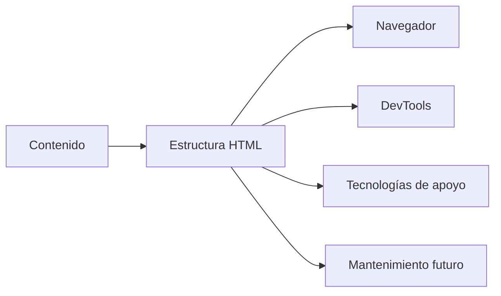
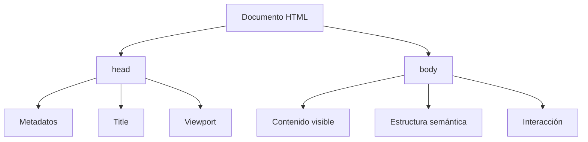
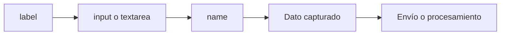
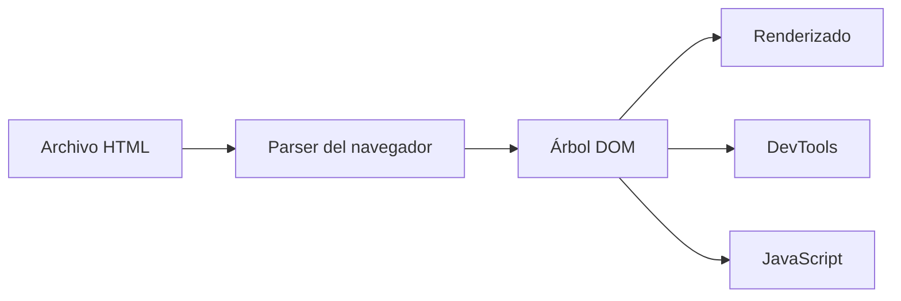
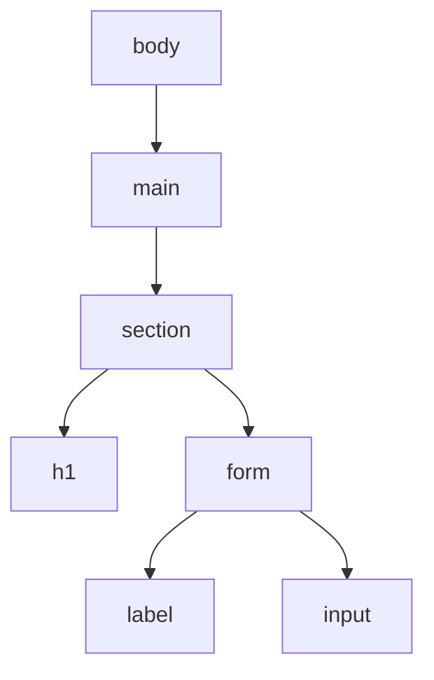

# Clase 03 - Semana 01 - La Página Bien Construida: HTML Semántico, Formularios y Accesibilidad Inicial

- Unidad 01: Fundamentos y la Web Estática
- Fecha: Miércoles 18 de marzo de 2026
- Duración: 3 horas (10:00 - 13:00)
- Modalidad: Presencial en Laboratorio PC
- Docente: Diego Obando

---

# Objetivos de la Clase

## Objetivo General

Al terminar esta clase, el estudiante podrá reconocer y construir la estructura básica de una página web usando HTML semántico, comprendiendo la función de los principales elementos del documento, el propósito de los formularios, los principios iniciales de accesibilidad y la relación entre el HTML y el DOM.

## Objetivos Específicos

Al finalizar la sesión, el estudiante será capaz de:

1. Identificar la estructura esencial de un documento HTML y explicar la función general de elementos semánticos frecuentes como `header`, `main`, `section`, `article`, `nav`, `aside` y `footer`.
2. Diferenciar una página “solo armada con etiquetas” de una página estructurada con criterio semántico, comprendiendo por qué eso importa para lectura, mantenimiento y accesibilidad.
3. Reconocer la función de formularios, etiquetas `label`, campos de entrada, botones y atributos básicos asociados a captura de datos en la web.
4. Explicar, a nivel inicial, qué relación existe entre el HTML visible en el archivo y el DOM que interpreta el navegador, entendiendo que la estructura del documento también condiciona inspección, interacción y accesibilidad.

## Competencias Transversales

- Organización estructural del contenido: comprender que una interfaz web no se construye solo para verse bien, sino también para tener una estructura legible y mantenible.
- Criterio de accesibilidad inicial: reconocer que nombrar, agrupar y etiquetar correctamente los elementos mejora la experiencia de uso y la comprensión del sistema.
- Lectura técnica de interfaces: comenzar a mirar una página como una estructura interpretable por navegador, herramientas de desarrollo y usuarios.

---

# BLOQUE 1: ¿Por Qué la Estructura de una Página Importa?

- Duración: 35 minutos
- Objetivo del bloque: comprender que HTML no consiste solo en “poner contenido en pantalla”, sino en dar estructura y sentido al contenido para que la página sea interpretable por personas, navegadores y herramientas.
- Modalidad: expositiva y conversada

## Desarrollo

### 1.1 Una página web no es solo contenido visible

Cuando una persona mira una página web por primera vez, suele fijarse en lo visible: títulos, imágenes, botones, colores, menús o formularios. Sin embargo, una página no se compone únicamente de lo que “se ve”. También tiene una **estructura interna** que organiza ese contenido y le da sentido.

Esa estructura importa porque una página web no es leída solo por una persona. También debe ser interpretada por:

- el navegador, que necesita entender cómo construir la interfaz;
- las herramientas de desarrollo, que permiten inspeccionar y diagnosticar;
- tecnologías de apoyo, como lectores de pantalla;
- y el propio desarrollador, que más adelante tendrá que mantener, corregir o ampliar el documento.

Eso significa que una página bien construida no depende solo de que “se vea ordenada”. También depende de que el contenido esté **organizado con criterio**.

Una idea central para este bloque es la siguiente:

> Una página web no debería pensarse solo como una superficie visual, sino como una estructura de información con significado.

### 1.2 HTML como lenguaje de estructura y significado

HTML es el lenguaje base con el que se construyen los documentos web. Su función principal no es decorar, sino **describir qué es cada parte del contenido**.

Por ejemplo, no es lo mismo escribir un texto cualquiera que indicar explícitamente:

- que algo es un título;
- que un conjunto de enlaces forma una navegación;
- que una parte corresponde al contenido principal;
- o que cierto bloque pertenece al pie de la página.

En ese sentido, HTML no debería usarse solo para “armar cajitas”, sino para expresar la lógica del documento. Cuando esa lógica queda bien representada, la página se vuelve más clara y más fácil de interpretar.

Podemos pensarlo así:



El diagrama muestra una idea importante: la estructura del HTML no afecta solo cómo se ve una página hoy, sino también cómo se interpreta, se revisa y se mantiene después.

### 1.3 No es lo mismo “llenar etiquetas” que estructurar una página

En etapas iniciales es común pensar que hacer HTML consiste en memorizar etiquetas y usarlas una tras otra. Ese enfoque puede permitir construir algo visible, pero no siempre produce un documento bien resuelto.

Una página puede estar “hecha en HTML” y aun así estar mal estructurada si:

- todo está resuelto con elementos genéricos sin distinguir funciones;
- no existe una jerarquía clara de títulos y secciones;
- la navegación no se reconoce como navegación;
- el contenido principal no se distingue del contenido secundario;
- o el formulario aparece como un conjunto de campos sin contexto ni etiquetas claras.

La diferencia entre una página improvisada y una página bien estructurada no siempre se nota solo por diseño. Muchas veces se nota cuando alguien intenta:

- leer el documento con orden;
- inspeccionarlo en el navegador;
- modificarlo sin romper otras partes;
- o usarlo con herramientas que dependen de una estructura más clara.

Por eso, hablar de **HTML semántico** no es un detalle académico. Es una forma de construir documentos más comprensibles.

### 1.4 La semántica mejora lectura, mantenimiento y accesibilidad

Cuando usamos elementos con significado, el documento gana calidad en varios niveles al mismo tiempo.

Primero, mejora la **lectura técnica** del archivo. Un desarrollador que abre el documento puede entender con más rapidez qué parte corresponde a encabezado, navegación, contenido principal, secciones o pie.

Segundo, mejora el **mantenimiento**. Si más adelante hay que corregir una sección, cambiar un bloque de contenido o inspeccionar un problema, una estructura clara reduce confusión.

Tercero, mejora la **accesibilidad inicial**. Aunque la accesibilidad es un tema más amplio, una parte importante comienza aquí: en cómo se organiza y se nombra el contenido. Cuando el documento tiene jerarquía y sentido, la experiencia también mejora para quienes no consumen la página del mismo modo visual que otros usuarios.

Dicho de forma simple:

- una página semántica se entiende mejor;
- se mantiene mejor;
- y ofrece una base más sana para seguir construyendo.

Ese será el punto de partida del resto de la clase. Antes de hablar de formularios o DOM, primero conviene afirmar esta idea: una página web bien hecha necesita una estructura reconocible.

### Preguntas guía

- ¿Por qué una página web no debería entenderse solo como algo visual?
- ¿Qué problema aparece cuando todo el contenido se organiza sin jerarquía clara?
- ¿Por qué HTML puede entenderse como un lenguaje de significado y no solo de formato?

### Cierre del bloque

- Idea clave: HTML no solo muestra contenido; también lo organiza y le da sentido dentro del documento.
- Puente: en el siguiente bloque entraremos a la anatomía de un documento HTML y revisaremos cómo esa estructura se expresa mediante elementos semánticos concretos.

---

# BLOQUE 2: Anatomía de un Documento HTML

- Duración: 35 minutos
- Objetivo del bloque: reconocer la estructura base de un documento HTML, diferenciar el rol de `head` y `body`, y comprender cómo los elementos semánticos organizan la interfaz con mayor claridad técnica.
- Modalidad: expositiva, análisis de código y lectura guiada

## Desarrollo

### 2.1 La estructura mínima de un documento HTML

Después de comprender por qué la estructura importa, el siguiente paso es mirar **cómo esa estructura aparece realmente en código**. Un documento HTML no comienza directamente con un título o con un párrafo. Tiene una forma base que le dice al navegador qué tipo de archivo está leyendo y cómo debe interpretarlo.

Una versión mínima y correcta de un documento HTML moderno puede verse así:

```html
<!DOCTYPE html>
<html lang="es">
  <head>
    <meta charset="UTF-8" />
    <meta name="viewport" content="width=device-width, initial-scale=1.0" />
    <title>Mi primera página semántica</title>
  </head>
  <body>
    <h1>Hola mundo</h1>
    <p>Este documento ya tiene una estructura básica válida.</p>
  </body>
</html>
```

Este fragmento ya permite introducir varias ideas técnicas importantes:

- `<!DOCTYPE html>` indica que el documento debe interpretarse como HTML5.
- `<html lang="es">` envuelve todo el documento y declara el idioma principal.
- `<head>` contiene información sobre el documento, pero no el contenido principal visible de la página.
- `<body>` contiene el contenido que se representa como parte de la interfaz.

Aunque al principio este esqueleto parezca repetitivo, en realidad funciona como una **base obligatoria de legibilidad técnica**. Cuando un documento parte bien estructurado, después resulta más fácil extenderlo sin convertirlo en una mezcla confusa de piezas sueltas.

### 2.2 `head` y `body` no cumplen la misma función

Una de las primeras distinciones importantes en HTML es entender que no todo lo que existe en el archivo cumple el mismo rol.

El bloque `<head>` no está pensado para contener el contenido principal de la página. Su función es declarar información que el navegador, el sistema o ciertas herramientas necesitan para interpretar mejor el documento. Allí suelen aparecer:

- el conjunto de caracteres;
- la configuración de visualización en dispositivos;
- el título de la página;
- enlaces a hojas de estilo;
- y metadatos diversos.

En cambio, el bloque `<body>` sí contiene la estructura que el usuario recorre: encabezados, navegación, contenido principal, secciones, formularios, botones, enlaces y otros elementos de interfaz.

Podemos representarlo así:



Este diagrama ayuda a fijar una distinción importante: el documento tiene una parte orientada a **descripción y configuración** y otra orientada a **contenido e interacción**.

### 2.3 El `body` necesita jerarquía y no una suma de etiquetas sueltas

Dentro del `body`, la pregunta ya no es solo “qué quiero mostrar”, sino “cómo organizo ese contenido para que el documento sea comprensible”.

Aquí aparecen elementos semánticos frecuentes como:

- `header`
- `nav`
- `main`
- `section`
- `article`
- `aside`
- `footer`

No todos deben usarse siempre, pero sí conviene reconocer su lógica. Una página sencilla con estructura semántica podría verse así:

```html
<body>
  <header>
    <h1>Portafolio de Ana Pérez</h1>
    <nav>
      <a href="#sobre-mi">Sobre mí</a>
      <a href="#proyectos">Proyectos</a>
      <a href="#contacto">Contacto</a>
    </nav>
  </header>

  <main>
    <section id="sobre-mi">
      <h2>Sobre mí</h2>
      <p>Desarrolladora en formación con interés en frontend y accesibilidad.</p>
    </section>

    <section id="proyectos">
      <h2>Proyectos</h2>
      <article>
        <h3>Sitio de portafolio</h3>
        <p>Proyecto estático construido con HTML y CSS.</p>
      </article>
    </section>
  </main>

  <footer>
    <p>Contacto: ana@email.com</p>
  </footer>
</body>
```

Este ejemplo ya deja ver una diferencia técnica clara con respecto a una página armada solo con `div`:

- el encabezado se reconoce como encabezado;
- la navegación se reconoce como navegación;
- el contenido principal se distingue del resto;
- las secciones tienen títulos;
- y el pie de página cumple una función distinta del contenido central.

Eso no solo mejora el “orden visual”. Mejora también la lectura del código, la inspección en el navegador y la comprensión general del documento.

### 2.4 Una anatomía clara facilita inspección, mantenimiento y evolución

Cuando un documento HTML tiene una anatomía reconocible, el trabajo técnico posterior se vuelve más razonable.

Por ejemplo, si un estudiante abre una página en DevTools y encuentra una estructura como:

- `header`
- `nav`
- `main`
- `section`
- `footer`

podrá ubicarse más rápido que si todo aparece como una cadena larga de contenedores genéricos sin jerarquía visible.

Lo mismo ocurre cuando hay que:

- agregar una nueva sección;
- corregir un bloque del contenido principal;
- cambiar la navegación;
- o conectar después JavaScript con ciertos elementos del documento.

En otras palabras, la anatomía de un documento HTML no es una formalidad. Es una forma de dejar el sistema preparado para ser:

- leído;
- inspeccionado;
- corregido;
- y extendido.

Una síntesis útil para este bloque sería esta:

> Un documento HTML bien construido parte con una base válida, diferencia claramente `head` y `body`, y organiza el contenido visible con una jerarquía semántica reconocible.

### Preguntas guía

- ¿Qué función cumple `<!DOCTYPE html>` dentro de un documento?
- ¿Por qué `head` y `body` no deberían confundirse?
- ¿Qué ventaja técnica ofrece una estructura basada en `header`, `nav`, `main`, `section` y `footer`?

### Cierre del bloque

- Idea clave: la estructura de un documento HTML se expresa en código mediante una base mínima válida y una jerarquía semántica reconocible.
- Puente: en el siguiente bloque entraremos a formularios y accesibilidad inicial, donde esa lógica estructural se vuelve todavía más importante para capturar datos e interactuar con usuarios.

---

# BLOQUE 3: Formularios y Accesibilidad Inicial

- Duración: 35 minutos
- Objetivo del bloque: comprender cómo se construye un formulario HTML básico con sentido técnico, reconociendo la función de `form`, `label`, `input`, `textarea`, `select`, `button` y algunos atributos que mejoran captura de datos, claridad y accesibilidad inicial.
- Modalidad: expositiva, análisis de código y lectura guiada

## Desarrollo

### 3.1 Un formulario no es solo una colección de campos

En la web, un formulario representa uno de los puntos más claros de interacción entre una persona y una aplicación. Allí el usuario escribe, selecciona, confirma, busca, inicia sesión, envía datos o actualiza información.

Eso significa que un formulario no debería pensarse solo como una suma de cajas para completar. En realidad, es una **estructura de captura de datos** donde importa:

- qué dato se está pidiendo;
- cómo se identifica ese dato;
- cómo se agrupan los campos;
- qué espera el sistema recibir;
- y qué tan clara resulta la interacción para distintos tipos de usuarios.

Por eso, un formulario bien hecho no depende solo de verse ordenado. También depende de que su estructura sea comprensible para:

- la persona que lo completa;
- el navegador, que interpreta tipos y validaciones iniciales;
- herramientas de desarrollo, que permiten inspeccionarlo;
- y futuras capas de lógica, que necesitarán leer esos valores en JavaScript o enviarlos al servidor.

Una idea importante para este bloque es la siguiente:

> Un formulario HTML no solo captura texto: organiza una conversación técnica entre usuario, interfaz y sistema.

### 3.2 Anatomía básica de un formulario HTML

La pieza contenedora principal es el elemento `form`. Dentro de él suelen aparecer etiquetas de texto, campos de entrada, áreas de selección y botones.

Un ejemplo inicial podría verse así:

```html
<form>
  <label for="nombre">Nombre</label>
  <input id="nombre" name="nombre" type="text" />

  <label for="correo">Correo electrónico</label>
  <input id="correo" name="correo" type="email" />

  <label for="mensaje">Mensaje</label>
  <textarea id="mensaje" name="mensaje"></textarea>

  <button type="submit">Enviar</button>
</form>
```

Este fragmento ya permite fijar varias relaciones técnicas:

- `form` agrupa la interacción completa;
- `label` nombra el campo;
- `for` conecta la etiqueta con el `id` del control;
- `name` define cómo se identificará ese dato cuando el formulario se procese;
- `type` le dice al navegador qué tipo de entrada se espera;
- `button type="submit"` indica el botón que envía el formulario.

No todos estos atributos cumplen la misma función. Una distinción inicial útil es esta:

- `id` sirve para identificar el elemento dentro del documento;
- `for` enlaza el texto de la etiqueta con el control;
- `name` identifica el dato en el envío;
- `type` orienta comportamiento y validación inicial;
- `value`, cuando exista, representa el valor asociado al control.

Podemos resumir parte del flujo así:



Este diagrama muestra que el formulario no es solo algo visual. También es una estructura donde cada parte ayuda a dar nombre, contexto y destino al dato.

### 3.3 Tipos de campos y atributos que conviene reconocer desde el inicio

Aunque HTML ofrece muchos tipos de controles, para una primera aproximación técnica conviene reconocer algunos de uso frecuente:

- `input type="text"` para texto breve;
- `input type="email"` para correos;
- `input type="password"` para contraseñas;
- `textarea` para textos más largos;
- `select` para elegir entre opciones;
- `button` para confirmar una acción;
- `input type="checkbox"` y `input type="radio"` para elecciones específicas.

Un ejemplo un poco más completo podría ser este:

```html
<form>
  <label for="usuario">Usuario</label>
  <input id="usuario" name="usuario" type="text" required />

  <label for="clave">Contraseña</label>
  <input id="clave" name="clave" type="password" required />

  <label for="rol">Rol</label>
  <select id="rol" name="rol">
    <option value="estudiante">Estudiante</option>
    <option value="docente">Docente</option>
  </select>

  <button type="submit">Ingresar</button>
</form>
```

Aquí ya aparecen atributos y decisiones que vale la pena leer técnicamente:

- `required` indica que el campo no debería enviarse vacío;
- `type="email"` permite una validación inicial distinta de `text`;
- `select` expresa que el dato viene de un conjunto de opciones;
- el texto del botón debería indicar con claridad la acción.

También conviene notar que un formulario no siempre “manda datos a internet” de inmediato. A veces primero se valida con JavaScript, otras veces se procesa localmente, y otras se envía al servidor. Pero en todos los casos el HTML debería partir bien organizado.

### 3.4 Accesibilidad inicial: etiquetar, agrupar y nombrar bien

Una parte importante de la accesibilidad comienza antes de CSS y antes de JavaScript: comienza en la forma en que se estructuran y nombran los controles.

Por ejemplo, este código se ve corto, pero es técnicamente débil:

```html
<form>
  <input type="text" placeholder="Nombre" />
  <input type="email" placeholder="Correo" />
  <button>Enviar</button>
</form>
```

¿Qué problemas aparecen aquí?

- no hay `label` visibles ni asociadas;
- el `placeholder` está reemplazando una etiqueta real;
- los campos no tienen `name`;
- el botón no declara su tipo;
- y la estructura ofrece poca claridad para inspección, mantenimiento o tecnologías de apoyo.

Una versión mejor resuelta sería esta:

```html
<form>
  <label for="nombre-contacto">Nombre</label>
  <input
    id="nombre-contacto"
    name="nombre"
    type="text"
    required
  />

  <label for="correo-contacto">Correo electrónico</label>
  <input
    id="correo-contacto"
    name="correo"
    type="email"
    required
  />

  <button type="submit">Enviar mensaje</button>
</form>
```

Esta segunda versión es mejor porque:

- cada campo tiene una etiqueta clara;
- la relación entre `label` e `input` está explícita mediante `for` e `id`;
- los datos tienen nombre técnico a través de `name`;
- el botón expresa una acción concreta;
- y la estructura se vuelve más legible para usuario, navegador y desarrollador.

Cuando hay grupos de controles relacionados, también puede ser útil pensar en elementos como `fieldset` y `legend`, porque ayudan a expresar que varios campos pertenecen a una misma unidad lógica.

Por ejemplo:

```html
<form>
  <fieldset>
    <legend>Preferencias de contacto</legend>

    <label>
      <input type="radio" name="contacto" value="correo" />
      Correo electrónico
    </label>

    <label>
      <input type="radio" name="contacto" value="telefono" />
      Teléfono
    </label>
  </fieldset>
</form>
```

Este tipo de agrupación no es un detalle estético. Expresa que esos controles forman parte de una misma decisión.

Una síntesis útil para este bloque sería esta:

> Un formulario básico gana calidad cuando cada campo está bien nombrado, bien conectado con su etiqueta y bien integrado dentro de una estructura comprensible.

### Preguntas guía

- ¿Por qué un formulario no debería construirse como una simple suma de campos sueltos?
- ¿Qué diferencia técnica existe entre `id`, `for` y `name`?
- ¿Por qué el `placeholder` no debería reemplazar una etiqueta real?
- ¿Qué gana un formulario cuando los campos se agrupan y se nombran con claridad?

### Cierre del bloque

- Idea clave: un formulario HTML bien construido no solo captura datos; también organiza esa captura con nombres, relaciones y agrupaciones que mejoran claridad y accesibilidad inicial.
- Puente: en el siguiente bloque veremos cómo el navegador toma ese HTML y lo transforma en DOM, lo que permite inspeccionarlo, recorrerlo y después manipularlo con más criterio técnico.

---

# BLOQUE 4: Del HTML al DOM

- Duración: 35 minutos
- Objetivo del bloque: comprender que el HTML no queda como texto “muerto” dentro del archivo, sino que el navegador lo interpreta como una estructura DOM que puede inspeccionarse, recorrerse y, más adelante, manipularse con herramientas y código.
- Modalidad: expositiva, inspección guiada y lectura técnica

## Desarrollo

### 4.1 El navegador no “muestra el archivo”: interpreta una estructura

Cuando se abre una página en el navegador, el archivo HTML no se representa en pantalla de forma literal. Antes de que exista una interfaz visible, el navegador **lee**, **interpreta** y **organiza** ese documento como una estructura interna.

Esa estructura se conoce como **DOM** (`Document Object Model`). El DOM puede entenderse como una representación del documento en forma de árbol, donde cada parte del HTML pasa a ser un nodo con relaciones reconocibles.

Eso significa que una etiqueta no solo “está escrita” en el archivo: también pasa a convertirse en una pieza que el navegador puede:

- ubicar;
- inspeccionar;
- relacionar con otras;
- estilizar;
- y más adelante manipular con JavaScript.

Podemos representarlo así:



El punto importante aquí es que el navegador no trabaja directamente sobre “líneas de texto”. Trabaja sobre una **estructura interpretada**.

### 4.2 Del documento escrito a nodos, relaciones y jerarquía

Una vez interpretado el documento, el navegador puede reconocer relaciones entre las distintas partes de la página.

Por ejemplo, si tenemos un HTML como este:

```html
<body>
  <main>
    <section>
      <h1>Contacto</h1>
      <form>
        <label for="correo">Correo</label>
        <input id="correo" name="correo" type="email" />
      </form>
    </section>
  </main>
</body>
```

el navegador ya no lo “ve” solo como texto. Lo interpreta como una jerarquía en la que:

- `body` contiene a `main`;
- `main` contiene a `section`;
- `section` contiene un `h1` y un `form`;
- y `form` contiene `label` e `input`.

Eso nos permite empezar a hablar en términos técnicos más concretos:

- **padre** (`parent`): el nodo que contiene a otro;
- **hijo** (`child`): el nodo contenido dentro de otro;
- **hermano** (`sibling`): nodos que comparten el mismo padre;
- **atributo**: información asociada al elemento, como `id`, `name` o `type`;
- **texto**: contenido textual dentro de un elemento.

Una forma simple de visualizarlo sería esta:



Entender esta jerarquía importa porque después muchas decisiones técnicas dependen justamente de eso:

- dónde aplicar estilos;
- cómo seleccionar un elemento;
- cómo leer una parte de la página en DevTools;
- y cómo modificar el contenido sin romper relaciones.

### 4.3 Leer el DOM en DevTools y desde consola

Una de las mejores formas de fijar esta idea es abrir DevTools y mirar la pestaña de elementos. Allí se ve con claridad que el navegador expone la página como una estructura navegable.

En esa lectura, el estudiante puede reconocer varias cosas:

- qué etiqueta contiene a cuál;
- cómo aparecen los atributos en cada nodo;
- qué parte corresponde al contenido principal;
- y cómo un formulario bien estructurado también se lee mejor en el árbol del DOM.

Además, la consola del navegador permite hacer primeras consultas simples sobre esa estructura. No se trata todavía de programar a fondo, sino de reconocer que el documento ya puede ser recorrido técnicamente.

Por ejemplo:

```js
document.querySelector("form");
document.querySelectorAll("input");
document.getElementById("correo");
```

Estas expresiones permiten introducir una idea muy importante:

- `document` representa el documento cargado;
- `querySelector()` busca el primer elemento que cumpla una condición;
- `querySelectorAll()` devuelve una colección de coincidencias;
- `getElementById()` busca un nodo por su identificador.

Aunque todavía no estemos trabajando JavaScript en profundidad, estas primeras lecturas dejan instalado algo fundamental: una estructura HTML clara facilita también una exploración clara del DOM.

### 4.4 ¿Por qué el DOM importa incluso antes de manipularlo?

A veces se piensa que el DOM solo importa cuando ya se empieza a escribir JavaScript. En realidad, importa antes.

Importa cuando se inspecciona una página para diagnosticar un problema. Importa cuando un desarrollador intenta ubicar un formulario, una sección o un botón dentro de una estructura grande. Importa cuando CSS necesita apuntar a elementos concretos. E importa cuando más adelante el código quiera escuchar eventos, leer valores o insertar contenido dinámicamente.

Por eso conviene fijar esta relación desde ya:

- **HTML** define la estructura del documento;
- **DOM** es la representación viva de esa estructura dentro del navegador;
- **DevTools** permite observar esa representación;
- y más adelante **JavaScript** podrá recorrerla y modificarla.

Podemos resumirlo así:

> Si el HTML está bien organizado, el DOM también será más legible, más fácil de inspeccionar y más razonable de manipular.

Este cierre conecta muy bien con lo visto durante toda la semana:

- el lunes se presentó la lógica general de la web;
- el martes se revisó el navegador como herramienta de trabajo;
- y hoy se ve cómo la estructura HTML termina convertida en una base técnica real para inspección, accesibilidad y trabajo futuro.

### Preguntas guía

- ¿Qué diferencia existe entre el archivo HTML guardado en disco y el DOM que interpreta el navegador?
- ¿Por qué una estructura semántica clara también facilita la lectura en DevTools?
- ¿Qué ventaja técnica tiene poder ubicar elementos con `querySelector()` o `getElementById()`?
- ¿Por qué conviene entender el DOM antes de llegar a manipularlo con JavaScript?

### Cierre del bloque

- Idea clave: el HTML no termina en el archivo; el navegador lo transforma en una estructura DOM que puede inspeccionarse, recorrerse y convertirse en base para estilos, interacción y debugging.
- Puente: esta idea prepara el terreno para las próximas semanas, donde la estructura HTML servirá como soporte para CSS, inspección técnica y, más adelante, manipulación del DOM con JavaScript.
