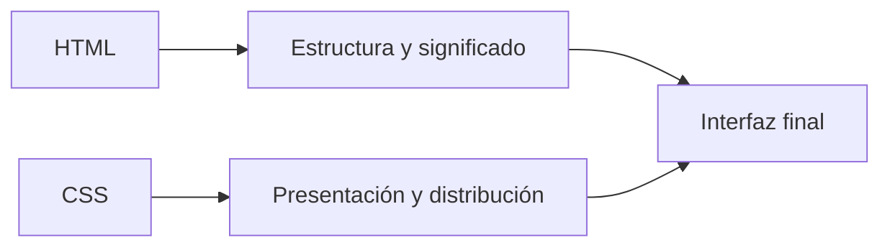
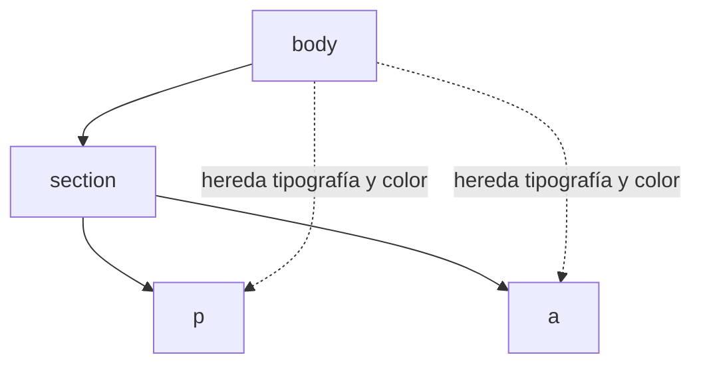
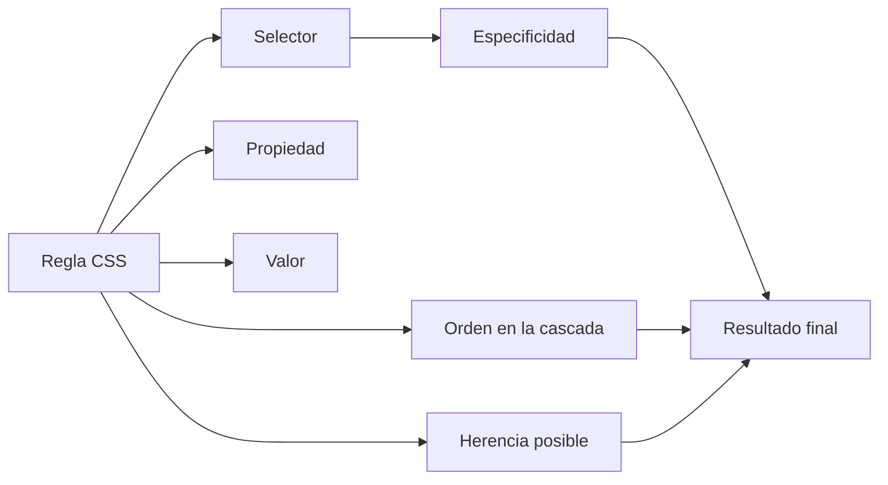
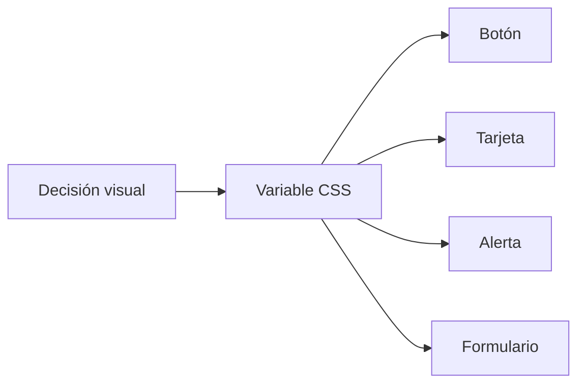
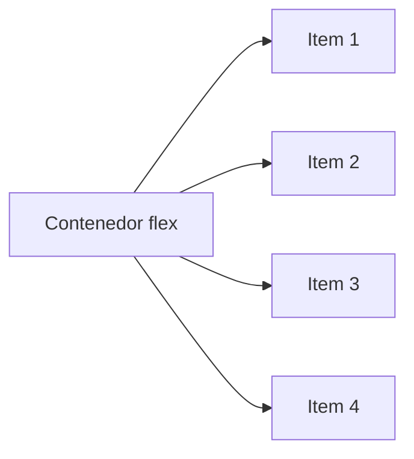
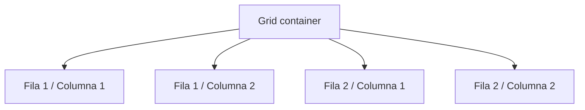

# Clase 01 - Semana 02 - CSS Moderno: Cascada, Variables, Flexbox y Grid

- Unidad 01: Fundamentos y la Web Estática
- Fecha: Lunes 23 de marzo de 2026
- Duración: 3 horas (10:00 - 13:00)
- Modalidad: Presencial en Laboratorio PC
- Docente: Diego Obando

---

# Objetivos de la Clase

## Objetivo General

Al terminar esta clase, el estudiante podrá comprender cómo CSS organiza la presentación visual de una página web, reconociendo la lógica de la cascada, la especificidad, el uso de variables y el papel de sistemas de distribución modernos como Flexbox y Grid para construir interfaces más ordenadas, mantenibles y adaptables.

## Objetivos Específicos

Al finalizar la sesión, el estudiante será capaz de:

1. Explicar qué función cumple CSS dentro de una aplicación web y por qué no debería entenderse solo como “decoración”, sino como una capa de presentación con reglas, jerarquía y criterio técnico.
2. Reconocer la lógica básica de la cascada y la especificidad, comprendiendo por qué algunas reglas se aplican y otras quedan sobreescritas dentro de una interfaz.
3. Identificar el valor de las variables CSS para mejorar consistencia, mantenimiento y reutilización de decisiones visuales dentro de un documento o sistema pequeño.
4. Diferenciar el propósito general de Flexbox y Grid, reconociendo cuándo conviene usar cada uno para resolver distribución, alineación y estructura de interfaces.

## Competencias Transversales

- Lectura técnica de estilos: comenzar a interpretar una interfaz no solo por su apariencia final, sino por las reglas que la construyen y organizan.
- Criterio de mantenibilidad visual: reconocer que una buena capa de estilos debe ser coherente, reutilizable y razonable de extender.
- Organización estructural de interfaces: comprender que la distribución visual también responde a decisiones técnicas y no solo a intuiciones estéticas.

---

# BLOQUE 1: CSS como Sistema de Reglas, no como Maquillaje

- Duración: 35 minutos
- Objetivo del bloque: comprender que CSS no consiste solo en “poner colores” o decorar una página, sino en definir reglas de presentación que organizan cómo se ve, se distribuye y se mantiene una interfaz web.
- Modalidad: expositiva, conversada y con lectura guiada de ejemplos

## Desarrollo

### 1.1 HTML estructura, CSS presenta

En la clase anterior trabajamos la idea de que HTML organiza el contenido de una página y le da significado estructural. CSS aparece ahora como la capa que se encarga de la **presentación visual** de esa estructura.

Eso quiere decir que HTML y CSS no cumplen la misma función:

- HTML dice qué es cada parte del documento;
- CSS dice cómo debería verse esa parte dentro de la interfaz.

Por ejemplo, un mismo bloque HTML puede verse de formas muy distintas sin cambiar su significado estructural. Un encabezado sigue siendo encabezado, una sección sigue siendo sección y un formulario sigue siendo formulario, aunque cambien color, tamaño, espaciado o distribución.

Esta separación importa mucho porque permite trabajar con mayor claridad técnica:

- una capa organiza contenido;
- la otra capa organiza presentación.

Cuando esa separación se respeta, la interfaz se vuelve más fácil de leer, corregir y ampliar.

Podemos resumir esta relación así:



El diagrama muestra una idea central para esta clase: la apariencia no nace “mágicamente” desde el navegador. Se construye a partir de reglas escritas sobre una estructura previa.

### 1.2 CSS no es decoración: es un lenguaje de reglas

Al principio, CSS suele percibirse como la parte “bonita” del desarrollo web. Esa idea es parcialmente cierta, pero insuficiente. CSS no es solo un conjunto de adornos; es un **lenguaje declarativo de reglas** que le indica al navegador cómo presentar ciertos elementos del documento.

Una regla CSS básica tiene tres partes:

- un **selector**, que indica a qué elemento o grupo de elementos se aplica;
- una **propiedad**, que define qué aspecto se quiere controlar;
- un **valor**, que expresa con qué criterio se quiere aplicar esa propiedad.

Por ejemplo:

```css
h1 {
  color: #102a43;
  font-size: 32px;
}
```

En este fragmento:

- `h1` es el selector;
- `color` y `font-size` son propiedades;
- `#102a43` y `32px` son valores.

Eso ya deja ver algo importante: CSS no trabaja por intuición visual directa, sino por declaraciones explícitas. Cada cambio que aparece en pantalla responde a una regla que puede leerse, rastrearse y modificarse.

Por eso conviene mirar CSS menos como “estilo” en sentido informal y más como **sistema de instrucciones visuales**.

### 1.3 Una interfaz bien resuelta depende de decisiones consistentes

Si CSS fuera solo maquillaje, daría lo mismo repetir colores, tamaños o espacios de manera improvisada. Pero en la práctica eso produce interfaces confusas y difíciles de mantener.

Una interfaz web gana calidad cuando existen decisiones consistentes sobre:

- colores;
- tamaños de texto;
- espaciados;
- alineaciones;
- jerarquía visual;
- distribución de bloques;
- estados de interacción.

Eso significa que CSS también participa en la mantenibilidad de un proyecto. Un archivo de estilos mal organizado no solo genera una interfaz menos clara; también vuelve más difícil:

- agregar nuevos componentes;
- corregir errores visuales;
- mantener coherencia entre distintas pantallas;
- y entender por qué cierta parte de la interfaz se comporta de una manera específica.

Una primera lectura profesional de CSS debería partir desde aquí:

> No se trata solo de hacer que algo “se vea bien”, sino de construir una presentación coherente y sostenible.

### 1.4 CSS también expresa criterio técnico

Cuando una persona revisa una interfaz, puede detectar rápido si existe orden o improvisación. Pero ese orden no nace solo del “buen gusto”. También nace de decisiones técnicas bien tomadas.

Por ejemplo, hay diferencias importantes entre:

- repetir el mismo color muchas veces de forma manual;
- o centralizarlo como decisión visual;
- alinear elementos “a ojo”;
- o usar un sistema claro de distribución;
- ajustar espacios caso a caso;
- o pensar la interfaz como un conjunto de reglas consistentes.

En ese sentido, CSS también expresa criterio técnico porque obliga a tomar decisiones sobre:

- alcance de reglas;
- reutilización;
- coherencia entre componentes;
- y control de complejidad visual.

Esto será especialmente importante en los siguientes bloques, donde entraremos a cascada, especificidad, variables y sistemas modernos de layout. Pero antes de llegar ahí, conviene instalar esta idea:

CSS no es una capa superficial separada del razonamiento técnico. También forma parte del diseño de un sistema web.

### Preguntas guía

- ¿Por qué HTML y CSS no deberían entenderse como si cumplieran la misma función?
- ¿Qué cambia cuando CSS se mira como un lenguaje de reglas y no solo como decoración?
- ¿Por qué una interfaz visualmente coherente también refleja criterio técnico?

### Cierre del bloque

- Idea clave: CSS no maquilla una página terminada, sino que define reglas de presentación sobre una estructura HTML previa.
- Puente: en el siguiente bloque entraremos a la lógica de la cascada, la herencia y la especificidad para entender por qué algunas reglas se aplican, otras se combinan y otras se sobreescriben.

---

# BLOQUE 2: Cascada, Herencia y Especificidad

- Duración: 35 minutos
- Objetivo del bloque: comprender por qué ciertas reglas CSS se aplican y otras no, reconociendo la lógica de la cascada, la herencia y la especificidad como base técnica para leer, mantener y depurar estilos.
- Modalidad: expositiva, análisis de reglas y lectura técnica de ejemplos

## Desarrollo

### 2.1 La cascada: CSS no decide al azar

Uno de los primeros puntos que genera confusión en CSS es este: dos o más reglas pueden apuntar al mismo elemento, pero no todas terminan teniendo efecto final. Cuando eso ocurre, no significa que CSS “falló”, sino que está operando su lógica normal.

Esa lógica se conoce como **cascada**. La cascada define cómo se resuelven conflictos entre reglas cuando varias declaraciones afectan la misma propiedad sobre un mismo elemento.

Esto significa que CSS no aplica reglas de manera aislada. Las evalúa dentro de un sistema donde importan, entre otras cosas:

- el origen de la regla;
- el orden en que aparece;
- la especificidad del selector;
- y si el valor puede heredarse o no.

Por ejemplo:

```css
p {
  color: #52606d;
}

.destacado {
  color: #d62027;
}
```

Si un párrafo tiene la clase `destacado`, ambas reglas apuntan al mismo elemento, pero no ganan por igual. El navegador debe resolver qué valor usar y esa resolución forma parte del comportamiento esperado del lenguaje.

Por eso, trabajar bien con CSS no consiste solo en escribir propiedades. También exige entender **cómo conviven y compiten las reglas** dentro del documento.

### 2.2 La herencia: no todo necesita declararse otra vez

Otro principio importante es la **herencia**. Algunas propiedades CSS pueden pasar desde un elemento contenedor hacia sus hijos. Esto permite que ciertas decisiones visuales se propaguen sin tener que repetirse una por una.

Por ejemplo:

```css
body {
  color: #243b53;
  font-family: Arial, sans-serif;
}
```

Si no se redefine otra cosa más abajo, muchos elementos dentro del `body` heredarán ese color y esa tipografía. Eso ahorra repetición y contribuye a una presentación más consistente.

Sin embargo, no todas las propiedades se heredan. En general:

- propiedades ligadas a texto suelen heredarse;
- propiedades de caja, tamaño o distribución suelen no heredarse automáticamente.

Esto es importante porque evita dos errores comunes:

- repetir reglas innecesarias por no entender qué ya viene heredado;
- o asumir que una propiedad debería propagarse cuando en realidad no funciona así.

Una lectura útil sería esta:



El diagrama muestra que algunas decisiones visuales se transmiten por la jerarquía del documento, lo que conecta muy bien con lo visto en HTML y DOM.

### 2.3 Especificidad: no todas las reglas pesan lo mismo

Cuando dos reglas compiten sobre una misma propiedad, no basta con mirar cuál está más arriba o más abajo. También importa **qué tan específico es el selector**.

La especificidad puede entenderse como el “peso” relativo de una regla. Un selector más preciso suele imponerse sobre uno más general.

Por ejemplo:

```css
p {
  color: #52606d;
}

.card p {
  color: #102a43;
}

#principal .card p {
  color: #d62027;
}
```

Aquí las tres reglas podrían afectar a un mismo párrafo, pero no tienen el mismo peso. En términos generales:

- una etiqueta simple pesa poco;
- una clase pesa más;
- un `id` pesa todavía más.

Esto no significa que siempre haya que usar selectores cada vez más pesados. De hecho, hacerlo sin control suele volver el CSS más difícil de mantener. Lo importante es entender por qué una regla gana, y evitar resolver conflictos solo agregando más complejidad.

Una lectura técnica básica de especificidad ayuda a responder preguntas como:

- ¿por qué este color no cambió aunque la regla existe?
- ¿por qué esta clase no está teniendo efecto?
- ¿por qué tengo que revisar qué selector la está sobreescribiendo?

Ese tipo de preguntas ya forma parte del trabajo real de depuración en CSS.

### 2.4 Orden, conflicto y debugging de reglas

Una vez instaladas cascada, herencia y especificidad, se vuelve más fácil mirar CSS con criterio técnico.

Cuando una regla no se aplica, conviene pensar en una secuencia de diagnóstico como esta:

1. ¿La regla realmente apunta al elemento correcto?
2. ¿La propiedad que estoy cambiando puede estar heredándose desde otro lugar?
3. ¿Existe otra regla más específica que la está sobreescribiendo?
4. ¿El orden del archivo está afectando el resultado?

Esta forma de leer CSS es mucho más útil que cambiar cosas al azar hasta que “parezca funcionar”.

Podemos resumir este núcleo técnico así:



Este diagrama deja una idea clave para todo lo que viene después: una interfaz no se estiliza bien solo por tener muchas reglas, sino por entender cómo interactúan entre sí.

### Preguntas guía

- ¿Por qué CSS necesita una lógica de cascada cuando varias reglas afectan un mismo elemento?
- ¿Qué tipo de propiedades suelen heredarse y cuáles no?
- ¿Por qué la especificidad ayuda a explicar conflictos entre reglas?
- ¿Qué cambia cuando se diagnostica un problema de estilo con criterio en vez de modificar propiedades al azar?

### Cierre del bloque

- Idea clave: cascada, herencia y especificidad explican cómo conviven las reglas CSS y por qué unas se aplican mientras otras quedan desplazadas.
- Puente: en el siguiente bloque entraremos a variables CSS y consistencia visual, donde estas mismas decisiones se vuelven importantes para construir estilos más mantenibles y menos repetitivos.

---

# BLOQUE 3: Variables CSS y Consistencia Visual

- Duración: 35 minutos
- Objetivo del bloque: comprender cómo las variables CSS ayudan a organizar decisiones visuales, reducir repetición y construir una capa de estilos más consistente y mantenible.
- Modalidad: expositiva, análisis de ejemplos y lectura guiada de fragmentos de código

## Desarrollo

### 3.1 Repetir decisiones visuales tiene costo

Cuando una interfaz empieza a crecer, es frecuente que ciertos valores se repitan muchas veces:

- colores principales;
- tamaños de texto;
- espaciados;
- radios de borde;
- sombras;
- anchos máximos.

Si esos valores se escriben una y otra vez de forma manual, el proyecto se vuelve más difícil de mantener. Un cambio pequeño deja de ser pequeño cuando hay que buscar el mismo color o el mismo espacio en muchos lugares distintos.

Por ejemplo, este tipo de CSS funciona, pero escala mal:

```css
.card {
  background: #ffffff;
  border-radius: 12px;
  color: #102a43;
}

.button {
  background: #d62027;
  color: #ffffff;
  border-radius: 12px;
}

.alert {
  border-left: 4px solid #d62027;
  color: #102a43;
}
```

Aquí ya aparecen varias decisiones visuales repetidas. El problema no es solo estético: también es técnico. Si más adelante cambia el rojo principal, el radio de borde o el color base del texto, habrá que corregir múltiples reglas por separado.

Por eso, además de escribir reglas correctas, conviene pensar **cómo centralizar decisiones visuales**.

### 3.2 Variables CSS: una forma simple de centralizar criterio

Las variables CSS, también conocidas como **custom properties**, permiten declarar valores reutilizables dentro del documento. Esto ayuda a expresar mejor la lógica visual de un proyecto.

Un ejemplo básico sería:

```css
:root {
  --color-primario: #d62027;
  --color-texto: #102a43;
  --radio-md: 12px;
}

.button {
  background: var(--color-primario);
  color: #ffffff;
  border-radius: var(--radio-md);
}

.card {
  color: var(--color-texto);
  border-radius: var(--radio-md);
}
```

Aquí aparecen varias ideas importantes:

- `:root` define variables disponibles para todo el documento;
- `--color-primario`, `--color-texto` y `--radio-md` representan decisiones reutilizables;
- `var(...)` permite recuperar esos valores dentro de las reglas.

Esto vuelve el CSS más legible porque el valor deja de verse solo como dato visual y empieza a verse como **decisión nombrada**.

No es lo mismo leer `#d62027` repetido muchas veces que leer `var(--color-primario)`. En el segundo caso, el archivo comunica mejor qué papel cumple ese valor dentro del sistema.

### 3.3 Consistencia visual no es rigidez: es control

Trabajar con variables no significa convertir el diseño en algo rígido o mecánico. Significa tener más control sobre decisiones que se repiten y que deberían mantenerse alineadas.

Esto es especialmente útil cuando varios componentes comparten criterios visuales. Por ejemplo:

- botones y enlaces pueden compartir un color de acción;
- tarjetas y paneles pueden compartir radios y sombras;
- títulos y textos pueden seguir una escala más clara de tamaños;
- espaciados internos pueden mantener ritmo visual entre componentes.

Podemos resumir esta idea así:



El diagrama muestra que una variable no es solo un atajo técnico. También es una forma de distribuir coherencia entre distintas partes de la interfaz.

En términos profesionales, esto se acerca a una idea muy importante: una interfaz madura no se construye componente por componente como si cada pieza fuera un caso aislado. Se construye con reglas compartidas.

### 3.4 De valor suelto a token visual

Aunque hoy estemos viendo una versión inicial, las variables CSS abren la puerta a una lógica que más adelante aparece en sistemas de diseño más completos: los **tokens visuales**.

Un token es, en términos simples, una decisión visual nombrada para que pueda reutilizarse con claridad.

Por ejemplo:

```css
:root {
  --space-sm: 8px;
  --space-md: 16px;
  --space-lg: 24px;
  --font-title: 32px;
  --surface-card: #ffffff;
  --text-main: #102a43;
}
```

Estos nombres ayudan a pensar el estilo como sistema:

- `--space-sm` no es solo un número;
- `--text-main` no es solo un color;
- `--surface-card` no es solo un fondo.

Cada uno expresa una función dentro de la interfaz.

Eso mejora la conversación técnica sobre el CSS porque permite hablar con más precisión:

- qué color representa la acción principal;
- qué espacio corresponde a un bloque mediano;
- qué tono se usa como texto base;
- qué superficie usan las tarjetas.

Esa precisión será muy útil cuando entremos a layout moderno, responsive y sistemas visuales más complejos.

### 3.5 Variables y mantenimiento: una lectura técnica más madura

Desde el punto de vista del mantenimiento, las variables CSS ayudan a responder mejor preguntas como estas:

- ¿qué color representa realmente la acción principal del sitio?
- ¿cuántos tamaños de espacio estamos usando?
- ¿por qué componentes parecidos se ven distintos?
- ¿qué habría que cambiar si el estilo visual del proyecto evoluciona?

Una capa de estilos madura no se mide solo por cómo se ve hoy, sino también por **qué tan razonable resulta modificarla mañana**.

Por eso, una lectura técnica útil de este bloque podría ser:

1. detectar repetición innecesaria;
2. identificar decisiones visuales que conviene centralizar;
3. nombrarlas con intención clara;
4. reutilizarlas en distintos componentes.

Eso prepara bien el paso siguiente: ya no pensar solo en reglas individuales, sino en cómo se distribuyen elementos en pantalla con Flexbox y Grid.

### Preguntas guía

- ¿Qué problemas aparecen cuando un mismo color, espacio o radio se repite muchas veces de forma manual?
- ¿Qué aporta una variable CSS además de ahorrar escritura?
- ¿Por qué un nombre como `--color-primario` comunica más que repetir un código hexadecimal en varias reglas?
- ¿Qué relación existe entre variables CSS y la idea de consistencia visual?

### Cierre del bloque

- Idea clave: las variables CSS permiten centralizar decisiones visuales y construir una capa de estilos más coherente, legible y mantenible.
- Puente: en el siguiente bloque entraremos a Flexbox y Grid para ver cómo esa misma lógica de orden y consistencia se aplica ahora a la distribución de elementos en pantalla.

---

# BLOQUE 4: Flexbox y Grid como Herramientas de Distribución

- Duración: 35 minutos
- Objetivo del bloque: reconocer cómo Flexbox y Grid resuelven problemas de distribución visual en interfaces web modernas, diferenciando el tipo de estructura que conviene construir con cada uno.
- Modalidad: expositiva, comparativa y lectura guiada de ejemplos de layout

## Desarrollo

### 4.1 Distribuir elementos también es una decisión técnica

Hasta aquí hemos trabajado CSS como sistema de reglas, resolución de conflictos y consistencia visual. Pero una interfaz no solo necesita color, tipografía y espaciado. También necesita **orden espacial**.

Eso significa decidir:

- cómo se alinean los elementos;
- cómo se reparten dentro de un contenedor;
- qué piezas van una al lado de otra;
- qué bloques forman filas o columnas;
- y cómo responde la interfaz cuando el espacio disponible cambia.

Durante mucho tiempo, resolver estas preguntas fue más incómodo y menos claro. Hoy CSS moderno ofrece herramientas pensadas específicamente para distribución. Las dos más importantes en esta etapa son:

- **Flexbox**, orientado a distribuir elementos dentro de un eje principal;
- **Grid**, orientado a organizar estructuras bidimensionales con filas y columnas.

Ambos forman parte del trabajo normal de maquetación web actual.

### 4.2 Flexbox: una buena herramienta para alinear y repartir en una dirección

Flexbox resulta especialmente útil cuando un contenedor necesita organizar elementos en una sola dirección dominante:

- una fila de botones;
- un menú horizontal;
- una barra con logo y navegación;
- una columna de tarjetas pequeñas;
- un grupo de controles dentro de un formulario.

Un ejemplo básico sería:

```css
.toolbar {
  display: flex;
  justify-content: space-between;
  align-items: center;
  gap: 16px;
}
```

Aquí aparecen propiedades clave:

- `display: flex` activa el contexto flex;
- `justify-content` organiza elementos sobre el eje principal;
- `align-items` alinea sobre el eje secundario;
- `gap` separa elementos sin depender de márgenes improvisados.

La gran ventaja de Flexbox es que permite resolver alineación y reparto con una lógica bastante directa. Por eso suele ser una primera elección cuando el problema principal consiste en **ordenar una secuencia de elementos**.

Podemos representarlo así:



Este tipo de distribución es muy común en navegación, barras de acciones, cabeceras y pequeños conjuntos de componentes.

### 4.3 Grid: una herramienta más fuerte para estructura bidimensional

Cuando el problema ya no es solo alinear una fila o una columna, sino construir una estructura más completa, **Grid** ofrece una solución más potente.

Grid es especialmente útil cuando conviene pensar la interfaz como una combinación de:

- filas;
- columnas;
- zonas de contenido;
- relaciones espaciales más amplias entre bloques.

Por ejemplo:

```css
.layout {
  display: grid;
  grid-template-columns: 240px 1fr;
  gap: 24px;
}
```

Aquí el contenedor define una estructura con dos columnas:

- una columna lateral fija de `240px`;
- una columna principal flexible con `1fr`.

Eso ya permite pensar interfaces como:

- panel lateral + contenido principal;
- grillas de tarjetas;
- dashboards simples;
- catálogos;
- áreas de trabajo con más de una región visual.

Podemos resumir la idea así:



La diferencia importante es esta: Grid no piensa solo en secuencia; piensa en **estructura espacial**.

### 4.4 ¿Cuándo conviene Flexbox y cuándo conviene Grid?

Una buena forma inicial de diferenciarlos es esta:

- usar **Flexbox** cuando el problema principal sea alinear o repartir elementos dentro de un eje;
- usar **Grid** cuando el problema principal sea organizar una estructura de varias áreas o relaciones entre filas y columnas.

Esto no significa que uno reemplaza al otro. Al contrario, suelen convivir dentro de la misma interfaz.

Por ejemplo:

- una página puede usar Grid para definir la estructura general;
- y Flexbox para alinear botones o controles dentro de un bloque específico.

Esa convivencia es importante porque ayuda a abandonar una mirada demasiado rígida. CSS moderno no obliga a elegir una única herramienta para todo; permite combinar herramientas según el tipo de problema.

Podemos comparar ambos así:

| Herramienta | Mejor para | Tipo de organización |
| --- | --- | --- |
| Flexbox | secuencias, alineación, grupos de elementos | una dimensión principal |
| Grid | layout general, áreas, paneles, grillas | dos dimensiones |

Esta tabla no reemplaza la práctica real, pero sí deja una intuición inicial útil para leer y diseñar interfaces.

### 4.5 Layout moderno como continuidad del criterio visual

Conviene notar algo importante: Flexbox y Grid no aparecen como tema aislado. Son continuidad directa de todo lo que vimos en esta clase.

Si en los bloques anteriores hablamos de:

- reglas;
- cascada;
- consistencia;
- variables;
- mantenibilidad;

entonces ahora hablamos de cómo ese mismo criterio llega a la **distribución visual**.

Una interfaz bien distribuida:

- se entiende mejor;
- se recorre mejor;
- se mantiene mejor;
- y se adapta mejor a distintos tamaños o cambios futuros.

Por eso, aprender Flexbox y Grid no consiste solo en memorizar propiedades. También consiste en desarrollar una mirada más madura sobre cómo se organiza una pantalla.

### Preguntas guía

- ¿Qué tipo de problema resuelve Flexbox con más naturalidad?
- ¿Qué cambia cuando el layout ya necesita filas y columnas coordinadas?
- ¿Por qué Flexbox y Grid no deberían entenderse como herramientas rivales?
- ¿Qué relación existe entre distribución visual y criterio técnico?

### Cierre del bloque

- Idea clave: Flexbox y Grid permiten resolver distribución visual moderna con más claridad, precisión y control que enfoques antiguos o improvisados.
- Puente: en la próxima clase seguiremos con responsive design y sistemas visuales, donde estas herramientas se vuelven fundamentales para que una interfaz no solo se vea bien, sino que también responda bien al contexto.

---

# Cierre de la Clase

## Síntesis final

En esta clase vimos que CSS no debería entenderse como una capa superficial agregada al final, sino como un sistema técnico de reglas que organiza presentación, coherencia visual y distribución.

La sesión avanzó desde cuatro ideas conectadas:

1. CSS como lenguaje de reglas sobre una estructura HTML previa.
2. Cascada, herencia y especificidad como lógica que explica conflictos entre estilos.
3. Variables CSS como herramienta para centralizar decisiones visuales y reducir repetición.
4. Flexbox y Grid como herramientas modernas para distribuir elementos con más criterio y control.

Una lectura madura de CSS empieza justamente aquí: no basta con cambiar colores o alinear bloques hasta que algo “se vea bien”. También importa comprender por qué una regla gana, qué decisiones se repiten, qué conviene centralizar y qué herramienta de layout resulta más adecuada según el problema.

## Ideas que deberían quedar instaladas

- HTML estructura; CSS presenta.
- CSS no actúa al azar: resuelve reglas mediante cascada, herencia y especificidad.
- Una interfaz mantenible necesita consistencia, no solo apariencia.
- Flexbox y Grid no compiten: resuelven problemas distintos y suelen convivir en una misma interfaz.

## Preguntas de salida

- ¿Qué diferencia existe entre escribir CSS para “ajustar cosas” y escribir CSS con criterio de sistema?
- ¿Qué señales permiten detectar que una hoja de estilos se está volviendo difícil de mantener?
- ¿En qué casos parece más natural pensar un layout con Flexbox y en cuáles con Grid?

## Próximo paso

En la próxima clase profundizaremos en responsive design, sistemas visuales y decisiones de layout más adaptables. Para llegar mejor preparados, conviene revisar con calma los ejemplos de selectores, variables y contenedores vistos hoy, porque serán la base del trabajo que sigue.
