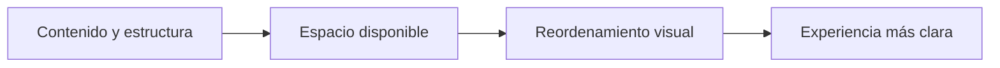
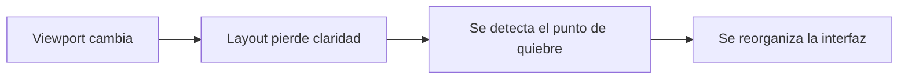
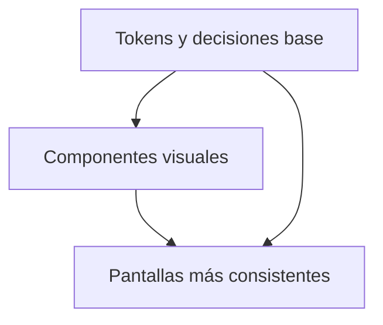
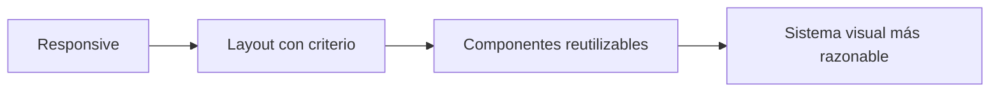

# Clase 02 - Semana 02 - Diseñar para Pantallas Reales: Responsive, Componentes Visuales y Sistemas de Diseño

- Unidad 01: Fundamentos y la Web Estática
- Fecha: Martes 24 de marzo de 2026
- Duración: 3 horas (10:50 - 13:10)
- Modalidad: Presencial en Laboratorio PC
- Docente: Diego Obando

---

# Objetivos de la Clase

## Objetivo General

Al terminar esta clase, el estudiante podrá comprender cómo una interfaz web se adapta a distintos contextos de uso, reconociendo el valor del diseño responsivo, de los componentes visuales y de los sistemas de diseño como base para construir experiencias más claras, consistentes y menos dependientes de soluciones rígidas o copiadas sin criterio.

## Objetivos Específicos

Al finalizar la sesión, el estudiante será capaz de:

1. Explicar por qué una interfaz no debería pensarse para una sola pantalla fija, sino como un sistema que debe adaptarse a distintos anchos, contextos y necesidades de uso.
2. Reconocer principios básicos de diseño responsivo, incluyendo adaptación del layout, priorización de contenido y lectura visual en distintas resoluciones.
3. Identificar el valor de trabajar con componentes visuales reutilizables y con decisiones consistentes de diseño en vez de resolver cada pantalla como un caso aislado.
4. Comprender qué problema intentan resolver los sistemas de diseño y por qué conviene evitar una dependencia ciega de frameworks o soluciones rígidas cuando impiden entender la lógica real de la interfaz.

## Competencias Transversales

- Lectura técnica de interfaces: comenzar a interpretar una pantalla por su estructura, su adaptación y sus decisiones visuales, no solo por su apariencia final.
- Pensamiento componentizado: reconocer patrones reutilizables dentro de una interfaz y comprender que consistencia visual también es una forma de organización técnica.
- Criterio de diseño y mantenibilidad: distinguir entre usar herramientas de apoyo y depender de estructuras rígidas que dificultan adaptación, claridad o evolución del sistema.
- Trabajo supervisado con apoyo inteligente: usar agentes para proponer variantes de layout, componentes o puntos de quiebre, validando después el comportamiento real en navegador, viewport y herramientas de inspección.

---

# BLOQUE 1: Diseñar para Pantallas Reales, no para una Maqueta Fija

- Duración: 25 minutos
- Objetivo del bloque: comprender que una interfaz web no debería pensarse como una composición rígida para una sola resolución, sino como un sistema visual que debe adaptarse a distintos anchos, contextos de uso y prioridades de contenido.
- Modalidad: expositiva, conversada y con lectura guiada de ejemplos

## Desarrollo

### 1.1 Una interfaz web no vive en una sola pantalla

Uno de los errores más comunes al empezar a trabajar interfaces es imaginar que una página "existe" en una sola resolución. Esa idea suele venir de mirar una maqueta estática, una captura o una pantalla de referencia y asumir que el diseño correcto es el que se ve bien solo ahí.

En desarrollo real eso no alcanza.

Una interfaz web puede ser leída desde:

- un notebook;
- un monitor más ancho;
- una tablet;
- un teléfono;
- o una ventana reducida dentro del navegador.

Eso significa que la interfaz no debería diseñarse como una imagen rígida, sino como una estructura que debe conservar claridad aunque cambie el espacio disponible.

La pregunta importante deja de ser:

> "¿Cómo se ve esta pantalla?"

y pasa a ser:

> "¿Cómo se comporta esta interfaz cuando el espacio cambia?"

Ese cambio de enfoque es clave para entrar al diseño responsivo con criterio técnico.

### 1.2 Responsive no es achicar: es reorganizar con intención

Cuando se habla de responsive design, a veces parece que solo se tratara de "hacer más pequeña" la misma interfaz. Pero adaptar una interfaz no significa reducir todo proporcionalmente.

Lo importante es decidir:

- qué contenido debe aparecer primero;
- qué bloques pueden cambiar de posición;
- qué elementos necesitan más ancho para seguir siendo legibles;
- y qué parte del layout conviene simplificar cuando el espacio disminuye.

Por eso una interfaz responsiva no es una copia reducida de la versión desktop. Es una versión reordenada según prioridades de lectura, interacción y espacio disponible.

Podemos resumir esa lógica así:

El punto importante del diagrama es que el espacio no se trata como accidente. Se convierte en una condición de diseño.

### 1.3 El viewport cambia la lectura de una misma interfaz

En clases anteriores ya trabajamos HTML como estructura y CSS como sistema de reglas. Ahora aparece una capa adicional: el **viewport**, es decir, el área visible del navegador donde la interfaz se presenta.

Cuando el viewport cambia:

- cambian proporciones;
- cambian relaciones entre columnas y bloques;
- cambia la densidad visual;
- y cambia la manera en que el usuario recorre la página.

Eso quiere decir que una misma interfaz puede necesitar decisiones distintas según el contexto. Lo que en un ancho amplio funciona como dos o tres columnas, en una pantalla más estrecha puede necesitar:

- pasar a una sola columna;
- aumentar separación entre bloques;
- o simplificar la jerarquía visible para no saturar la lectura.

Una lectura técnica madura de responsive empieza aquí:

- no pensar primero en "breakpoints" como números sueltos;
- sino en cómo cambia la experiencia cuando cambia el espacio.

### 1.4 Un layout fijo suele esconder problemas que después explotan

Una maqueta rígida puede verse ordenada mientras todo coincide con el ancho para el que fue pensada. El problema aparece cuando esa misma interfaz se mueve a otro contexto.

Ahí suelen aparecer errores como:

- texto demasiado apretado;
- tarjetas que dejan de respirar;
- navegación que ya no cabe;
- botones que pierden jerarquía;
- formularios incómodos;
- o bloques que parecen bien alineados solo en un caso ideal.

Por eso el responsive design no es un "extra visual" para después. Es una parte central del diseño de interfaz.

Una interfaz realmente bien pensada no depende de un ancho perfecto. Resiste cambio de contexto sin perder:

- claridad;
- legibilidad;
- jerarquía;
- ni coherencia visual.

### 1.5 Responsive, agentes y validación en pantalla real

Aquí también conviene instalar una práctica moderna. Un agente puede ayudar a:

- proponer una primera adaptación móvil;
- sugerir variantes de distribución;
- comparar si un caso parece más de una columna o de reordenamiento;
- o bosquejar una primera versión de media queries y cambios de layout.

Pero eso no resuelve el problema por sí solo.

Lo que sigue siendo responsabilidad humana es:

- mirar el resultado en pantalla real;
- validar si la jerarquía visual sigue clara;
- comprobar si la lectura se vuelve más pesada o más liviana;
- y decidir si la adaptación realmente mejora la experiencia o solo "acomoda" elementos para que quepan.

En otras palabras:

- el agente puede acelerar una primera propuesta;
- pero responsive design se confirma observando comportamiento real en viewport, navegador y herramientas de inspección.

### Preguntas guía

- ¿Por qué una interfaz web no debería pensarse como una maqueta fija?
- ¿Qué diferencia hay entre achicar una pantalla y reorganizarla con intención?
- ¿Qué problemas suelen aparecer cuando un layout solo funciona bien en un ancho ideal?

### Cierre del bloque

- Idea clave: diseñar responsive no consiste en encoger una pantalla, sino en reorganizar una interfaz para distintos contextos reales de uso.
- Huella metodológica: un agente puede sugerir una primera adaptación, pero la lectura del viewport y la validación visual siguen dependiendo del desarrollador.
- Puente: en el siguiente bloque aterrizaremos esta idea en viewport, adaptación concreta y decisiones de layout más visibles.

---

# BLOQUE 2: Viewport, Adaptación y Decisiones de Layout

- Duración: 25 minutos
- Objetivo del bloque: aterrizar el diseño responsivo en decisiones visibles de layout, comprendiendo cómo el viewport obliga a priorizar contenido, reorganizar bloques y validar comportamiento real en navegador.
- Modalidad: expositiva, análisis de ejemplos y lectura técnica guiada

## Desarrollo

### 2.1 El viewport no es un detalle: condiciona la interfaz

Cuando una interfaz cambia de ancho, no cambia solo su tamaño. Cambia la forma en que el contenido respira, se agrupa y se entiende.

Por eso conviene pensar el viewport como una condición real de diseño y no como un dato accesorio. Un layout razonable en escritorio puede volverse incómodo en una ventana más estrecha aunque los mismos elementos sigan presentes.

Lo importante no es solo "si cabe", sino:

- si sigue siendo legible;
- si el orden visual todavía ayuda;
- si la navegación sigue siendo clara;
- y si el usuario entiende qué mirar o tocar primero.

Responsive design empieza a volverse técnico justamente cuando dejamos de mirar la pantalla como una foto y empezamos a leerla como un comportamiento.

### 2.2 Adaptar no significa conservar exactamente la misma composición

Una mala adaptación suele intentar mantener la misma composición original aunque el espacio ya no la soporte. Ahí aparecen soluciones forzadas:

- columnas demasiado angostas;
- textos comprimidos;
- botones que pierden jerarquía;
- tarjetas con proporciones raras;
- o bloques que siguen juntos solo porque en escritorio funcionaban así.

En cambio, una buena adaptación acepta que ciertas relaciones cambien.

Por ejemplo:

- una barra horizontal puede necesitar apilar opciones;
- una grilla de tres columnas puede pasar a dos o una;
- un bloque secundario puede moverse más abajo;
- un CTA importante puede necesitar más aire;
- y un formulario puede cambiar su ritmo de lectura.

La decisión correcta no siempre es conservar la forma inicial, sino proteger la experiencia de lectura e interacción.

### 2.3 Breakpoints con criterio: no como números memorizados

En este punto suele aparecer el concepto de **breakpoint**. Un breakpoint no debería entenderse solo como un número arbitrario, sino como el punto donde el layout deja de comportarse bien y necesita otra organización.

Eso cambia mucho la forma de trabajar.

En vez de pensar:

- "agregaré media queries porque hay que tenerlas";

conviene pensar:

- "¿en qué momento esta interfaz deja de leerse bien?";
- "¿qué elemento empieza a fallar primero?";
- "¿qué parte del layout ya no tiene sentido en este ancho?".

Esa lectura permite usar media queries con intención y no como parche automático.

Podemos resumirlo así:

El breakpoint, entonces, no nace del capricho. Nace de una lectura del comportamiento visual.

### 2.4 Prioridad de contenido: no todo debe pesar igual en todas las resoluciones

Una interfaz madura no trata todos los elementos con la misma importancia en todos los contextos. Cuando el espacio disminuye, conviene decidir qué parte del contenido debe sostener la experiencia principal.

Eso obliga a pensar:

- qué elemento abre la lectura;
- qué bloque puede esperar;
- qué información puede compactarse;
- qué acciones necesitan seguir visibles;
- y qué parte del layout puede simplificarse sin perder sentido.

Esta idea conecta muy bien con diseño de productos reales, porque en pantallas más pequeñas la claridad depende menos de "mostrar todo" y más de "mostrar lo correcto en el orden correcto".

### 2.5 Viewport, DevTools y validación de la adaptación

Aquí el diseño responsivo deja de ser puramente teórico. El navegador y DevTools permiten observar la interfaz en distintos anchos y comprobar si la adaptación realmente funciona.

Eso ayuda a detectar:

- cuándo una columna ya no respira;
- cuándo un texto se corta o queda incómodo;
- cuándo una navegación pierde claridad;
- o cuándo una media query mejora algo en una parte y rompe otra.

Un agente puede ayudar a:

- sugerir breakpoints iniciales;
- proponer media queries;
- comparar posibles reorganizaciones;
- o dar una primera hipótesis sobre qué parte del layout conviene mover.

Pero lo que no conviene delegar es:

- confirmar si la adaptación se lee bien;
- decidir si la jerarquía visual se mantuvo;
- validar si el viewport real justifica el cambio;
- y dar por buena una solución sin inspeccionarla en herramientas.

En responsive, la validación final no ocurre en el prompt. Ocurre mirando comportamiento real.

### Preguntas guía

- ¿Qué cambia realmente cuando cambia el viewport?
- ¿Por qué un breakpoint útil no debería decidirse solo por memoria o costumbre?
- ¿Qué significa priorizar contenido cuando el espacio se vuelve más limitado?

### Cierre del bloque

- Idea clave: un layout responsivo no se define solo por números, sino por decisiones de reorganización tomadas cuando la interfaz empieza a perder claridad.
- Huella metodológica: un agente puede proponer puntos de quiebre o media queries, pero la adaptación se valida leyendo comportamiento real en navegador y DevTools.
- Puente: en el siguiente bloque pasaremos de pantallas completas a componentes visuales, para entender cómo la consistencia se construye también desde piezas reutilizables.

---

# BLOQUE 3: Componentes Visuales y Consistencia

- Duración: 25 minutos
- Objetivo del bloque: comprender que una interfaz madura no debería resolverse pantalla por pantalla, sino a través de componentes visuales reutilizables y decisiones consistentes de diseño.
- Modalidad: expositiva, análisis de ejemplos y lectura guiada de patrones

## Desarrollo

### 3.1 Una interfaz se vuelve más clara cuando deja de pensarse como una suma de pantallas aisladas

Cuando una interfaz se construye pantalla por pantalla, sin observar patrones comunes, suele crecer de forma desordenada. Cada sección resuelve sus propios colores, márgenes, tamaños, tarjetas o botones, y el resultado termina siendo visualmente inestable.

En cambio, una interfaz mejora mucho cuando empezamos a detectar piezas que se repiten:

- botones;
- cards;
- bloques informativos;
- barras de navegación;
- formularios;
- mensajes de estado;
- encabezados;
- listas o tablas simples.

Esa repetición no debería verse como problema. De hecho, es una oportunidad. Si varias partes cumplen una función parecida, conviene tratarlas como componentes visuales con comportamiento y estilo más coherentes.

### 3.2 Un componente no es solo una caja: es una decisión reutilizable

Cuando hablamos de componentes visuales, no nos referimos solo a "bloques bonitos" o a piezas de librería. Hablamos de unidades que resuelven una función visual y que pueden reutilizarse con cierta consistencia.

Por ejemplo, una card puede tener:

- una estructura reconocible;
- una jerarquía interna;
- una separación clara entre título, contenido y acción;
- y una forma consistente de responder al espacio disponible.

Eso hace que el componente no sea una improvisación repetida, sino una decisión reutilizable.

La ganancia técnica aparece rápido:

- el sistema se vuelve más fácil de leer;
- los cambios visuales se vuelven más razonables de aplicar;
- y el responsive design deja de sentirse como parches dispersos.

### 3.3 Consistencia visual no significa rigidez

Una confusión frecuente es pensar que, si una interfaz usa componentes y repite patrones, entonces todo se vuelve rígido o monótono. En realidad, la consistencia bien aplicada no elimina variedad; elimina ruido innecesario.

Por ejemplo, dos tarjetas pueden compartir:

- espaciado;
- borde;
- estructura base;
- y jerarquía tipográfica;

sin dejar de cumplir funciones distintas.

Eso significa que la consistencia no obliga a copiar exactamente el mismo bloque una y otra vez. Lo que busca es mantener:

- un lenguaje visual común;
- decisiones comprensibles;
- y una experiencia más estable para quien usa la interfaz.

Una lectura profesional de diseño debería reconocer esa diferencia:

- rigidez es repetir sin pensar;
- consistencia es repetir con criterio.

### 3.4 Un buen componente también debe resistir cambio de contexto

En una clase sobre responsive no basta con hablar de componentes como piezas aisladas. También importa cómo se comportan cuando cambia el espacio.

Un botón, una card o un formulario breve no deberían diseñarse solo para un ancho ideal. Conviene observar:

- si siguen siendo legibles en tamaños menores;
- si la jerarquía se mantiene;
- si el contenido respira;
- y si el componente todavía comunica bien su función.

Por eso, pensar en componentes visuales también exige pensar en adaptabilidad. Un componente útil no solo se reutiliza: también se comporta razonablemente en distintos contextos.

### 3.5 Componentes, agentes y primeras propuestas reutilizables

Aquí el apoyo con agentes puede ser bastante útil. Un agente puede ayudar a:

- proponer una primera versión de un componente;
- generar variantes visuales;
- sugerir qué decisiones conviene unificar;
- o detectar piezas repetidas que ya podrían transformarse en patrón.

Pero eso no significa que el agente decida por sí solo qué entra a formar parte del sistema.

Lo que sigue dependiendo del criterio humano es:

- decidir si realmente hay un patrón reutilizable;
- validar si el componente mantiene claridad en distintos contextos;
- revisar si sus variantes siguen perteneciendo al mismo lenguaje visual;
- y detectar cuándo una aparente "reutilización" en realidad está ocultando una mala decisión de diseño.

En otras palabras:

- el agente puede ayudar a encontrar orden;
- pero la consistencia real del sistema depende de lectura, comparación y validación humana.

### Preguntas guía

- ¿Qué problemas aparecen cuando una interfaz se resuelve pantalla por pantalla sin detectar patrones?
- ¿Por qué un componente visual útil no debería entenderse solo como una caja repetida?
- ¿Qué diferencia hay entre consistencia visual y rigidez visual?

### Cierre del bloque

- Idea clave: una interfaz madura gana calidad cuando empieza a construirse desde componentes reutilizables y decisiones consistentes, no desde soluciones aisladas.
- Huella metodológica: un agente puede ayudar a proponer o detectar patrones, pero el componente solo se vuelve realmente útil cuando se valida su claridad, adaptación y coherencia dentro del sistema.
- Puente: en el siguiente bloque cerraremos conectando componentes, tokens y criterio de sistema para evitar dependencia ciega de frameworks rígidos.

---

# BLOQUE 4: Sistemas de Diseño y Criterio para no Depender Ciegamente de Frameworks

- Duración: 25 minutos
- Objetivo del bloque: comprender que un sistema de diseño no es una colección rígida de estilos prefabricados, sino una forma de ordenar decisiones visuales y componentes; además, desarrollar criterio para usar frameworks sin delegar completamente la comprensión de la interfaz.
- Modalidad: expositiva, comparativa y de reflexión técnica aplicada

## Desarrollo

### 4.1 Un sistema de diseño intenta ordenar decisiones, no solo decorar pantallas

Cuando una interfaz empieza a crecer, ya no basta con recordar "más o menos" qué color, qué espaciado o qué forma tenía cada componente. En ese punto aparece la necesidad de ordenar decisiones visuales de manera más explícita.

Ahí es donde un sistema de diseño empieza a tener sentido.

Un sistema de diseño no es solamente:

- una paleta;
- una tipografía;
- o una colección de componentes listos.

También es una manera de definir:

- qué decisiones se repiten;
- qué patrones conviene estabilizar;
- cómo se nombran ciertos elementos;
- y qué partes del lenguaje visual deberían mantenerse coherentes entre distintas pantallas.

Por eso un sistema de diseño sirve menos para "embellecer" y más para volver la interfaz más legible, más mantenible y más predecible.

### 4.2 Tokens, componentes y reglas compartidas forman una misma capa de sistema

En la clase anterior ya vimos variables CSS como forma de centralizar decisiones. Ahora conviene conectar eso con una idea más amplia.

Un sistema visual pequeño suele apoyarse en tres niveles:

- decisiones base, como colores, espacios, radios o tipografía;
- componentes reutilizables, como cards, botones, banners o formularios;
- y reglas de uso, que ayudan a mantener consistencia entre distintas partes de la interfaz.

Podemos resumirlo así:

Esto ayuda a entender que los componentes no viven aislados. Se apoyan en un lenguaje visual previo.

### 4.3 Un framework puede ayudar, pero no debería reemplazar la comprensión

Aquí aparece una discusión importante. Muchos frameworks o librerías ofrecen componentes, clases utilitarias o estructuras visuales ya preparadas. Eso puede ser útil, sobre todo para acelerar ciertas tareas.

El problema aparece cuando se usan como si fueran sustituto del criterio técnico.

Si una persona usa un framework sin entender:

- jerarquía visual;
- layout;
- responsive;
- componentes;
- o consistencia visual;

entonces la interfaz puede funcionar "por casualidad", pero cuesta mucho adaptarla, leerla o corregirla cuando sale del caso ideal.

Por eso conviene instalar esta idea:

- usar herramientas de apoyo está bien;
- depender ciegamente de ellas debilita la comprensión del sistema.

Un framework no debería reemplazar preguntas como:

- ¿qué problema espacial estoy resolviendo?;
- ¿qué componente se repite aquí?;
- ¿qué patrón visual estoy estabilizando?;
- ¿esta solución sigue siendo clara cuando cambia el contexto?;
- ¿podría mantener esto si mañana cambiara una decisión base?

### 4.4 Rigidizar una interfaz también puede ser una forma de deuda técnica

A veces una interfaz parece "ordenada" solo porque todo depende de un conjunto cerrado de clases o componentes que nadie entiende del todo. En el corto plazo eso puede dar velocidad, pero en el mediano plazo genera rigidez.

Esa rigidez se nota cuando:

- cuesta adaptar un componente;
- pequeños cambios rompen consistencia;
- el sistema no tolera nuevas variantes;
- el responsive se vuelve incómodo;
- o el equipo ya no sabe dónde tocar sin producir efectos secundarios.

En ese sentido, la dependencia ciega de frameworks también puede convertirse en deuda técnica visual.

La pregunta útil no es:

- "¿estoy usando framework o no?"

sino:

- "¿entiendo realmente la lógica visual y estructural de lo que estoy usando?"

### 4.5 Sistemas de diseño, agentes y criterio de gobernanza

Este es un punto muy alineado con el enfoque nuevo del módulo. Un agente puede ayudar a:

- proponer una primera estructura de componentes;
- sugerir tokens o nombres;
- comparar variantes de una misma interfaz;
- o detectar inconsistencias entre piezas repetidas.

Pero en temas de sistema visual, lo que no conviene delegar es:

- decidir qué se vuelve regla compartida;
- dar por bueno un componente solo porque "se ve moderno";
- asumir que una propuesta ya pertenece al mismo lenguaje visual;
- o aceptar una solución sin revisar si introduce más rigidez o más claridad.

En trabajo moderno, esto se parece mucho a una lógica spec-driven:

- primero explicitar intención y restricciones;
- luego proponer componentes o reglas;
- después validar consistencia, adaptación y mantenibilidad;
- y recién entonces consolidar una decisión.

Eso vale tanto para frameworks como para apoyo con agentes.

### Preguntas guía

- ¿Qué intenta resolver realmente un sistema de diseño?
- ¿Por qué un framework puede ayudar sin volverse automáticamente una buena decisión?
- ¿Qué riesgos aparecen cuando una interfaz depende de estructuras rígidas que nadie entiende bien?

### Cierre del bloque

- Idea clave: un sistema de diseño ordena decisiones visuales y componentes, pero solo agrega valor real cuando existe comprensión del problema y no dependencia ciega de herramientas o frameworks.
- Huella metodológica: un agente puede ayudar a proponer patrones, tokens o variantes, pero la gobernanza del sistema visual sigue dependiendo de intención explícita, revisión y validación humana.
- Puente: en el cierre de la clase reuniremos responsive, componentes y sistema visual como una misma forma de diseñar interfaces más razonables.

---

# Cierre de la Clase

- Duración: 20 minutos
- Objetivo del cierre: sintetizar la progresión de la clase y dejar instalada una lectura más madura de responsive, componentes y sistema visual como parte de una misma forma de diseñar interfaces.

## Síntesis final

Durante esta clase la idea fue movernos desde una visión más ingenua de la interfaz hacia una lectura más técnica y más profesional.

La progresión fue esta:

- primero, entender que una pantalla no debería pensarse como maqueta fija;
- después, leer cómo el viewport obliga a reorganizar contenido y layout;
- luego, detectar que una interfaz gana consistencia cuando trabaja con componentes reutilizables;
- y finalmente, reconocer que un sistema de diseño ayuda a estabilizar decisiones sin depender ciegamente de frameworks.

Podemos resumir el hilo central así:

### Ideas que deberían quedar instaladas

- Diseñar para la Web no es fijar una sola pantalla, sino anticipar comportamiento en distintos contextos.
- El responsive design exige reorganizar con criterio, no solo achicar una maqueta.
- Los componentes visuales ayudan a construir consistencia cuando responden a decisiones reutilizables.
- Un sistema de diseño ordena tokens, componentes y reglas compartidas para que la interfaz sea más mantenible.
- Un framework puede ayudar, pero no debería reemplazar comprensión del problema, del layout ni del lenguaje visual.

### Huella metodológica de la clase

Esta sesión también deja una práctica moderna bastante clara:

- un agente puede proponer breakpoints, media queries, variantes de layout, componentes o tokens;
- pero la validación final sigue dependiendo de mirar comportamiento real en navegador, viewport y herramientas de inspección;
- además, cuando una decisión se vuelve parte del sistema, ya no basta con que "funcione": debe ser comprensible, consistente y razonable de mantener.

En forma breve:

> entender la interfaz -> explicitar intención -> apoyarse con inteligencia -> validar con evidencia.

### Preguntas de salida

- ¿Qué parte de una adaptación responsiva conviene validar siempre en pantalla real?
- ¿Cuándo una repetición visual ya sugiere que debería existir un componente?
- ¿Qué riesgo aparece cuando una interfaz depende demasiado de clases o patrones que nadie entiende bien?

### Puente a la siguiente clase

La próxima sesión profundizará una consecuencia natural de todo esto: si una interfaz debe adaptarse, mantenerse y escalar con criterio, entonces también importa medir cómo rinde, qué tan accesible es y qué tan bien está construida desde el punto de vista técnico.

Eso nos lleva directamente a:

- SEO técnico;
- rendimiento web;
- accesibilidad;
- y auditoría con herramientas actuales.

---
