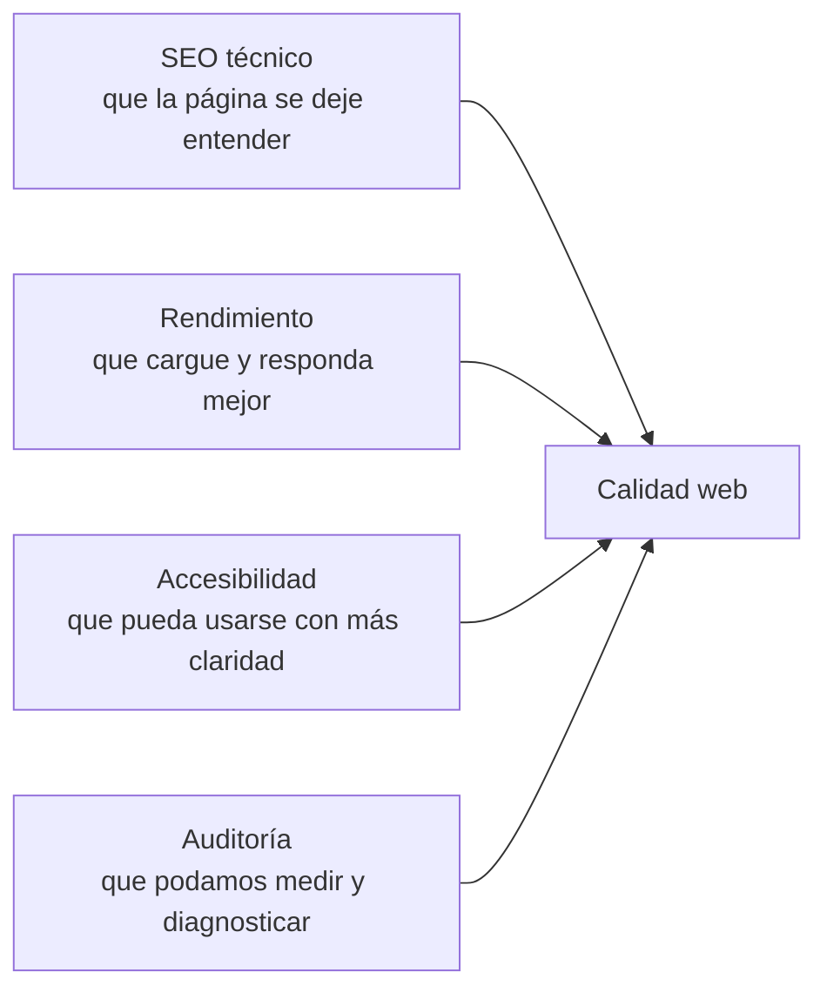
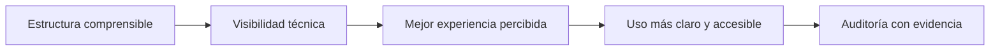

# Clase 03 - Semana 02 - Medir y Mejorar la Calidad Web: SEO Técnico, Rendimiento, Accesibilidad y Auditoría

- Unidad 01: Fundamentos y la Web Estática
- Fecha: Miércoles 25 de marzo de 2026
- Duración: 3 horas (10:50 - 13:10)
- Modalidad: Presencial en Laboratorio PC
- Docente: Diego Obando

---

# Objetivos de la Clase

## Objetivo General

Al terminar esta clase, el estudiante podrá evaluar técnicamente la calidad básica de un sitio web desde cuatro dimensiones conectadas: SEO técnico, rendimiento, accesibilidad y auditoría, utilizando herramientas actuales para detectar problemas, interpretar hallazgos y proponer mejoras con criterio.

## Objetivos Específicos

Al finalizar la sesión, el estudiante será capaz de:

1. Explicar qué aspectos básicos del SEO técnico influyen en la visibilidad y comprensión de una página por parte de buscadores y usuarios.
2. Reconocer factores que afectan el rendimiento web, como peso de recursos, carga inicial, estructura del contenido y experiencia percibida.
3. Identificar principios iniciales de accesibilidad web y comprender por qué una interfaz técnicamente correcta no siempre resulta usable para todas las personas.
4. Interpretar auditorías realizadas con herramientas actuales del navegador o del ecosistema web, distinguiendo entre hallazgos útiles, advertencias automáticas y decisiones que requieren criterio humano.
5. Comprender cómo un agente puede ayudar a revisar, resumir o proponer mejoras, sin reemplazar la validación manual de accesibilidad, rendimiento y calidad real en pantalla.

## Competencias Transversales

- Lectura técnica basada en evidencia: interpretar métricas, alertas y resultados de auditoría sin depender solo de intuición visual.
- Criterio de calidad web: entender que una buena interfaz no solo se ve bien, sino que también carga mejor, se entiende mejor y se usa mejor.
- Uso responsable de herramientas modernas: integrar navegador, auditorías y apoyo inteligente como parte del flujo de mejora técnica.
- Validación supervisada con IA/agentes: usar agentes para acelerar análisis o priorización, verificando después con herramientas reales y revisión humana.

---

# BLOQUE 1: Calidad Web no es solo Apariencia

- Duración: 25 minutos
- Objetivo del bloque: comprender que la calidad de un sitio web no se agota en su apariencia visual, sino que también involucra estructura entendible, carga razonable, uso accesible y lectura técnica basada en evidencia.
- Modalidad: expositiva, conversada y con lectura guiada de hallazgos técnicos iniciales

## Desarrollo

### 1.1 Una página puede verse bien y aun así estar mal resuelta

Al empezar a trabajar interfaces web, es común asociar "calidad" con una impresión visual inmediata:

- que la página se vea ordenada;
- que los colores se sientan correctos;
- que el layout no parezca roto;
- o que el diseño "se vea profesional".

Eso importa, pero no alcanza.

Una página puede verse razonablemente bien y aun así tener problemas importantes:

- un título poco claro o mal estructurado;
- imágenes demasiado pesadas;
- textos alternativos ausentes;
- enlaces confusos;
- encabezados mal jerarquizados;
- o una carga lenta que empeora la experiencia antes de que el usuario alcance a leer nada.

En otras palabras, una interfaz bonita no garantiza una interfaz técnicamente buena.

La idea central de este bloque es justamente esa: la calidad web debe leerse en más de una capa.

### 1.2 SEO técnico, rendimiento y accesibilidad forman una misma conversación

Durante esta clase trabajaremos cuatro dimensiones conectadas:

- **SEO técnico**: que la página se deje entender por buscadores y también por personas;
- **rendimiento**: que la experiencia no se vuelva pesada o lenta por recursos mal gestionados;
- **accesibilidad**: que la interfaz pueda usarse, leerse y recorrerse con mejores condiciones;
- **auditoría**: que podamos medir y revisar con herramientas en vez de confiar solo en intuición.

No conviene tratar estos temas como listas aisladas. En la práctica suelen cruzarse.

Por ejemplo:

- una estructura semántica más clara puede ayudar tanto a SEO como a accesibilidad;
- una imagen demasiado grande afecta rendimiento y también experiencia percibida;
- un formulario mal etiquetado no solo "se ve igual", pero funciona peor para más personas;
- una auditoría puede detectar problemas que visualmente pasan desapercibidos.

Podemos resumir esa relación así:



La calidad web aparece entonces como una lectura conectada del sistema, no como un simple checklist estético.

### 1.3 Intuición visual no basta: hay que aprender a mirar evidencia

Este es un buen punto para subir un poco la densidad técnica de la semana.

Hasta aquí ya trabajamos:

- estructura HTML;
- CSS moderno;
- responsive;
- componentes visuales;
- y decisiones de sistema.

Ahora toca una pregunta más exigente:

> ¿Cómo sabemos si una página realmente está bien resuelta?

La respuesta ya no puede salir solo de mirar la pantalla "a ojo".

Necesitamos aprender a leer evidencia como:

- títulos y jerarquía del documento;
- peso de imágenes y recursos;
- tiempos de carga percibidos;
- alertas de accesibilidad;
- auditorías del navegador;
- o recomendaciones de herramientas como Lighthouse.

Eso cambia el rol del desarrollador.

Ya no se trata solo de construir la interfaz, sino también de revisarla con herramientas que permitan detectar:

- qué está funcionando bien;
- qué está degradando la experiencia;
- qué advertencia importa de verdad;
- y qué hallazgo necesita interpretación antes de actuar.

### 1.4 Las herramientas ayudan a medir, pero no deciden solas

Una auditoría automática puede resultar muy útil porque permite observar problemas que no siempre se ven de inmediato. Sin embargo, también conviene evitar un error frecuente: creer que toda advertencia tiene el mismo peso o que una herramienta ya resolvió el diagnóstico por nosotros.

Herramientas como DevTools, Lighthouse u otras auditorías pueden ayudar a:

- detectar recursos pesados;
- señalar contrastes débiles;
- avisar sobre títulos o etiquetas ausentes;
- mostrar oportunidades de mejora;
- y ordenar parte del análisis.

Pero sigue siendo necesario leer con criterio:

- si el hallazgo es realmente relevante para ese caso;
- si el problema afecta de verdad la experiencia;
- si una mejora automática puede romper otra parte del sistema;
- y qué conviene priorizar primero.

La herramienta no reemplaza la lectura técnica. La hace más visible.

### 1.5 Auditoría, agentes y validación humana

Aquí también aparece una práctica moderna de trabajo.

Un agente puede ayudar a:

- resumir los hallazgos de una auditoría;
- agrupar problemas por prioridad;
- explicar qué significa una métrica;
- sugerir una primera lista de mejoras;
- o proponer cambios iniciales en HTML, imágenes, metadatos o estructura.

Pero lo que no conviene delegar ciegamente es:

- decidir si una advertencia realmente importa en contexto;
- confirmar si la experiencia mejoró de verdad;
- asumir que una puntuación alta equivale a una página bien resuelta;
- o aceptar una corrección automática sin revisarla en navegador y herramientas reales.

La lógica correcta sigue siendo:

1. entender el problema técnico;
2. apoyarse en herramientas o agentes;
3. validar el hallazgo;
4. y recién después decidir la mejora.

### Preguntas guía

- ¿Por qué una página puede verse correcta y aun así estar mal resuelta técnicamente?
- ¿Qué cambia cuando pasamos de una lectura visual a una lectura basada en evidencia?
- ¿Por qué una auditoría automática ayuda mucho, pero no debería gobernar sola la decisión final?

### Cierre del bloque

- Idea clave: calidad web no significa solo apariencia; significa también estructura entendible, experiencia razonable, accesibilidad y capacidad de medición.
- Huella metodológica: una herramienta o un agente puede acelerar el análisis inicial, pero la interpretación de hallazgos y la validación final siguen dependiendo del criterio humano.
- Puente: en el siguiente bloque entraremos al primer eje concreto de esa calidad: el SEO técnico y la estructura que sí se deja entender.

---

# BLOQUE 2: SEO Técnico y Estructura que sí se Deja Entender

- Duración: 25 minutos
- Objetivo del bloque: comprender que el SEO técnico básico empieza en una estructura HTML clara, en metadatos razonables y en señales que ayuden a buscadores y personas a entender de qué trata una página.
- Modalidad: expositiva, lectura guiada de estructura real y análisis técnico de ejemplos

## Desarrollo

### 2.1 SEO técnico no empieza en marketing: empieza en entender la página

Cuando se menciona SEO, muchas veces se piensa de inmediato en posicionamiento, palabras clave o visibilidad comercial. Pero antes de todo eso existe una base más técnica:

- que la página tenga un propósito claro;
- que su estructura se deje leer;
- que el documento no sea ambiguo;
- y que existan señales mínimas para entender qué contenido ofrece.

Eso importa tanto para buscadores como para personas.

Una página técnicamente confusa suele mostrar problemas como:

- títulos genéricos o repetidos;
- encabezados mal jerarquizados;
- demasiados bloques sin semántica clara;
- imágenes sin contexto;
- enlaces poco descriptivos;
- o una estructura que obliga a adivinar de qué trata el contenido.

Por eso conviene instalar esta idea desde el principio:

> SEO técnico no consiste primero en “subir en Google”, sino en construir una página que sí se deja interpretar.

### 2.2 Hay señales básicas que conviene revisar siempre

En una lectura inicial de SEO técnico, hay varias piezas del documento que ayudan a entender la página:

- el elemento `<title>`;
- una `meta description` razonable;
- la jerarquía de encabezados;
- el uso de HTML semántico;
- textos de enlaces más descriptivos;
- atributos `alt` en imágenes cuando corresponde;
- y una organización general que no esconda el contenido importante.

Eso no convierte por sí solo a una página en “perfecta”, pero sí mejora mucho su legibilidad técnica.

Por ejemplo, no produce la misma lectura esto:

- título: `Inicio`
- encabezado principal: `Bienvenido`
- botón: `Haz clic aquí`

que esto:

- título: `Portafolio de Ana Pérez | Proyectos Web`
- encabezado principal: `Proyectos de desarrollo web y diseño responsivo`
- enlace: `Ver proyecto de tienda responsive`

En el segundo caso, el documento entrega mucha más información útil sin necesidad de “explicar después” qué significa cada bloque.

### 2.3 La estructura HTML sigue siendo una de las bases del SEO técnico

Aquí se conecta muy bien lo que ya vimos en la semana 1 con HTML semántico.

Una estructura más clara ayuda a que el documento se deje recorrer mejor. Por eso conviene revisar piezas como:

- `head` con información básica bien resuelta;
- un `title` representativo;
- encabezados (`h1`, `h2`, `h3`) usados con jerarquía;
- regiones semánticas como `main`, `section`, `article`, `nav` y `footer`;
- y contenido que no dependa solo de apariencia visual para tener sentido.

Un ejemplo básico podría verse así:

```html
<!doctype html>
<html lang="es">
  <head>
    <meta charset="UTF-8" />
    <meta name="viewport" content="width=device-width, initial-scale=1.0" />
    <title>Guía inicial de accesibilidad web | Taller PRO301</title>
    <meta
      name="description"
      content="Introducción a estructura semántica, contraste, formularios y revisión básica de accesibilidad."
    />
  </head>
  <body>
    <main>
      <article>
        <h1>Guía inicial de accesibilidad web</h1>
        <p>Primeros criterios para revisar una interfaz más clara y usable.</p>
        
      </article>
    </main>
  </body>
</html>
```

Este ejemplo no agota el tema, pero muestra algo importante: una parte relevante del SEO técnico básico se puede leer directamente en el documento.

### 2.4 Enlaces, imágenes y jerarquía también comunican

Hay decisiones pequeñas que suelen parecer menores, pero afectan bastante la comprensión técnica de una página.

Por ejemplo:

- un enlace que dice `haz clic aquí` comunica menos que un enlace que dice `descargar guía de auditoría web`;
- una imagen sin `alt` deja una pieza sin contexto;
- un documento con varios `h1` mal pensados puede volver difusa la lectura;
- y una página donde el contenido principal aparece escondido entre bloques poco relevantes suele comunicar peor su propósito.

La pregunta útil no es solo:

> “¿Esto existe en el HTML?”

Sino también:

> “¿Esto ayuda realmente a entender qué ofrece la página?”

Ese cambio de mirada ayuda mucho, porque evita convertir SEO técnico en una lista mecánica de casillas.

### 2.5 Agentes, sugerencias automáticas y validación de intención

En esta parte de la clase conviene instalar una integración moderna bien concreta.

Un agente puede ayudar a:

- proponer títulos y descripciones iniciales;
- detectar encabezados poco claros;
- sugerir textos alternativos o enlaces más descriptivos;
- resumir problemas estructurales del HTML;
- o comparar si una página se entiende mejor antes y después de una mejora.

Pero lo que no conviene delegar sin revisión es:

- si el título realmente representa la intención de la página;
- si la jerarquía de encabezados tiene sentido para ese contenido;
- si una descripción está diciendo algo útil o solo rellenando;
- o si una sugerencia automática mejora la comprensión en vez de volverla más genérica.

La ayuda inteligente puede acelerar un primer diagnóstico, pero la intención comunicativa y la validación final siguen siendo responsabilidad del desarrollador.

### Preguntas guía

- ¿Por qué conviene entender SEO técnico primero como problema de estructura y comprensión?
- ¿Qué señales del documento ayudan a que una página se deje interpretar mejor?
- ¿Por qué una sugerencia automática puede ser útil y aun así necesitar revisión humana?

### Cierre del bloque

- Idea clave: el SEO técnico básico parte en una página que se deja entender desde su estructura, sus metadatos y su jerarquía.
- Huella metodológica: un agente puede proponer títulos, descripciones o mejoras iniciales, pero la intención del documento y la validación de sentido siguen siendo humanas.
- Puente: en el siguiente bloque pasaremos desde estructura y comprensión hacia otra dimensión crítica de calidad: rendimiento y experiencia percibida.

---

# BLOQUE 3: Rendimiento y Experiencia Percibida

- Duración: 25 minutos
- Objetivo del bloque: comprender que el rendimiento web no es solo una sensación difusa de rapidez, sino una dimensión técnica que depende del peso de recursos, del orden de carga, del renderizado y de la experiencia que el usuario percibe al entrar e interactuar con una página.
- Modalidad: expositiva, análisis técnico guiado y lectura inicial de métricas y herramientas

## Desarrollo

### 3.1 Rendimiento no significa solo “rápido” o “lento”

Cuando una página se siente pesada, el problema no siempre se explica con una sola causa. A veces:

- tarda en mostrar contenido útil;
- mueve elementos cuando ya parecía cargada;
- demora demasiado en responder a una interacción;
- o descarga recursos innecesarios antes de mostrar lo principal.

Por eso conviene pensar el rendimiento como experiencia percibida y no solo como velocidad en abstracto.

Lo importante es observar preguntas como estas:

- ¿cuándo aparece el contenido principal?;
- ¿cuándo la página parece lista para ser leída?;
- ¿cuándo se puede interactuar sin atraso?;
- ¿qué recursos están consumiendo tiempo antes de aportar valor?

Ese cambio de mirada ayuda mucho, porque deja de tratar rendimiento como algo “mágico” y lo vuelve una lectura concreta del comportamiento de la página.

### 3.2 Muchas veces el problema está en decisiones visibles del proyecto

El rendimiento suele degradarse por decisiones bastante comunes:

- imágenes demasiado pesadas;
- tipografías o librerías cargadas sin necesidad;
- archivos CSS o JavaScript más grandes de lo que el caso necesita;
- recursos externos que agregan espera;
- componentes visuales vistosos pero costosos;
- o una página que intenta cargar demasiadas cosas antes de mostrar lo esencial.

Eso significa que el rendimiento no vive separado del diseño o de la estructura. Se relaciona con decisiones muy concretas sobre:

- qué se carga;
- cuánto pesa;
- en qué orden aparece;
- y qué parte de ese costo mejora o empeora la experiencia.

Una interfaz bien presentada puede sentirse mucho peor si obliga al usuario a esperar demasiado por elementos secundarios antes de mostrar el contenido principal.

### 3.3 Las herramientas actuales permiten mirar el problema con más precisión

Aquí empieza a ser importante trabajar con evidencia más técnica.

Herramientas como:

- la pestaña **Network** de DevTools;
- el panel **Performance**;
- y auditorías como **Lighthouse**

permiten ver mejor qué está ocurriendo.

En una lectura inicial conviene observar al menos:

- qué recursos pesan más;
- qué tarda más en descargarse;
- qué bloquea la carga inicial;
- si el contenido principal aparece tarde;
- y si hay movimientos visuales molestos durante la carga.

También conviene empezar a reconocer métricas que aparecerán seguido en auditorías, aunque todavía sea de manera introductoria:

- **LCP (Largest Contentful Paint)**: cuándo aparece el contenido principal más importante;
- **CLS (Cumulative Layout Shift)**: cuánto se mueve la interfaz mientras carga;
- **INP (Interaction to Next Paint)**: qué tan bien responde la interfaz cuando el usuario interactúa.

No hace falta memorizar estas siglas como fórmula vacía. Lo importante es asociarlas a experiencia real:

- contenido principal que aparece tarde;
- elementos que saltan;
- o una página que responde con torpeza.

### 3.4 Mejorar rendimiento básico suele empezar con decisiones simples

Muchas mejoras iniciales no requieren arquitectura compleja. A veces parten por revisar cosas como:

- comprimir imágenes;
- usar dimensiones razonables;
- no cargar recursos innecesarios en la primera vista;
- diferir scripts que no son críticos;
- o reservar espacio para evitar movimientos bruscos del layout.

Un ejemplo básico podría verse así:

```html


<script src="interacciones-secundarias.js" defer></script>
```

Este fragmento no “optimiza todo”, pero sí muestra varias decisiones útiles:

- usar un formato más razonable;
- declarar dimensiones para reducir saltos de layout;
- posponer la carga de imágenes que no son inmediatamente críticas;
- y evitar que un script secundario bloquee el parseo inicial del documento.

La idea importante es que rendimiento no siempre se mejora con trucos misteriosos. Muchas veces mejora cuando el proyecto deja de cargar cosas innecesarias o mal resueltas.

### 3.5 Agentes, métricas y riesgo de optimizar sin entender

En este bloque también conviene dejar instalada una advertencia metodológica clara.

Un agente puede ayudar a:

- resumir un reporte de Lighthouse;
- priorizar hallazgos de rendimiento;
- proponer compresión de imágenes;
- sugerir cambios iniciales en carga de scripts;
- o explicar qué significa una métrica que apareció en la auditoría.

Pero lo que no conviene delegar ciegamente es:

- asumir que una puntuación mejor siempre equivale a una mejor experiencia real;
- aceptar una optimización que rompe accesibilidad, semántica o claridad;
- aplicar cambios sin revisar Network, Performance o la pantalla real;
- o perseguir números sin entender qué está percibiendo el usuario.

En rendimiento, igual que en otros temas de la clase, la herramienta y el agente ayudan a leer. No reemplazan la validación del comportamiento real.

### Preguntas guía

- ¿Por qué conviene pensar el rendimiento como experiencia percibida y no solo como “velocidad” en abstracto?
- ¿Qué decisiones comunes del proyecto suelen empeorar la carga inicial de una página?
- ¿Por qué una métrica o una puntuación puede ayudar, pero no debería gobernar sola la mejora?

### Cierre del bloque

- Idea clave: rendimiento web significa hacer que el contenido útil aparezca mejor, que la interacción responda con más claridad y que la experiencia no se degrade por recursos o decisiones mal resueltas.
- Huella metodológica: un agente puede resumir métricas o proponer optimizaciones iniciales, pero el diagnóstico y la validación siguen dependiendo de herramientas reales y lectura humana.
- Puente: en el siguiente bloque cerraremos la clase con accesibilidad y auditoría, donde la calidad web se vuelve todavía más visible como criterio técnico y no solo como puntaje.

---

# BLOQUE 4: Accesibilidad y Auditoría con Herramientas Actuales

- Duración: 25 minutos
- Objetivo del bloque: comprender que la accesibilidad y la auditoría permiten revisar la calidad de una interfaz más allá de lo visual, combinando herramientas automáticas con validación humana para detectar problemas reales de uso, lectura y estructura.
- Modalidad: expositiva, análisis de hallazgos y lectura guiada de criterios técnicos

## Desarrollo

### 4.1 Accesibilidad no es un “extra”: es parte de la calidad base

Una interfaz puede verse ordenada y aun así excluir o dificultar el uso a muchas personas.

Eso puede ocurrir por problemas como:

- contraste insuficiente;
- textos o botones poco claros;
- imágenes sin descripción;
- formularios sin `label`;
- foco de teclado mal resuelto;
- o un orden de lectura que visualmente “parece correcto”, pero técnicamente resulta confuso.

Por eso conviene entender la accesibilidad como una parte de la calidad base y no como un ajuste opcional al final del proyecto.

Cuando una página mejora su accesibilidad, normalmente también mejora:

- su claridad general;
- su estructura;
- su comprensión técnica;
- y muchas veces su mantenibilidad.

La idea importante aquí es simple: una interfaz mejor no solo se ve mejor; también se usa mejor.

### 4.2 Hay señales iniciales que conviene revisar siempre

Sin entrar todavía en una norma completa, ya existen criterios básicos que vale la pena observar desde temprano:

- que el color no sea el único portador de significado;
- que exista contraste suficiente entre texto y fondo;
- que las imágenes relevantes tengan `alt` cuando corresponde;
- que los formularios usen `label`;
- que los encabezados mantengan jerarquía;
- que el foco visible no desaparezca;
- y que la interfaz pueda recorrerse de manera razonable.

Un ejemplo muy básico:

```html
<form>
  <label for="correo">Correo electrónico</label>
  <input id="correo" name="correo" type="email" />

  <button type="submit">Enviar formulario</button>
</form>
```

Este fragmento no “resuelve toda la accesibilidad”, pero sí muestra una decisión importante:

- el campo no queda anónimo;
- la relación entre control y texto es explícita;
- y la interfaz se vuelve más entendible que un formulario con inputs sueltos y placeholders como único apoyo.

### 4.3 Las auditorías automáticas ayudan, pero no agotan la revisión

Herramientas como Lighthouse, DevTools y otras extensiones de revisión pueden detectar varias cosas útiles:

- problemas de contraste;
- imágenes sin `alt`;
- botones o enlaces ambiguos;
- labels ausentes;
- fallas de estructura;
- o advertencias de buenas prácticas.

Eso ayuda mucho porque vuelve visibles problemas que de otro modo podrían pasar desapercibidos.

Pero conviene evitar otro error frecuente:

> creer que una auditoría automática reemplaza la revisión de uso real.

Una herramienta puede señalar cosas importantes, pero no siempre puede decidir por sí sola:

- si el texto realmente comunica bien;
- si el orden de lectura se entiende;
- si el flujo de teclado resulta razonable;
- o si la experiencia general sigue siendo clara en contexto.

La auditoría automática detecta bastante, pero la lectura humana sigue siendo necesaria.

### 4.4 Puntaje alto no equivale automáticamente a buena experiencia

Este es un cierre metodológico clave para la clase.

En temas como SEO, rendimiento o accesibilidad, es fácil caer en una lógica de puntuaciones:

- “subió el score”;
- “aparecen menos alertas”;
- “la herramienta ya no reclama”.

Eso puede ser útil, pero no debería convertirse en el objetivo final.

Una página puede tener una puntuación razonable y aun así:

- usar textos poco claros;
- esconder decisiones importantes;
- mantener una navegación incómoda;
- o generar una experiencia confusa para parte de sus usuarios.

Por eso la auditoría conviene leerla como apoyo para diagnóstico, no como juez absoluto.

La calidad real aparece cuando combinamos:

- estructura;
- carga razonable;
- accesibilidad;
- herramientas de medición;
- y criterio técnico para priorizar mejoras.

### 4.5 Agentes, auditorías y riesgo de confiar demasiado en el reporte

Aquí también calza muy bien la huella metodológica del módulo.

Un agente puede ayudar a:

- resumir hallazgos de accesibilidad;
- ordenar advertencias por prioridad;
- proponer mejoras iniciales en etiquetas, textos alternativos o contraste;
- explicar un reporte de auditoría;
- o comparar qué cambió entre una revisión y otra.

Pero lo que no conviene delegar sin revisión es:

- decidir que una interfaz ya es accesible solo porque el reporte mejoró;
- aceptar cambios automáticos que dañan semántica o claridad;
- asumir que el foco, la lectura y el uso están bien sin probarlos;
- o convertir la auditoría en un trámite para “sacar mejor nota” en vez de usarla para mejorar el sistema.

La práctica profesional más sana sigue siendo:

1. revisar la interfaz;
2. usar auditorías y agentes para ampliar la lectura;
3. validar en navegador y con criterio humano;
4. y recién después decidir qué mejorar primero.

### Preguntas guía

- ¿Por qué accesibilidad y calidad web deberían pensarse como parte del mismo problema?
- ¿Qué puede detectar bien una auditoría automática y qué parte sigue necesitando revisión humana?
- ¿Por qué una mejor puntuación no garantiza por sí sola una mejor experiencia?

### Cierre del bloque

- Idea clave: accesibilidad y auditoría hacen visible que una interfaz buena no se define solo por apariencia o puntaje, sino por claridad de uso, estructura y capacidad real de revisión.
- Huella metodológica: un agente puede resumir, explicar o priorizar hallazgos, pero la validación final de accesibilidad y experiencia sigue siendo humana.
- Puente: con este bloque la clase queda lista para cerrarse como una lectura integrada de calidad web basada en evidencia, no en intuición aislada.

---

# Cierre de la Clase

- Duración: 20 minutos
- Objetivo del cierre: sintetizar la clase como una lectura integrada de calidad web y dejar instalada una metodología de mejora basada en evidencia, herramientas actuales y validación humana.

## Síntesis final

Durante esta sesión avanzamos desde una idea inicial importante: una interfaz puede verse correcta y aun así estar mal resuelta técnicamente.

Desde ahí, la clase fue organizando la calidad web en cuatro dimensiones conectadas:

- primero, entender que calidad no es solo apariencia;
- después, leer cómo SEO técnico empieza en estructura, metadatos y jerarquía;
- luego, observar que rendimiento significa experiencia percibida y no solo velocidad abstracta;
- y finalmente, reconocer que accesibilidad y auditoría ayudan a revisar el sistema con más criterio.

Podemos resumir el hilo principal así:



La idea importante del cierre es esta: una página web madura no se evalúa solo por cómo se ve, sino por qué tan bien se deja entender, cargar, usar y revisar.

## Ideas que deberían quedar instaladas

- SEO técnico, rendimiento, accesibilidad y auditoría no son temas aislados; forman una misma conversación sobre calidad web.
- Una estructura HTML más clara ayuda tanto a comprensión como a visibilidad técnica y revisión posterior.
- El rendimiento se lee mejor cuando observamos experiencia percibida, carga útil e interacción, no solo una sensación general de rapidez.
- La accesibilidad mejora la claridad de uso y no debería tratarse como un ajuste opcional al final.
- Una auditoría automática ayuda mucho, pero no reemplaza criterio humano ni validación real en navegador.

## Huella metodológica de la clase

Esta clase también deja instalada una práctica de trabajo más actual:

- una herramienta o un agente puede resumir reportes, detectar hallazgos iniciales y sugerir mejoras;
- pero la lectura del problema, la priorización y la validación final siguen siendo responsabilidad humana;
- además, una mejora técnica no debería darse por correcta solo porque subió un puntaje: debe revisarse en contexto.

En forma breve:

> entender el problema -> medir con herramientas -> apoyarse con inteligencia -> validar con criterio.

## Preguntas de salida

- ¿Qué diferencia existe entre mirar una página “a ojo” y leer su calidad con evidencia técnica?
- ¿Qué señales del HTML ayudan a que una página se deje entender mejor por personas y buscadores?
- ¿Por qué una puntuación más alta no garantiza por sí sola una mejor experiencia?
- ¿Qué puede acelerar un agente en una auditoría y qué parte sigue necesitando revisión humana directa?

## Puente a la siguiente clase

La próxima sesión empezará a aumentar todavía más el nivel técnico de la unidad, porque ya no bastará con revisar una página estática: comenzaremos a trabajar con JavaScript base, estructuras de control, funciones, tipos de datos y eventos.

Ese paso será importante, porque nos moverá desde revisar calidad en una interfaz ya construida hacia empezar a construir comportamiento en la propia interfaz.

---
