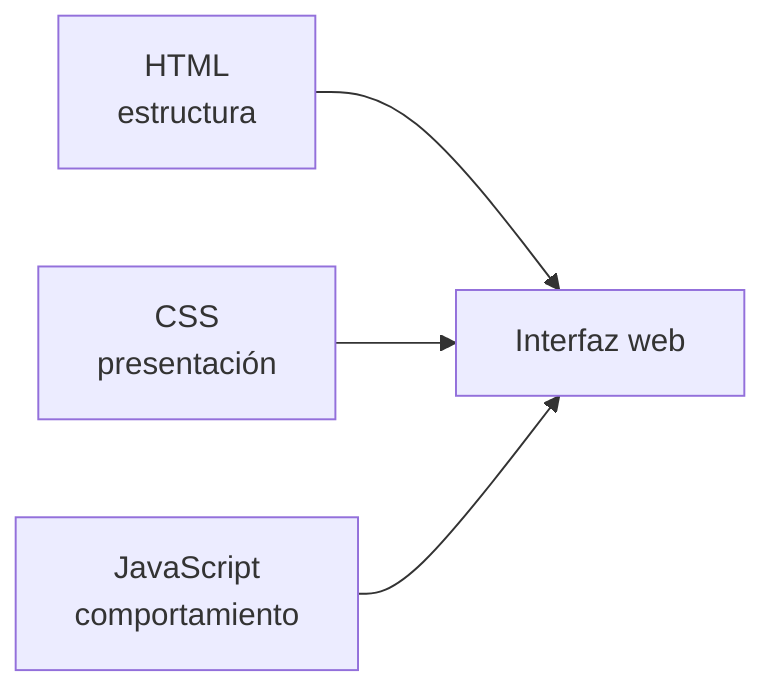
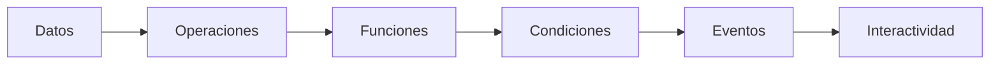

# Clase 02 - Semana 03 - JavaScript Base: Tipos de Datos, Funciones, Estructuras de Control y Eventos

- Unidad 01: Fundamentos y la Web Estática
- Fecha: Martes 31 de marzo de 2026
- Duración: 3 horas (10:50 - 13:10)
- Modalidad: Presencial en Laboratorio PC
- Docente: Diego Obando

---

# Objetivos de la Clase

## Objetivo General

Al terminar esta clase, el estudiante podrá comprender y aplicar fundamentos iniciales de JavaScript para representar datos, reutilizar lógica mediante funciones, tomar decisiones con estructuras de control y responder a eventos básicos del navegador en pequeñas interacciones de interfaz.

## Objetivos Específicos

Al finalizar la sesión, el estudiante será capaz de:

1. Explicar qué rol cumple JavaScript dentro de una página web y cómo se diferencia de HTML y CSS al momento de agregar comportamiento.
2. Reconocer y utilizar tipos de datos básicos en JavaScript, comprendiendo cómo permiten representar información y estados iniciales dentro de un programa.
3. Aplicar funciones y estructuras de control simples para organizar lógica, reutilizar código y resolver decisiones básicas dentro de ejemplos guiados.
4. Identificar eventos frecuentes del navegador, como `click`, `input` o `submit`, y relacionarlos con interacciones reales de una interfaz web.
5. Comprender cómo un agente puede ayudar a explicar, bosquejar o depurar código JavaScript inicial, sin reemplazar la lectura humana de errores, consola y comportamiento real en navegador.

## Competencias Transversales

- Pensamiento lógico inicial: descomponer problemas simples en datos, decisiones, acciones y respuestas observables.
- Lectura técnica de comportamiento: empezar a mirar una interfaz no solo como estructura visual, sino también como flujo de acciones controlado por código.
- Validación en herramientas reales: usar navegador, consola y observación directa para comprobar qué hace realmente un script.
- Uso responsable de IA/agentes: apoyarse en agentes para acelerar explicación o primera versión de código, verificando siempre con criterio humano.

---

# BLOQUE 1: Por qué JavaScript aparece después de HTML y CSS

- Duración: 25 minutos
- Objetivo del bloque: comprender qué rol cumple JavaScript dentro de una página web y por qué se incorpora después de HTML y CSS como la capa que introduce comportamiento, lógica y respuesta a acciones del usuario.
- Modalidad: expositiva, conversada y con primeras observaciones guiadas en navegador y consola

## Desarrollo

### 1.1 HTML estructura, CSS presenta y JavaScript agrega comportamiento

Hasta este punto del módulo ya trabajamos dos capas fundamentales de una página web:

- **HTML**, para organizar el contenido y darle estructura;
- **CSS**, para definir apariencia, layout, responsive y sistema visual.

Pero una interfaz todavía puede seguir siendo completamente estática aunque esté bien construida y bien diseñada.

Por ejemplo:

- un botón puede verse correcto, pero no hacer nada;
- un formulario puede verse completo, pero no reaccionar a una entrada;
- una tarjeta puede estar bien maquetada, pero no cambiar ante una acción;
- y una interfaz puede cargar bien, verse profesional y seguir sin tener comportamiento real.

Ahí aparece JavaScript.

La idea central de este bloque es esta:

> HTML organiza, CSS presenta y JavaScript decide qué pasa cuando algo cambia, se ejecuta o se interactúa.

### 1.2 JavaScript no reemplaza HTML ni CSS: trabaja sobre otra capa del sistema

Uno de los errores más comunes al empezar JavaScript es pensarlo como “el lenguaje que hace todo”. En realidad, su rol dentro de la web es más específico.

JavaScript permite:

- guardar y transformar datos;
- tomar decisiones;
- ejecutar instrucciones;
- reaccionar a eventos;
- y, más adelante, modificar el DOM o comunicarse con datos externos.

Eso significa que JavaScript no debería reemplazar a HTML o CSS cuando esas capas ya resuelven mejor un problema.

Por ejemplo:

- la estructura semántica sigue siendo responsabilidad de HTML;
- la apariencia sigue siendo responsabilidad de CSS;
- y la lógica, la interacción y la respuesta del sistema empiezan a entrar en terreno de JavaScript.

Esta separación ayuda mucho porque evita mezclar responsabilidades demasiado pronto.

Podemos resumirlo así:



La interfaz final no depende de una sola capa, sino de la relación entre estas tres.

### 1.3 Un script es una secuencia de instrucciones que el navegador ejecuta

Cuando incorporamos JavaScript a una página, el navegador no “adivina intenciones”. Lee y ejecuta instrucciones escritas con una lógica concreta.

Un ejemplo mínimo podría ser este:

```html
<script>
  console.log("JavaScript está corriendo");
</script>
```

Aunque este fragmento todavía no hace nada visible en la interfaz, ya muestra algo importante:

- existe un bloque de código ejecutable;
- el navegador lo interpreta;
- y el resultado puede observarse en la consola.

Eso permite introducir una idea técnica inicial:

> JavaScript no se evalúa solo por lo que se ve en pantalla; también se valida en consola, en errores y en comportamiento observable.

Aquí conviene empezar a instalar una práctica que será muy importante en las semanas siguientes:

- escribir;
- ejecutar;
- observar resultado;
- y corregir si algo no ocurrió como se esperaba.

### 1.4 La consola se vuelve una herramienta básica de lectura y validación

Con JavaScript empieza a ser todavía más importante mirar el navegador como herramienta de trabajo y no solo como lugar donde “se abre una página”.

La consola del navegador permite:

- ver mensajes;
- detectar errores;
- probar pequeñas expresiones;
- e inspeccionar qué está haciendo realmente el script.

Un primer ejemplo sencillo:

```js
console.log("Hola desde JavaScript");
console.log(2 + 3);
console.log(true);
```

Este tipo de pruebas iniciales sirve para fijar varias cosas al mismo tiempo:

- que JavaScript puede trabajar con distintos tipos de valores;
- que las instrucciones se ejecutan en orden;
- y que la consola es una fuente de evidencia técnica, no un accesorio opcional.

Esto importa mucho porque, desde aquí en adelante, empezar a programar también significará empezar a leer:

- mensajes de consola;
- resultados inesperados;
- y errores que habrá que interpretar con criterio.

### 1.5 Agentes, primeras explicaciones y validación humana del comportamiento

En JavaScript inicial, un agente puede ayudar bastante si se usa con criterio.

Puede ayudar a:

- explicar una línea de código;
- proponer un ejemplo básico;
- comparar dos versiones de una función;
- sugerir una primera estructura;
- o resumir qué hace un fragmento pequeño.

Pero no conviene delegar ciegamente cosas como:

- si el código realmente corre;
- si la consola muestra errores;
- si el resultado visible coincide con la intención;
- o si una explicación automática entendió bien el problema.

La práctica correcta aquí sigue siendo:

1. entender qué se quiere lograr;
2. apoyarse en una explicación o primera versión;
3. ejecutar en navegador;
4. leer consola y comportamiento;
5. y recién después decidir si el código sirve.

### Preguntas guía

- ¿Por qué una página bien hecha con HTML y CSS puede seguir siendo completamente estática?
- ¿Qué tipo de problemas sí empieza a resolver JavaScript dentro de una interfaz?
- ¿Por qué la consola del navegador se vuelve una herramienta central al empezar a trabajar con scripts?

### Cierre del bloque

- Idea clave: JavaScript entra a la web como capa de comportamiento, no como reemplazo de HTML y CSS.
- Huella metodológica: un agente puede explicar o bosquejar código inicial, pero el comportamiento real siempre debe validarse en navegador y consola.
- Puente: en el siguiente bloque empezaremos a mirar con más detalle qué tipo de información maneja JavaScript y cómo la representa mediante variables y tipos de datos.

---

# BLOQUE 2: Datos, Variables y Operaciones Básicas

- Duración: 25 minutos
- Objetivo del bloque: comprender cómo JavaScript representa información mediante tipos de datos básicos y variables, y cómo esa información puede combinarse, compararse o transformarse en operaciones simples.
- Modalidad: expositiva, análisis guiado de ejemplos cortos y lectura técnica en consola

## Desarrollo

### 2.1 Antes de decidir o reaccionar, un programa necesita representar información

Si JavaScript va a introducir comportamiento, primero necesita algo sobre lo cual operar. Esa base son los datos.

En una página web, incluso las interacciones más simples dependen de información representada de alguna forma:

- el nombre de una persona;
- la cantidad de productos en un carrito;
- si una sesión está iniciada o no;
- el texto escrito en un campo;
- o el estado visible de un botón.

Eso significa que, antes de hablar de lógica compleja, conviene instalar una idea básica:

> un programa necesita guardar información para poder usarla, transformarla o decidir algo con ella.

Ahí aparecen variables y tipos de datos.

### 2.2 Variables: nombres para guardar valores

Una variable puede entenderse como un identificador al que se le asigna un valor.

Por ejemplo:

```js
let nombre = "Camila";
let edad = 22;
let tieneAcceso = true;
```

Aquí ya aparecen tres ideas importantes:

- `nombre` guarda texto;
- `edad` guarda un número;
- `tieneAcceso` guarda un valor lógico.

Esto no es solo “sintaxis para memorizar”. En realidad, es la base de cómo un programa empieza a modelar pequeñas partes del mundo.

También conviene marcar desde temprano una diferencia práctica:

- `const` para valores que no deberían cambiar;
- `let` para valores que sí pueden cambiar más adelante.

Por ejemplo:

```js
const curso = "PRO301";
let intentos = 0;
```

En este caso:

- el nombre del curso se mantiene fijo;
- los intentos podrían aumentar con el tiempo.

Esa distinción ayuda a escribir código un poco más claro desde el inicio.

### 2.3 Tipos de datos básicos: texto, números y booleanos

En esta etapa inicial del curso conviene concentrarse en tres tipos de datos fundamentales:

- `string`: texto;
- `number`: números;
- `boolean`: verdadero o falso.

Ejemplos simples:

```js
const ciudad = "Santiago";
const precio = 14990;
const estaDisponible = false;
```

Cada uno de estos valores se comporta distinto.

Por ejemplo:

- un `string` puede unirse con otro texto;
- un `number` puede sumarse, restarse o compararse;
- un `boolean` suele aparecer cuando una condición se cumple o no.

Esto importa porque muchos errores tempranos en JavaScript aparecen justamente cuando se mezclan valores sin entender qué tipo de dato representan.

Una primera lectura útil en consola podría ser:

```js
console.log(typeof "Hola");
console.log(typeof 42);
console.log(typeof true);
```

Esto ayuda a fijar que JavaScript también permite inspeccionar el tipo de un valor.

### 2.4 Operaciones básicas: combinar, calcular y comparar

Una vez que existen variables y valores, el siguiente paso es hacer operaciones simples con ellos.

Ejemplos:

```js
const nombre = "Diego";
const saludo = "Hola, " + nombre;

const precio = 10000;
const descuento = 1500;
const total = precio - descuento;

const esMayorDeEdad = 20 >= 18;
```

Aquí ya aparecen tres familias de operaciones iniciales:

- concatenación de texto;
- cálculo numérico;
- comparación lógica.

Estas operaciones parecen pequeñas, pero son la base de muchas decisiones posteriores.

Por ejemplo:

- construir un mensaje;
- calcular un total;
- comprobar si un dato cumple una condición.

En esta etapa no hace falta “hacer programas grandes”. Lo importante es que el estudiante empiece a leer una línea y pueda decir:

- qué datos hay;
- qué operación se está haciendo;
- y qué resultado produce.

### 2.5 Agentes, explicación de código y riesgo de copiar sin entender

En este punto un agente puede ayudar mucho a reducir fricción inicial.

Puede ayudar a:

- explicar qué significa una variable;
- mostrar la diferencia entre `let` y `const`;
- proponer ejemplos con `string`, `number` y `boolean`;
- o aclarar por qué una comparación devuelve `true` o `false`.

Pero también aparece un riesgo muy típico:

- copiar variables y operaciones sin entender qué representan;
- aceptar código que “parece correcto” sin probarlo;
- o creer que entender el resultado es lo mismo que entender la lógica.

La práctica recomendable aquí sigue siendo simple:

1. leer el ejemplo;
2. ejecutarlo en consola;
3. cambiar un valor;
4. observar qué pasó;
5. y recién después reutilizar la idea.

### Preguntas guía

- ¿Por qué un programa necesita representar información antes de tomar decisiones?
- ¿Qué diferencia práctica existe entre `let` y `const`?
- ¿Qué cambia cuando un valor es texto, número o booleano?
- ¿Por qué conviene ejecutar y modificar ejemplos cortos en vez de solo leerlos?

### Cierre del bloque

- Idea clave: JavaScript empieza a construir comportamiento cuando puede guardar, leer y transformar información mediante variables y tipos de datos.
- Huella metodológica: un agente puede acelerar explicaciones y ejemplos básicos, pero comprender el significado de cada valor y validar resultados sigue siendo trabajo humano.
- Puente: en el siguiente bloque pasaremos desde datos y operaciones hacia lógica reutilizable y decisiones, usando funciones y estructuras de control.

---

# BLOQUE 3: Funciones y Estructuras de Control

- Duración: 25 minutos
- Objetivo del bloque: comprender cómo JavaScript permite reutilizar lógica mediante funciones y tomar decisiones básicas con estructuras de control como `if` y `else`.
- Modalidad: expositiva, análisis guiado de código completo y lectura paso a paso de decisiones simples

## Desarrollo

### 3.1 Una función permite agrupar una acción con nombre

Hasta ahora ya vimos que JavaScript puede guardar datos y hacer operaciones con ellos. El siguiente paso natural es evitar repetir instrucciones dispersas y empezar a organizarlas.

Ahí aparecen las funciones.

Una función puede entenderse como un bloque de código que:

- tiene un nombre;
- puede recibir información;
- ejecuta una acción;
- y, si hace falta, devuelve un resultado.

Ejemplo simple:

```js
function saludar(nombre) {
  return "Hola, " + nombre;
}
```

Aquí ya se pueden leer varias cosas:

- la función se llama `saludar`;
- recibe un dato llamado `nombre`;
- y devuelve un texto construido a partir de ese dato.

Esto importa porque permite pasar de instrucciones sueltas a piezas reutilizables.

Por ejemplo:

```js
console.log(saludar("Ana"));
console.log(saludar("Diego"));
```

La misma lógica puede ejecutarse varias veces sin volver a escribirla completa.

### 3.2 Los parámetros permiten que una misma lógica sirva para varios casos

Una función gana valor cuando no queda amarrada a un solo caso. Para eso sirven los parámetros.

En vez de escribir una acción diferente para cada situación, podemos definir una estructura general y luego cambiar los valores que entran.

Por ejemplo:

```js
function calcularTotal(precio, descuento) {
  return precio - descuento;
}

console.log(calcularTotal(10000, 1500));
console.log(calcularTotal(25000, 3000));
```

Este fragmento ayuda a fijar una idea importante:

- la lógica es la misma;
- los datos cambian;
- el resultado se adapta según esos datos.

Eso prepara muy bien la transición hacia problemas un poco más reales, donde un programa no trabaja siempre con el mismo valor fijo.

### 3.3 Estructuras de control: decidir qué camino sigue el programa

Guardar datos y definir funciones todavía no basta si el programa no puede decidir.

Las estructuras de control permiten justamente eso: evaluar una condición y tomar un camino u otro.

La forma inicial más útil para esta etapa es:

```js
if (condicion) {
  // acción si se cumple
} else {
  // acción si no se cumple
}
```

Ejemplo:

```js
const edad = 19;

if (edad >= 18) {
  console.log("Puede ingresar");
} else {
  console.log("No puede ingresar");
}
```

Aquí el programa no solo guarda un dato. También lo interpreta para decidir una respuesta.

Ese cambio es importante porque marca el paso desde “tener información” a “actuar según esa información”.

### 3.4 Funciones y condiciones suelen trabajar juntas

En código real, las funciones y las estructuras de control suelen aparecer combinadas.

Por ejemplo:

```js
function verificarAcceso(edad) {
  if (edad >= 18) {
    return "Acceso permitido";
  }

  return "Acceso denegado";
}

console.log(verificarAcceso(20));
console.log(verificarAcceso(15));
```

Este ejemplo es útil porque ya muestra una pieza de lógica más cercana al trabajo real:

- entra un dato;
- la función lo evalúa;
- decide un camino;
- y entrega un resultado.

Aunque todavía sea un caso pequeño, la estructura mental ya es la misma que después aparecerá en validaciones, formularios, eventos o lectura de datos.

### 3.5 Agentes, pseudológica y necesidad de leer cada rama con cuidado

En esta parte del curso un agente puede ayudar bastante a destrabar el miedo inicial a “programar”.

Puede ayudar a:

- traducir una idea verbal a una función simple;
- proponer un `if/else` inicial;
- explicar qué hace cada rama;
- o simplificar código demasiado repetido.

Pero aquí aparece otro riesgo frecuente:

- aceptar una función porque “se ve bien”;
- no revisar qué devuelve en cada caso;
- o no probar qué ocurre cuando cambia el dato de entrada.

Por eso conviene instalar un hábito muy concreto:

1. leer el nombre de la función;
2. identificar qué dato entra;
3. seguir la condición;
4. ver qué resultado entrega en cada camino;
5. y probar con más de un caso.

Eso enseña mucho más que copiar una solución completa.

### Preguntas guía

- ¿Qué problema resuelve una función dentro de un programa?
- ¿Por qué los parámetros vuelven reutilizable una misma lógica?
- ¿Qué cambia cuando el programa puede decidir entre dos caminos?
- ¿Por qué conviene probar una función con varios valores y no solo con uno?

### Cierre del bloque

- Idea clave: funciones y estructuras de control permiten que JavaScript deje de ser una secuencia fija de instrucciones y empiece a comportarse según datos y condiciones.
- Huella metodológica: un agente puede bosquejar funciones o condiciones, pero entender cada rama y validar resultados sigue siendo responsabilidad humana.
- Puente: en el último bloque conectaremos esta lógica con la interfaz mediante eventos, para que el código empiece a reaccionar a acciones reales del usuario.

---

# BLOQUE 4: Eventos y Primera Interactividad

- Duración: 25 minutos
- Objetivo del bloque: comprender cómo JavaScript puede escuchar acciones del usuario mediante eventos y ejecutar una respuesta básica dentro de la interfaz.
- Modalidad: expositiva, análisis guiado de ejemplos pequeños y lectura de interacción en navegador

## Desarrollo

### 4.1 Una interfaz deja de ser estática cuando puede reaccionar

Después de ver datos, funciones y decisiones, el siguiente paso natural es conectar esa lógica con algo que realmente ocurra en pantalla.

Ahí aparecen los eventos.

Un evento puede entenderse como una acción o cambio que ocurre en la interfaz y que el navegador detecta. Por ejemplo:

- un clic sobre un botón;
- escritura en un campo;
- envío de un formulario;
- o el cambio de valor de un control.

La idea central de este bloque es esta:

> JavaScript empieza a volver interactiva una página cuando puede escuchar una acción y responder a ella.

Eso es importante porque marca el paso entre “código que existe” y “código que reacciona”.

### 4.2 Eventos frecuentes: `click`, `input` y `submit`

En una primera aproximación no hace falta cubrir todos los eventos del navegador. Basta con reconocer algunos muy frecuentes:

- `click`: cuando el usuario presiona un botón o un elemento interactivo;
- `input`: cuando cambia el contenido de un campo;
- `submit`: cuando un formulario intenta enviarse.

Un ejemplo inicial simple:

```js
const boton = document.querySelector("#saludar");

boton.addEventListener("click", () => {
  console.log("Se hizo clic en el botón");
});
```

Aunque aquí ya aparece una pieza del DOM que profundizaremos el miércoles, el foco del martes no está en memorizar el selector, sino en entender la lógica general:

- existe un elemento;
- se escucha un evento;
- y cuando ocurre, se ejecuta una respuesta.

Eso ya basta para instalar la noción de interactividad.

### 4.3 Responder a un evento es ejecutar lógica en el momento correcto

Los eventos no son solo “algo que pasa”. Sirven para decidir cuándo debe ejecutarse una acción.

Por ejemplo:

- mostrar un mensaje cuando se hace clic;
- validar algo cuando cambia un campo;
- impedir que un formulario se envíe si falta información;
- o cambiar un estado cuando una persona interactúa.

Un ejemplo simple con condición:

```js
const edad = 17;

if (edad >= 18) {
  console.log("Puede continuar");
} else {
  console.log("Debe esperar");
}
```

Y ahora imaginemos esa misma lógica disparada por una acción del usuario. Lo importante aquí es entender que JavaScript no solo “sabe hacer cosas”, sino también **cuándo hacerlas**.

Eso hace que la lógica cobre sentido dentro de una interfaz real.

### 4.4 La interactividad inicial también se valida en navegador

Con eventos, la validación ya no depende solo de leer una línea en consola. También depende de observar:

- si la acción se ejecutó cuando correspondía;
- si ocurrió una sola vez o varias veces;
- si la respuesta coincide con la intención;
- y si el comportamiento es coherente con la interfaz.

Por eso, al empezar a trabajar eventos, conviene reforzar una práctica técnica muy simple:

1. escribir el código;
2. ejecutar la página;
3. interactuar con el elemento;
4. revisar consola;
5. y comprobar si el comportamiento visible coincide con lo esperado.

Ese ciclo será clave para todo lo que venga después con DOM, formularios, `fetch` y depuración.

### 4.5 Agentes, eventos y riesgo de aceptar interacción que no entiendes

En esta etapa un agente puede ayudar a:

- proponer el esqueleto de un listener;
- explicar qué hace `addEventListener`;
- sugerir un ejemplo básico de `click` o `submit`;
- o simplificar una primera interacción pequeña.

Pero tampoco aquí conviene delegar sin revisar:

- si el evento elegido era el correcto;
- si el código se ejecuta en el momento esperado;
- si el comportamiento real coincide con la explicación;
- o si la interacción se vuelve frágil porque no se entendió la estructura del problema.

La práctica sana sigue siendo:

1. entender la acción que debe ocurrir;
2. dejar que el agente ayude con una primera versión si hace falta;
3. probar en navegador;
4. leer la consola;
5. y ajustar con criterio.

### Preguntas guía

- ¿Qué convierte a una página en una interfaz más interactiva y no solo estática?
- ¿Qué diferencia existe entre escribir una función y decidir cuándo debe ejecutarse?
- ¿Por qué `click`, `input` y `submit` son buenos primeros eventos para aprender?
- ¿Por qué la validación de eventos requiere navegador y no solo lectura de código?

### Cierre del bloque

- Idea clave: los eventos conectan la lógica de JavaScript con acciones reales del usuario y abren la puerta a la interactividad.
- Huella metodológica: un agente puede proponer listeners y ejemplos básicos, pero el comportamiento real siempre debe validarse en navegador, consola e interacción directa.
- Puente: con este bloque la clase queda lista para pasar el miércoles a manipulación del DOM, lectura de elementos y consumo inicial de datos con `fetch`.

---

# Cierre de la Clase

- Duración: 20 minutos
- Objetivo del cierre: sintetizar la entrada inicial a JavaScript como una transición desde páginas estáticas hacia interfaces con lógica y comportamiento observable.

## Síntesis final

Durante esta sesión empezamos a construir una idea clave para el resto de la unidad: una página web no se vuelve interactiva solo por tener diseño o estructura, sino cuando puede responder a datos, condiciones y acciones del usuario.

El recorrido de la clase avanzó así:

- primero, ubicar a JavaScript como capa de comportamiento frente a HTML y CSS;
- después, comprender cómo se representan datos mediante variables y tipos básicos;
- luego, usar funciones y estructuras de control para organizar decisiones;
- y finalmente, conectar esa lógica con eventos del navegador.

Podemos resumir la progresión del martes así:



La idea importante que debería quedar instalada es esta:

> JavaScript empieza cuando una interfaz necesita guardar información, decidir algo con ella y reaccionar en el momento correcto.

## Ideas que deberían quedar instaladas

- JavaScript no reemplaza HTML ni CSS; trabaja sobre una capa distinta del sistema.
- Variables y tipos de datos permiten representar información con la que el programa puede operar.
- Las funciones ayudan a reutilizar lógica y a organizar mejor el código.
- Las estructuras de control permiten que el programa tome decisiones.
- Los eventos conectan esa lógica con acciones reales del usuario.

## Huella metodológica de la clase

Esta sesión también deja instalada una práctica de trabajo moderna:

- un agente puede explicar sintaxis, proponer una primera función o bosquejar un listener;
- pero el comportamiento real del código siempre debe comprobarse en navegador, consola y resultado observable;
- además, copiar una solución no equivale a comprenderla: hay que leer entradas, condiciones, salidas y efecto real en la interfaz.

En forma breve:

> entender la lógica -> apoyarse con inteligencia -> ejecutar -> leer -> validar.

## Preguntas de salida

- ¿Qué diferencia existe entre una página estructurada y una página que además tiene comportamiento?
- ¿Por qué variables, funciones y condiciones forman una misma cadena lógica?
- ¿Qué cambia cuando una función deja de ejecutarse “porque sí” y pasa a responder a un evento?
- ¿Qué puede ayudarte a hacer un agente en JavaScript inicial y qué deberías seguir validando tú?

## Puente a la siguiente clase

La próxima sesión aumentará todavía más la densidad técnica de esta semana, porque pasaremos desde lógica y eventos hacia trabajo directo sobre la interfaz:

- manipulación del DOM;
- lectura y selección de elementos;
- `fetch`;
- consumo simple de datos;
- y apoyo de agentes para depuración y documentación.

Ese paso será importante porque moverá a JavaScript desde lógica inicial hacia interacción directa con la página y con información externa.
