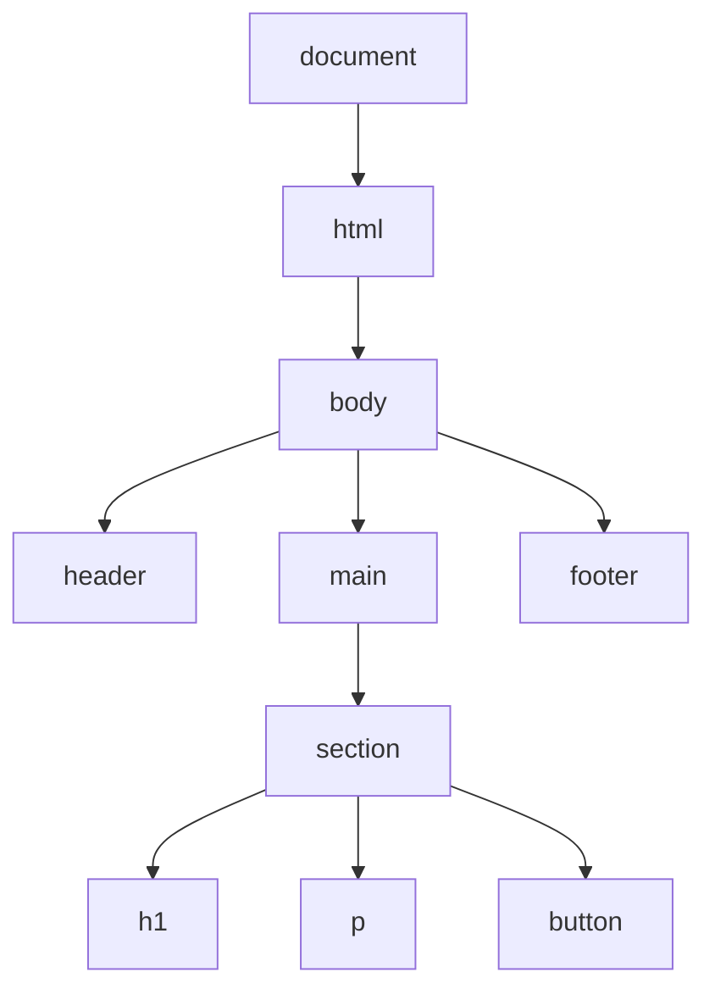
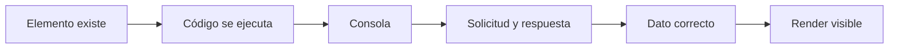

# Clase 03 - Semana 03 - Manipulación del DOM, `fetch`, consumo simple de datos y depuración inicial con agentes

- Unidad 01: Fundamentos y la Web Estática
- Fecha: Miércoles 1 de abril de 2026
- Duración: 3 horas (10:50 - 13:10)
- Modalidad: Presencial en Laboratorio PC
- Docente: Diego Obando

---

# Objetivos de la Clase

## Objetivo General

Al terminar esta clase, el estudiante podrá manipular elementos básicos del DOM, consumir datos simples mediante `fetch`, mostrar resultados en una interfaz inicial y depurar errores frecuentes usando navegador, consola y apoyo responsable de agentes.

## Objetivos Específicos

Al finalizar la sesión, el estudiante será capaz de:

1. Explicar qué es el DOM como representación manipulable de un documento HTML y por qué JavaScript puede leerlo y modificarlo en tiempo de ejecución.
2. Seleccionar, leer y actualizar elementos básicos de una interfaz mediante operaciones simples sobre el DOM, comprendiendo el efecto visible de esos cambios.
3. Reconocer el propósito de `fetch` como mecanismo inicial para solicitar datos y relacionarlo con flujos simples de consumo de información en la web.
4. Integrar respuestas de datos sencillas dentro de una interfaz básica, distinguiendo entre solicitud, respuesta, renderizado y validación.
5. Utilizar consola, lectura de errores y apoyo de agentes para depurar y documentar problemas iniciales sin delegar ciegamente el diagnóstico técnico.

## Competencias Transversales

- Lectura técnica de interfaz viva: entender que una página ya no es solo estructura y estilo, sino también un árbol manipulable y observable.
- Pensamiento secuencial aplicado: relacionar evento, selección de elemento, cambio de estado, solicitud de datos y actualización visible.
- Depuración inicial en herramientas reales: empezar a usar consola, errores de red y observación directa del DOM como parte del trabajo técnico.
- Uso responsable de IA/agentes: apoyarse en agentes para explicar pasos, proponer una primera versión o documentar un flujo, verificando siempre con criterio humano.

---

# BLOQUE 1: El DOM como documento vivo y manipulable

- Duración: 35 minutos
- Objetivo del bloque: comprender que el HTML cargado por el navegador se convierte en una estructura viva llamada DOM, y que JavaScript puede leerla, recorrerla y modificarla para producir cambios visibles en la interfaz.
- Modalidad: expositiva, conversada y con inspección guiada en navegador y DevTools

## Desarrollo

### 1.1 Una página en el archivo no es exactamente la misma página que vive en el navegador

Hasta este punto del módulo ya vimos tres piezas importantes:

- el HTML como estructura del documento;
- el CSS como capa de presentación;
- y JavaScript como capa de comportamiento.

Ahora aparece una pregunta clave:

> si JavaScript va a cambiar algo de la interfaz, ¿sobre qué objeto o estructura está trabajando realmente?

La respuesta es el `DOM`.

`DOM` significa `Document Object Model`, y conviene pensarlo no como una sigla para memorizar, sino como una idea técnica central:

> el navegador toma el documento HTML y lo representa como una estructura manipulable en memoria.

Eso significa que la página ya no es solo un archivo de texto con etiquetas. También es un árbol de nodos y elementos que el navegador puede recorrer, mostrar y actualizar.

Esta distinción es importante porque instala un cambio de nivel:

- el HTML es el documento fuente;
- el DOM es la representación viva con la que JavaScript trabaja.

### 1.2 El DOM se puede leer como una jerarquía

Una forma útil de introducir el DOM es dejar de mirar la página solo como “bloques visibles” y empezar a verla como una estructura jerárquica.

Por ejemplo, una página simple podría leerse así:



Lo importante aquí no es todavía dominar todos los detalles del árbol, sino instalar tres ideas:

1. la página tiene estructura interna;
2. esa estructura se puede inspeccionar;
3. y JavaScript puede apuntar a partes específicas de esa jerarquía.

Cuando un estudiante entiende esto, deja de ver el cambio de interfaz como magia y empieza a verlo como una operación sobre elementos concretos.

### 1.3 El navegador ya ofrece una forma real de mirar ese árbol

Aquí conviene volver a DevTools y reforzar una práctica técnica real:

- abrir una página;
- inspeccionar el panel de elementos;
- reconocer la jerarquía del documento;
- y comprobar que el DOM no es una idea abstracta, sino algo visible dentro de las herramientas.

Esto importa mucho porque el miércoles debe subir la densidad técnica del curso. Ya no basta con hablar de conceptos: hay que empezar a verlos en entorno real.

Al inspeccionar una página, el estudiante puede notar cosas como:

- qué elemento contiene a otro;
- qué `id` o clase tiene un nodo;
- dónde está el botón que luego se quiere seleccionar;
- o qué parte del contenido conviene modificar desde JavaScript.

En otras palabras:

> antes de manipular el DOM con código, conviene aprender a reconocerlo en el navegador.

### 1.4 JavaScript no modifica “la página en general”: modifica elementos concretos del DOM

Cuando un script cambia un texto, oculta una sección o reacciona a un botón, no está actuando sobre una idea difusa de “pantalla”. Está actuando sobre nodos concretos del DOM.

Por eso, antes de enseñar operaciones específicas, el bloque debe dejar clara esta secuencia mental:

1. existe una estructura HTML;
2. el navegador la convierte en DOM;
3. JavaScript identifica un elemento;
4. y luego puede leerlo o modificarlo.

Un ejemplo mínimo de esta lógica podría verse así:

```js
const titulo = document.querySelector("h1");
console.log(titulo);
```

Este código todavía no modifica nada, pero sí instala una idea técnica importante:

- `document` representa el documento cargado;
- `querySelector` busca una parte del DOM;
- y el resultado puede observarse en consola.

Eso es clave porque el miércoles ya no debería quedarse solo en sintaxis. Debe empezar a conectar:

- código;
- estructura real del documento;
- consola;
- y efecto visible posterior.

### 1.5 Qué puede hacer bien un agente aquí y qué sigue siendo validación humana

En este punto, un agente puede ayudar bastante si se usa con criterio.

Puede ayudar a:

- explicar qué significa `document`;
- resumir la diferencia entre HTML y DOM;
- proponer un ejemplo corto con `querySelector`;
- o traducir un árbol HTML a una explicación más legible.

Pero no conviene delegar ciegamente cosas como:

- si el elemento realmente existe en la página;
- si el selector apunta al nodo correcto;
- si el DOM real coincide con la suposición del ejemplo;
- o si la estructura inspeccionada en DevTools respalda lo que dice el agente.

La práctica correcta aquí sigue siendo:

1. entender qué parte de la página se quiere observar;
2. apoyarse en un ejemplo o explicación;
3. abrir DevTools;
4. inspeccionar el DOM real;
5. y recién después afirmar que la lectura es correcta.

Ese hábito es importante porque, a partir de aquí, el estudiante ya no solo “escribe JavaScript”: empieza a trabajar con una interfaz viva y verificable.

### Preguntas guía

- ¿Qué diferencia práctica hay entre el archivo HTML y el DOM que interpreta el navegador?
- ¿Por qué conviene pensar la página como una jerarquía de elementos y no solo como una superficie visual?
- ¿Qué gana un desarrollador cuando mira el DOM primero en DevTools antes de intentar modificar algo con JavaScript?

### Cierre del bloque

- Idea clave: el DOM es la representación viva del documento con la que JavaScript puede trabajar.
- Huella metodológica: un agente puede explicar la lógica del DOM o sugerir un selector inicial, pero la estructura real debe inspeccionarse en el navegador.
- Puente: en el siguiente bloque ya no nos quedaremos solo en el modelo mental; pasaremos a seleccionar elementos concretos, leer su contenido y actualizar la interfaz desde JavaScript.

---

# BLOQUE 2: Seleccionar, leer y modificar elementos

- Duración: 35 minutos
- Objetivo del bloque: aprender a seleccionar elementos concretos del DOM, leer propiedades simples y aplicar cambios visibles en la interfaz mediante operaciones básicas y comprobables desde JavaScript.
- Modalidad: expositiva, demostrativa y con observación guiada en navegador, consola y panel de elementos

## Desarrollo

### 2.1 Manipular una interfaz empieza por saber apuntar al elemento correcto

Una vez entendido que el navegador construye un DOM a partir del HTML, el siguiente paso natural es aprender a encontrar elementos concretos dentro de esa estructura.

Aquí aparece una idea técnica muy importante:

> JavaScript no cambia “la página completa” de una sola vez; trabaja sobre nodos específicos del DOM.

Por eso, antes de modificar algo, hay que saber identificar bien el objetivo.

En esta etapa conviene instalar dos formas iniciales de selección:

- `document.getElementById(...)`
- `document.querySelector(...)`

No hace falta todavía convertir esto en un catálogo de selectores. Lo importante es que el estudiante comprenda el principio:

- primero se ubica el elemento;
- luego se guarda la referencia;
- y recién después se lee o modifica algo.

Un ejemplo inicial:

```js
const titulo = document.getElementById("titulo-principal");
console.log(titulo);
```

Aquí la meta no es que memoricen la línea, sino que entiendan qué está ocurriendo:

- el documento se consulta;
- se obtiene una referencia a un nodo;
- y esa referencia puede inspeccionarse en consola.

### 2.2 Leer un elemento también es parte del trabajo técnico

Antes de cambiar una interfaz, conviene aprender a leerla desde JavaScript.

Esa lectura puede involucrar cosas como:

- el texto que contiene un elemento;
- el valor escrito en un `input`;
- una clase aplicada;
- o un atributo como `src`, `href` o `type`.

Esto es importante porque muchas veces el flujo no empieza cambiando algo, sino comprobando qué hay disponible.

Por ejemplo:

```js
const boton = document.querySelector("button");
console.log(boton.textContent);
```

Y en un formulario:

```js
const correo = document.getElementById("correo");
console.log(correo.value);
```

La idea central aquí es que JavaScript no solo “ordena cambios”. También observa el estado actual de la interfaz.

Eso prepara muy bien el paso siguiente, donde leer y modificar empiezan a trabajar juntos.

### 2.3 Cambiar texto, clases o atributos produce efectos visibles

Una vez que un elemento fue seleccionado correctamente, JavaScript puede actualizarlo.

En esta etapa conviene priorizar cambios simples y muy visibles, por ejemplo:

- cambiar un texto con `textContent`;
- mostrar un mensaje;
- activar o desactivar una clase;
- modificar un atributo;
- o cambiar una imagen o enlace en un caso guiado.

Ejemplo básico:

```js
const mensaje = document.getElementById("estado");
mensaje.textContent = "Formulario enviado";
```

Aquí el aprendizaje importante no es solo la propiedad `textContent`, sino la relación completa:

1. se selecciona un nodo;
2. se cambia una propiedad;
3. y la interfaz muestra un resultado nuevo.

Esto ayuda mucho porque vuelve visible la cadena entre código y pantalla.

Cuando esa relación se vuelve clara, el DOM deja de sentirse abstracto.

### 2.4 La interfaz cambia, pero el criterio sigue estando en elegir bien qué modificar

Uno de los errores más comunes al empezar es modificar cualquier cosa “porque funciona” sin pensar si esa es realmente la parte correcta de la interfaz.

Por eso, este bloque no debería enseñar solo mecánica. También debe enseñar criterio inicial.

Conviene preguntar cosas como:

- ¿este `id` realmente apunta al elemento correcto?
- ¿estoy cambiando el texto que corresponde o un contenedor demasiado amplio?
- ¿conviene cambiar el contenido o una clase CSS?
- ¿el resultado visible ayuda o confunde?

Estas preguntas son importantes porque empiezan a instalar una práctica profesional básica:

> no basta con que el código haga algo; debe hacer exactamente lo que la interfaz necesita.

Aquí también se empieza a notar por qué DevTools, consola y lectura del DOM importan tanto.

### 2.5 Qué puede hacer un agente en este punto y qué no conviene delegar

En esta etapa, un agente puede ser útil para:

- proponer un selector inicial;
- explicar la diferencia entre `getElementById` y `querySelector`;
- sugerir una primera versión de un cambio de texto o clase;
- o resumir qué propiedad conviene usar en un caso simple.

Pero no conviene delegar sin revisar:

- si el elemento existe en la estructura real;
- si el `id` o selector coincide con el HTML del proyecto;
- si el cambio visual quedó bien resuelto;
- o si el script está actuando sobre el nodo correcto y no sobre otro parecido.

La verificación correcta sigue siendo:

1. inspeccionar el DOM;
2. ejecutar el código;
3. mirar la consola;
4. comprobar el cambio visible;
5. y recién después dar el paso por bueno.

Eso es clave porque, desde aquí, ya empezamos a trabajar sobre interfaces vivas y no solo sobre ejemplos de sintaxis.

### Preguntas guía

- ¿Por qué seleccionar bien un elemento es una condición previa para cualquier cambio en la interfaz?
- ¿Qué diferencia hay entre leer una propiedad del DOM y modificarla?
- ¿En qué casos conviene cambiar un texto y en cuáles podría convenir cambiar una clase o un atributo?

### Cierre del bloque

- Idea clave: manipular el DOM empieza por seleccionar bien, leer con criterio y aplicar cambios concretos sobre elementos reales.
- Huella metodológica: un agente puede sugerir selectores o propiedades útiles, pero la validación siempre depende de la estructura real del HTML y del efecto visible en navegador.
- Puente: en el siguiente bloque incorporaremos una fuente externa de información mediante `fetch`, para que la interfaz ya no solo cambie por datos escritos a mano, sino también por respuestas recibidas desde fuera.

---

# BLOQUE 3: `fetch`, respuestas y consumo simple de datos

- Duración: 35 minutos
- Objetivo del bloque: comprender cómo `fetch` permite solicitar datos desde una fuente externa, interpretar respuestas básicas y conectar esa información con cambios visibles en la interfaz.
- Modalidad: expositiva, demostrativa y con lectura guiada de flujo entre navegador, red, consola e interfaz

## Desarrollo

### 3.1 Hasta ahora la interfaz cambia con datos locales; `fetch` abre la puerta a datos externos

En el bloque anterior, la interfaz reaccionaba a cambios producidos con datos ya disponibles en el propio script o en el DOM.

Eso sirve para aprender la lógica base, pero en una aplicación web real aparece una necesidad nueva:

> obtener información que no está escrita directamente en la página.

Ahí entra `fetch`.

`fetch` permite realizar una solicitud desde JavaScript y recibir una respuesta. Esa respuesta puede contener datos que luego se procesan y se muestran en la interfaz.

La idea importante aquí no es memorizar todavía una sintaxis larga, sino comprender el flujo:

1. la interfaz o el script dispara una solicitud;
2. el navegador intenta obtener una respuesta;
3. llegan datos;
4. esos datos se interpretan;
5. y la interfaz se actualiza.

Eso hace que la relación entre JavaScript y la web se vuelva más rica: ya no solo hay comportamiento local, sino también comunicación con información externa.

### 3.2 `fetch` debe leerse como una secuencia, no como una línea mágica

Cuando se presenta por primera vez, `fetch` suele parecer una línea rara o muy compacta. Por eso conviene desarmarlo conceptualmente.

Un ejemplo básico podría verse así:

```js
fetch("https://jsonplaceholder.typicode.com/users/1")
  .then((respuesta) => respuesta.json())
  .then((datos) => {
    console.log(datos);
  });
```

Más que memorizar la forma exacta, lo importante es leer qué está pasando:

- `fetch(...)` intenta obtener algo;
- `respuesta` representa lo que volvió desde la solicitud;
- `respuesta.json()` transforma el contenido a un formato usable;
- y `datos` contiene la información lista para trabajar.

Aquí conviene insistir en una idea técnica muy importante:

> no basta con “hacer fetch”; hay que entender qué etapa de la cadena se está mirando.

Porque los errores pueden aparecer en distintos puntos:

- en la solicitud;
- en la respuesta;
- en la conversión a JSON;
- o en el uso posterior de los datos.

### 3.3 JSON aparece como formato de intercambio inicial

En esta etapa, conviene introducir `JSON` de manera simple y muy aplicada.

No hace falta convertirlo en una clase aislada. Basta con instalar esta idea:

> muchas veces los datos que llegan desde fuera vienen en formato JSON.

JSON se parece bastante a una estructura de objetos y arreglos, por lo que resulta útil para representar información intercambiable entre sistemas.

Por ejemplo:

```json
{
  "id": 1,
  "name": "Leanne Graham",
  "email": "leanne@example.com"
}
```

Lo importante aquí es que el estudiante pueda leer esto no como un bloque decorativo, sino como datos estructurados que luego pueden usarse para:

- mostrar un nombre;
- completar una tarjeta;
- llenar un bloque de texto;
- o verificar en consola si la respuesta tiene la forma esperada.

### 3.4 Consumir datos simples tiene sentido cuando terminan en la interfaz

El bloque no debería quedarse solo en `console.log(datos)`. Eso sirve como primer paso, pero el aprendizaje más valioso aparece cuando esa información se conecta con un elemento real del DOM.

Por ejemplo:

```js
const nombre = document.getElementById("nombre-usuario");

fetch("https://jsonplaceholder.typicode.com/users/1")
  .then((respuesta) => respuesta.json())
  .then((datos) => {
    nombre.textContent = datos.name;
  });
```

Aquí la cadena ya se vuelve mucho más clara:

1. se selecciona un elemento;
2. se hace una solicitud;
3. llegan datos;
4. se toma una propiedad útil;
5. y la interfaz cambia.

Eso es exactamente el tipo de conexión que el miércoles debe instalar:

- red;
- datos;
- JavaScript;
- DOM;
- e interfaz visible.

### 3.5 La depuración empieza a incluir también la pestaña de red y la lectura de respuestas

Con `fetch`, la depuración deja de ser solo “mirar si el selector funcionó”.

Ahora aparecen preguntas nuevas:

- ¿la solicitud realmente salió?
- ¿la URL era correcta?
- ¿hubo respuesta?
- ¿la respuesta tenía el formato esperado?
- ¿el dato que intenté usar realmente existe?

Por eso este bloque ya debe empezar a enlazar:

- consola;
- pestaña `Network`;
- respuesta de la solicitud;
- y validación visual del cambio en la interfaz.

En otras palabras:

> cuando entra `fetch`, la depuración se vuelve más completa porque el problema puede estar en la red, en los datos o en el renderizado.

### 3.6 Qué puede hacer un agente aquí y qué no conviene delegar

En este punto, un agente puede ayudar bastante para:

- explicar la cadena de `fetch` paso a paso;
- proponer un ejemplo inicial con una API simple;
- traducir una respuesta JSON a lenguaje más claro;
- o sugerir cómo llevar un dato puntual a un elemento del DOM.

Pero no conviene delegar ciegamente:

- si la URL responde de verdad;
- si la respuesta contiene los campos esperados;
- si el error viene de red o del renderizado;
- o si el dato llegó bien, pero se está usando mal en el código.

La validación correcta sigue siendo técnica y concreta:

1. revisar la solicitud;
2. mirar la consola;
3. comprobar la respuesta;
4. observar si el DOM cambió como se esperaba;
5. y recién después aceptar la solución.

Aquí ya se siente con claridad el patrón metodológico del curso:

entender, apoyarse, ejecutar, inspeccionar y validar.

### Preguntas guía

- ¿Qué problema nuevo resuelve `fetch` respecto de los ejemplos que solo trabajan con datos locales?
- ¿Por qué conviene leer un flujo de `fetch` por etapas y no como una sola línea “mágica”?
- ¿Qué cambia en la depuración cuando la interfaz depende de datos externos?

### Cierre del bloque

- Idea clave: `fetch` conecta la interfaz con datos externos, pero el valor pedagógico no está solo en “traer algo”, sino en comprender la cadena completa entre solicitud, respuesta, datos y renderizado.
- Huella metodológica: un agente puede explicar el flujo o bosquejar un ejemplo inicial con JSON, pero la validación real depende de consola, red, estructura de respuesta y efecto visible en el DOM.
- Puente: en el siguiente bloque cerraremos uniendo DOM, `fetch` y debugging inicial, para que el estudiante aprenda no solo a hacer que algo funcione, sino también a detectar con criterio dónde se rompe cuando deja de funcionar.

---

# BLOQUE 4: Depuración inicial, documentación y apoyo de agentes

- Duración: 35 minutos
- Objetivo del bloque: integrar selección de elementos, cambios en el DOM y consumo de datos simples dentro de un flujo de depuración inicial, lectura de errores y documentación breve apoyada por agentes.
- Modalidad: expositiva, analítica y con revisión guiada de consola, red y comportamiento observable

## Desarrollo

### 4.1 Cuando algo falla, el problema no siempre está donde creemos

Después de introducir DOM y `fetch`, aparece un cambio importante en la experiencia del estudiante: ahora hay varias partes que pueden romperse.

Por ejemplo, si una interfaz no se actualiza, el problema podría estar en:

- el selector del elemento;
- el evento que nunca se disparó;
- la solicitud `fetch`;
- la respuesta recibida;
- el nombre de la propiedad usada;
- o el renderizado final en la interfaz.

Eso significa que el debugging ya no puede apoyarse solo en intuición o en “probar cosas hasta que funcione”.

Aquí conviene instalar una idea técnica clave:

> depurar no es adivinar. Es aislar etapas y comprobar evidencia.

Ese cambio mental es muy importante porque transforma la relación con el error:

- el error deja de ser una señal de fracaso;
- y pasa a ser una pista dentro de una cadena que puede leerse.

### 4.2 Una ruta de depuración inicial: DOM, consola, red y resultado visible

En esta etapa conviene enseñar una rutina simple, pero profesional, para revisar problemas frecuentes.

Una secuencia sana podría ser esta:

1. comprobar si el elemento del DOM existe;
2. revisar si el evento o la acción realmente se ejecutó;
3. mirar la consola;
4. revisar si `fetch` se disparó y si hubo respuesta;
5. comprobar la estructura del dato recibido;
6. y validar si el cambio visible ocurrió en el nodo correcto.

Esa secuencia ayuda mucho porque obliga a pensar por etapas y no por ansiedad.

Podemos representarlo así:



Lo importante aquí es que el estudiante empiece a reconocer que un mismo síntoma puede tener causas distintas.

### 4.3 La consola ya no es solo apoyo: se vuelve una fuente de evidencia

En clases anteriores la consola apareció como un lugar donde mirar mensajes y confirmar que un script estaba corriendo.

Ahora su rol crece.

La consola permite revisar:

- si una variable contiene lo esperado;
- si el selector devolvió un nodo real o `null`;
- si la respuesta de `fetch` llegó;
- si una propiedad no existe;
- o si una instrucción falló por una razón de sintaxis o de referencia.

Por eso conviene insistir en que la consola no es un espacio “extra”. Es parte del trabajo técnico.

Cuando un estudiante empieza a usarla con criterio, mejora mucho su capacidad de:

- localizar el punto donde se cortó el flujo;
- distinguir entre error de red y error de código;
- y corregir con más precisión.

### 4.4 Documentar un flujo simple también ayuda a entenderlo mejor

Este bloque no debería cerrar solo con debugging. También conviene mostrar que documentar un flujo breve obliga a ordenar la comprensión.

Por ejemplo, un estudiante podría describir un caso simple así:

1. seleccionar el contenedor;
2. hacer `fetch`;
3. convertir la respuesta a JSON;
4. tomar la propiedad `name`;
5. actualizar `textContent`.

Esa pequeña documentación tiene valor porque:

- obliga a secuenciar;
- reduce la sensación de que el código “solo ocurre”;
- y mejora la comunicación técnica.

En un contexto formativo, escribir dos o tres líneas explicando qué hace un flujo puede ser casi tan útil como ejecutarlo, porque revela si realmente fue entendido.

### 4.5 Qué puede hacer un agente aquí y qué no debe reemplazar

Este es probablemente el punto de la clase donde el uso de agentes se vuelve más naturalmente útil.

Un agente puede ayudar a:

- explicar un error de consola;
- resumir qué hace una cadena de `fetch`;
- proponer una hipótesis inicial de debugging;
- ordenar pasos de revisión;
- o ayudar a redactar una documentación breve del flujo.

Pero aquí también aparece uno de los riesgos más claros de delegación excesiva:

el agente puede sonar convincente incluso cuando está diagnosticando sobre una suposición equivocada.

Por eso no conviene delegar sin revisión:

- si el error que menciona coincide realmente con el que aparece;
- si el DOM inspeccionado es el mismo que el código supone;
- si la respuesta de red tiene efectivamente la forma indicada;
- o si la corrección propuesta cambia el problema real por otro distinto.

La práctica correcta sigue siendo:

1. recoger evidencia real;
2. apoyarse en una explicación o hipótesis;
3. contrastarla con consola, red y DOM;
4. ejecutar de nuevo;
5. y recién después afirmar que el problema fue resuelto.

Aquí el patrón metodológico del curso ya queda muy claro:

> entender el sistema, apoyarse en agentes y verificar con criterio.

### 4.6 Lo importante no es solo “hacer que funcione”, sino entender por qué funcionó

El bloque conviene cerrarlo con una idea de madurez técnica inicial.

En programación web, un estudiante puede llegar a una solución por copia, por ensayo, por ayuda de un compañero o por apoyo de un agente.

Pero el aprendizaje real aparece cuando también puede responder preguntas como:

- ¿qué elemento se modificó?
- ¿de dónde vino el dato?
- ¿qué parte del flujo fallaba antes?
- ¿qué evidencia mostró que ya quedó bien?

Ese salto, aunque todavía sea inicial, es muy importante porque prepara muy bien el terreno para lo que viene después en el módulo:

- asincronía más formal;
- módulos;
- APIs;
- y aplicaciones donde la depuración será todavía más necesaria.

### Preguntas guía

- ¿Por qué una interfaz puede fallar aunque el error no esté en la línea que primero sospechamos?
- ¿Qué aporta una rutina de revisión por etapas frente a una estrategia de prueba y error desordenada?
- ¿En qué sentido documentar un flujo simple también mejora la comprensión técnica?

### Cierre del bloque

- Idea clave: depurar una interfaz con DOM y `fetch` exige leer evidencia real en consola, red y estructura del documento, no solo probar cambios al azar.
- Huella metodológica: un agente puede ayudar a explicar, resumir o proponer una hipótesis de debugging, pero el diagnóstico final depende siempre de la evidencia observada en las herramientas reales.
- Puente: con esta clase queda instalada una base suficiente para pasar a JavaScript moderno con más seguridad, porque ahora ya existe una primera relación clara entre estructura, datos, comportamiento y depuración.

---

# Cierre de la Clase

Esta clase marca un punto importante en la progresión del módulo. Hasta ahora JavaScript ya había aparecido como una capa de comportamiento, pero aquí empieza a conectarse de forma visible con una interfaz real y con datos que no están escritos directamente dentro del mismo archivo.

El recorrido de la sesión deja instalada una cadena técnica inicial que conviene recordar con claridad:

- el HTML entrega una estructura base;
- el DOM convierte esa estructura en un documento manipulable;
- JavaScript puede seleccionar nodos, leerlos y modificarlos;
- `fetch` permite traer datos desde fuera;
- y la depuración ayuda a comprobar dónde se rompió el flujo cuando algo no funciona como se esperaba.

En otras palabras, la interfaz ya no debe entenderse solo como una maqueta visible. Empieza a comportarse como un sistema donde estructura, datos, comportamiento y evidencia técnica se conectan entre sí.

También queda instalada una metodología de trabajo que será cada vez más importante en las semanas siguientes:

1. entender qué parte del sistema se quiere observar o modificar;
2. apoyarse en herramientas y agentes para explorar, explicar o proponer una primera solución;
3. verificar el resultado real en navegador, consola, red y DOM;
4. y corregir con criterio en vez de improvisar cambios al azar.

Esa lógica importa porque, a medida que el curso avance, el estudiante va a trabajar con código más denso, asincronía más formal, módulos, promesas, manejo de errores y flujos donde ya no bastará con “probar hasta que funcione”.

Si esta clase queda bien comprendida, ya existe una base sólida para dar el siguiente paso del módulo: entrar a JavaScript moderno con más seguridad, leyendo mejor el comportamiento del código, entendiendo cómo se organiza y enfrentando ES6+, módulos, asincronía, promesas y manejo de errores con menos intuición ciega y más criterio técnico.
