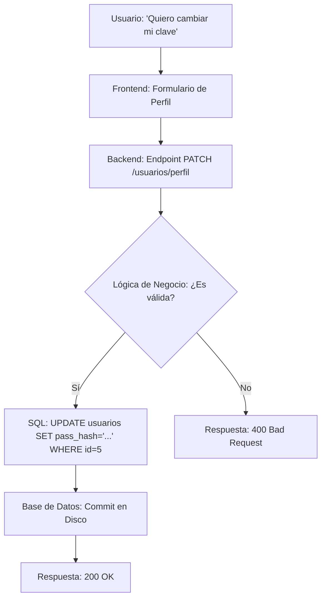

# Clase 02 - Semana 07 - SQL inicial: DDL, DML, consultas básicas y operaciones CRUD

- Unidad 02: Frontend Moderno, APIs y Legado
- Fecha: Martes 28 de abril de 2026
- Duración: 3 horas (10:50 - 13:10)
- Modalidad: Presencial en Laboratorio PC
- Docente: Diego Obando

---

# Objetivos de la Clase

## Objetivo General

Al finalizar esta sesión, el estudiante será capaz de interactuar con bases de datos relacionales utilizando el lenguaje SQL estándar, diferenciando con precisión entre la definición de estructuras y la manipulación de datos para gestionar la persistencia profesional en aplicaciones web.

## Objetivos Específicos

1.  **Diferenciar los sub-lenguajes de SQL**, identificando cuándo utilizar DDL (*Data Definition Language*) para estructurar datos y DML (*Data Manipulation Language*) para gestionar el contenido.
2.  **Construir esquemas de datos sólidos**, creando y modificando tablas mediante el uso correcto de tipos de datos y restricciones de integridad.
3.  **Ejecutar el ciclo CRUD completo**, implementando operaciones de Creación, Lectura, Actualización y Eliminación de registros con rigor técnico.
4.  **Validar técnicamente el código SQL generado por asistentes de IA**, supervisando la sintaxis, la seguridad y la coherencia del modelo antes de su ejecución en entornos reales.

## Competencias Transversales

- **Integridad de Datos:** valorar el impacto de las restricciones de base de datos en la calidad y consistencia de la información.
- **Pensamiento Estructurado:** diseñar modelos de persistencia que respondan fielmente a los requerimientos de la lógica de negocio.
- **Validación Crítica:** aplicar el juicio técnico para supervisar y corregir la generación automatizada de consultas SQL.

---

# BLOQUE 1: Definiendo el Contenedor - DDL (Data Definition Language)

- **Duración:** 35 minutos
- **Objetivo del bloque:** comprender la arquitectura del modelo relacional y dominar la definición de estructuras mediante DDL, priorizando la integridad técnica y el hardening (endurecimiento) de la base de datos desde su origen.
- **Modalidad:** Exposición técnica, análisis de anatomía de comandos y demostración de código.

## Desarrollo

### 1.1 El Modelo Relacional: Más allá de las tablas
Para entender DDL, primero debemos comprender que no estamos creando "listas". Estamos definiendo **entidades** y sus **atributos** dentro de un sistema relacional.
- **La Tupla (Fila):** Representa una instancia única de la entidad.
- **El Atributo (Columna):** Define una propiedad específica y su dominio (tipo de dato).
- **El Contrato Estructural:** A diferencia de NoSQL, en el mundo relacional el esquema es **estricto**. Si el dato no cumple con el plano, la base de datos lo rechaza. Esto garantiza que el Backend siempre reciba datos con la forma esperada.

### 1.2 Anatomía Técnica de `CREATE TABLE`
Un comando de creación profesional es una declaración de intenciones técnicas. Analicemos los componentes de un esquema de alta disponibilidad:

```sql
-- Caso de Estudio: Tabla de Gestión de Sesiones de Usuario
CREATE TABLE sesiones_seguras (
    id INT AUTO_INCREMENT,                    -- Identificador interno (Surrogate Key)
    token_uuid CHAR(36) NOT NULL,             -- Identificador público único (UUID v4)
    usuario_id INT NOT NULL,                  -- Referencia a otra entidad
    direccion_ip VARCHAR(45) NOT NULL,        -- Soporte para IPv4 e IPv6
    user_agent TEXT,                          -- Información del navegador/dispositivo
    ultima_actividad TIMESTAMP DEFAULT CURRENT_TIMESTAMP ON UPDATE CURRENT_TIMESTAMP,
    es_valida BOOLEAN DEFAULT TRUE,
    
    -- Restricciones de Integridad
    PRIMARY KEY (id),
    UNIQUE (token_uuid),
    INDEX (usuario_id)                        -- Optimización para búsquedas frecuentes
) ENGINE=InnoDB DEFAULT CHARSET=utf8mb4;      -- Configuración de motor y codificación
```

### 1.3 Densidad Técnica: Tipos de Datos y su Almacenamiento
Elegir el tipo de dato no es solo una cuestión de "qué cabe", sino de **rendimiento y almacenamiento**:
- **CHAR vs VARCHAR:** `CHAR(36)` reserva espacio fijo (ideal para UUIDs o códigos fijos), mientras que `VARCHAR` usa solo lo necesario más 1 byte de longitud. El uso incorrecto de `VARCHAR` en campos fijos penaliza el rendimiento de indexación.
- **INT, BIGINT y SMALLINT:** No uses `BIGINT` (8 bytes) si un `SMALLINT` (2 bytes, hasta 32,767) es suficiente. En millones de registros, esta diferencia es crítica para el uso de memoria RAM del servidor.
- **DECIMAL(p, s):** Fundamental para precisión. El primer número (p) es el total de dígitos y el segundo (s) los decimales. Ej: `DECIMAL(10,2)` puede guardar hasta `99,999,999.99`.

### 1.4 Restricciones: Las Reglas de Oro de la Consistencia
Las restricciones (`Constraints`) son guardias que trabajan 24/7 sin importar quién intente insertar los datos:
1.  **PRIMARY KEY:** Garantiza que no existan dos registros idénticos. Es la base de la integridad física.
2.  **NOT NULL:** Nuestra principal defensa contra los `NullPointerException` en el Backend. Obligamos a que la realidad del dato sea completa.
3.  **UNIQUE:** Previene duplicidad lógica (ej: no pueden haber dos usuarios con el mismo correo electrónico).
4.  **CHECK (MySQL 8.0+):** Permite validar rangos a nivel de base de datos. Ej: `CHECK (edad >= 18)`.

### 1.5 Eje de Cybersecurity: Hardening Estructural
En este curso, la seguridad no es un parche, es un cimiento. Al usar DDL aplicamos:
- **Reducción de Superficie de Ataque:** Si una columna no es estrictamente necesaria para el negocio, no se crea. Menos datos = Menos riesgo.
- **Ofuscación por Diseño:** No nombres tablas con prefijos obvios si el sistema es crítico, pero mantén la semántica profesional.
- **Pre-validación de Inyección:** Al definir tipos de datos estrictos (ej: `INT`), la base de datos actúa como un firewall de tipos. Si un atacante intenta inyectar `' OR 1=1 --` en un campo `INT`, la base de datos abortará la operación antes de que toque la lógica de negocio.
- **Codificación Segura (`utf8mb4`):** Previene ataques de truncamiento de caracteres y asegura soporte total para seguridad moderna (emojis, caracteres especiales de seguridad).

### 1.6 Evolución y Riesgo: `ALTER` y `DROP`
- **Mantenimiento:** `ALTER TABLE` permite añadir columnas de auditoría o cambiar longitudes sin detener el servicio.
- **El Comando Atómico de Destrucción:** `DROP TABLE` es irreversible. En entornos profesionales, este comando nunca se ejecuta manualmente en producción; se hace mediante scripts de migración controlados y con respaldos previos.

## Producto o evidencia del bloque
- Diseñar el esquema DDL para una tabla `transacciones` que incluya montos, fechas, estados y referencias de seguridad.
- Justificar la elección de `VARCHAR` vs `TEXT` para una columna de `comentarios`.

## Huella metodológica IA/agentes
El agente suele ser "perezoso" con los tipos de datos, usando `VARCHAR(255)` para todo por defecto.
- **Tu Criterio:** Debes forzar al agente a ser preciso. Si un código de país tiene 3 letras, usa `CHAR(3)`. Si una descripción es corta, usa `VARCHAR(150)`. 
- **Validación Humana:** El agente puede olvidar las cláusulas de codificación o motor (`ENGINE=InnoDB`). Es tu responsabilidad añadirlas para asegurar que la base de datos soporte transacciones seguras.

---

# BLOQUE 2: Poblando el Mundo - DML (Data Manipulation Language)

- **Duración:** 35 minutos
- **Objetivo del bloque:** dominar las operaciones de manipulación de datos (DML) para gestionar el ciclo de vida de la información, aplicando criterios de precisión técnica y estrategias de borrado seguro para garantizar la auditabilidad del sistema.
- **Modalidad:** Análisis de flujo de datos, demostración de manipulación y casos de estudio de integridad.

## Desarrollo

### 2.1 DML: El Dinamismo de la Información
Si DDL definió el escenario, DML es la obra en ejecución. Este sub-lenguaje permite interactuar con los registros de las tablas. En el desarrollo de aplicaciones para Internet, la mayoría de nuestras interacciones desde el Backend serán sentencias DML. 
- **Atomicidad:** Cada operación DML debe ser precisa. Un error aquí no rompe el "contenedor" (la tabla), pero puede corromper o destruir la "verdad" (los datos).

### 2.2 Inserción Profesional: `INSERT INTO`
No todas las inserciones son iguales. En entornos de producción, la claridad supera a la brevedad.

**Anatomía de una inserción segura:**
```sql
-- Mala práctica: Inserción posicional (depende del orden de DDL)
-- INSERT INTO sesiones_seguras VALUES (1, 'uuid-123', 5, '192.168.1.1', ...);

-- Buena práctica: Inserción con especificación de columnas (Explícita)
INSERT INTO sesiones_seguras (token_uuid, usuario_id, direccion_ip, user_agent)
VALUES ('550e8400-e29b-41d4-a716-446655440000', 101, '186.10.250.40', 'Mozilla/5.0...');

-- Optimización: Inserción múltiple (Bulk Insert)
INSERT INTO sesiones_seguras (token_uuid, usuario_id, direccion_ip)
VALUES 
    ('uuid-001', 102, '192.168.1.10'),
    ('uuid-002', 103, '192.168.1.11'),
    ('uuid-003', 104, '192.168.1.12');
```
**Punto clave:** Al nombrar las columnas, nuestro código es inmune a cambios futuros en el orden de la tabla (resiliencia técnica).

### 2.3 `UPDATE`: El Poder y la Responsabilidad del `WHERE`
El comando `UPDATE` permite modificar registros existentes. Es una herramienta poderosa pero extremadamente peligrosa.

```sql
-- Escenario: Invalidar una sesión sospechosa
UPDATE sesiones_seguras 
SET es_valida = FALSE, 
    ultima_actividad = CURRENT_TIMESTAMP 
WHERE token_uuid = '550e8400-e29b-41d4-a716-446655440000';
```
**Advertencia de Seguridad:** Ejecutar un `UPDATE` sin la cláusula `WHERE` aplicará el cambio a **todos** los registros de la tabla. En la industria, esto se conoce como un "desastre de nivel 1". **Regla de oro:** Siempre escribe el `WHERE` antes que el `SET`.

### 2.4 `DELETE` vs `TRUNCATE`: Destrucción Controlada
Existen dos formas de eliminar datos, con implicancias técnicas muy distintas:
- **`DELETE`:** Borra filas una por una. Es una operación transaccional, genera logs de recuperación y permite usar `WHERE`.
- **`TRUNCATE`:** Es un comando DDL encubierto. Vacía la tabla por completo "tirando" el espacio de datos y recreándolo. Es mucho más rápido pero **no se puede deshacer** y no permite filtros.

### 2.5 Eje de Cybersecurity: El "Soft Delete" (Borrado Lógico)
En sistemas modernos, especialmente en banca, salud o aplicaciones gubernamentales, **nunca borramos datos realmente**.
- **El Riesgo del Hard Delete (`DELETE`):** Si un atacante borra registros, la información desaparece. Además, perdemos la trazabilidad (¿quién borró qué y cuándo?).
- **La Estrategia de Soft Delete:** En lugar de `DELETE`, usamos un `UPDATE`.
  
**Implementación Técnica:**
1. Añadimos una columna `eliminado_en TIMESTAMP NULL`.
2. Para "borrar", ejecutamos: `UPDATE usuarios SET eliminado_en = NOW() WHERE id = 5;`.
3. Para consultar datos vivos: `SELECT * FROM usuarios WHERE eliminado_en IS NULL;`.

**Ventajas:**
- **Auditabilidad:** El dato sigue ahí para auditorías legales o forenses.
- **Recuperación Instantánea:** Si el borrado fue un error o un ataque, restaurar el dato es un simple `UPDATE`.

### 2.6 Integridad y Sanitización DML
A nivel de ciberseguridad, el DML es el blanco principal de la **Inyección SQL**. Aunque la base de datos define los tipos, el atacante intentará enviar "payloads" maliciosos a través de las variables que usamos en nuestras sentencias `INSERT` o `UPDATE`.
- **Fundamento:** La base de datos es el último filtro, pero la aplicación (Backend) debe ser el primero.

## Producto o evidencia del bloque
- Crear un script DML para poblar una tabla de `compras` con 5 registros coherentes.
- Explicar la diferencia de rendimiento y seguridad entre un `DELETE` masivo y un `TRUNCATE`.
- Proponer una estructura de columnas para implementar un sistema de "Soft Delete" en una tabla de `comentarios`.

## Huella metodológica IA/agentes
El agente es ideal para generar **Datos Sintéticos** (registros de prueba que parecen reales).
- **Tu misión:** Pedir al agente que genere un set de datos (`INSERT INTO`) que cubra casos de borde: nombres con tildes, correos electrónicos largos, fechas pasadas y futuras.
- **Validación Humana:** Verifica que el agente no intente insertar valores que violen las restricciones de `UNIQUE` o `NOT NULL` que definimos en el Bloque 1. La IA no conoce el estado actual de tu base de datos, solo la estructura que le proporcionaste.

---

# BLOQUE 3: Consultando con Propósito - DQL Básico (Data Query Language)

- **Duración:** 35 minutos
- **Objetivo del bloque:** dominar la recuperación selectiva de información mediante el sub-lenguaje DQL, aplicando filtros lógicos complejos y criterios de optimización para reducir la exposición de datos innecesarios y mejorar el rendimiento del sistema.
- **Modalidad:** Análisis de consultas, construcción de filtros avanzados y auditoría de exposición de datos.

## Desarrollo

### 3.1 DQL: El Arte de Preguntar a la Base de Datos
DQL es el sub-lenguaje más utilizado en el día a día de un desarrollador. Mientras que DDL y DML gestionan la estructura y el contenido, DQL es el encargado de **extraer valor** de la información. Una consulta bien escrita no solo trae datos; los trae de forma eficiente, segura y lista para ser consumida por el Frontend.

### 3.2 La Anatomía de la Consulta y el Pecado del `SELECT *`
En el desarrollo profesional, existe una regla de oro: **Nunca uses `SELECT *` en código de producción.**

```sql
-- Mala Práctica (Antipatrón): Trae todas las columnas, incluso las sensibles o pesadas.
-- SELECT * FROM usuarios WHERE id = 10;

-- Buena Práctica: Selección Explícita de Columnas
SELECT nombre, apellido, correo_electronico, perfil_publico 
FROM usuarios 
WHERE id = 10;
```

**Razones técnicas para evitar el asterisco:**
1.  **Rendimiento:** Traer columnas innecesarias (como un `TEXT` largo o un `BLOB`) consume memoria RAM en el servidor y ancho de banda en la red.
2.  **Mantenibilidad:** Si la estructura de la tabla cambia en el futuro, tu aplicación podría recibir datos inesperados que rompan la lógica del Backend.
3.  **Seguridad (Data Leakage):** Evitas enviar accidentalmente campos sensibles (como `password_hash`, `token_reset` o `secret_key`) hacia capas externas.

### 3.3 Filtrado de Precisión con `WHERE`
La cláusula `WHERE` no es solo para comparar igualdades. Es un motor de reglas potente que permite segmentar la información con rigor.

- **Comparadores de Rango y Conjunto:**
  - `BETWEEN`: Ideal para fechas y montos. `WHERE precio BETWEEN 100 AND 500`.
  - `IN`: Para buscar coincidencias dentro de una lista. `WHERE estado IN ('activo', 'pendiente', 'en_revision')`.
  - `LIKE`: Búsqueda de patrones de texto. `%` representa cualquier cadena de caracteres. `WHERE email LIKE '%@aiep.cl'`.

- **La Lógica del `NULL`:**
  En SQL, `NULL` no es un valor, es la **ausencia de valor**. Por lo tanto, no se puede comparar con `=`.
  - **Correcto:** `WHERE eliminado_en IS NULL`.
  - **Incorrecto:** `WHERE eliminado_en = NULL` (esta consulta siempre retornará vacío).

### 3.4 Composición Lógica y Precedencia
Cuando combinamos múltiples condiciones con `AND` y `OR`, el orden de los factores **sí altera el producto**.

```sql
-- Escenario: Buscar productos en oferta de la categoría 'Tecnología' o 'Hogar'
SELECT nombre, precio 
FROM productos 
WHERE (categoria = 'Tecnologia' OR categoria = 'Hogar') 
  AND stock > 0 
  AND precio_oferta IS NOT NULL;
```
**Importancia de los Paréntesis:** Sin ellos, SQL podría evaluar el `AND` antes que el `OR`, entregando resultados lógicamente incorrectos que podrían exponer productos sin stock de una categoría específica.

### 3.5 Ordenamiento y Control de Volumen (UI/UX)
La base de datos debe entregar los datos preparados para la interfaz de usuario.
- **`ORDER BY`:** Ordena los resultados de forma ascendente (`ASC`) o descendente (`DESC`). Un sistema profesional siempre ordena sus datos (ej: por fecha de creación).
- **`LIMIT`:** Es vital para la **Paginación**. Nunca permitas que una API retorne miles de registros de golpe; esto puede causar un ataque de Denegación de Servicio (DoS) por agotamiento de memoria.

### 3.6 Eje de Cybersecurity: Prevención de Data Leakage (Fuga de Datos)
El DQL es el lugar donde aplicamos el **Principio de Exposición Mínima**:
1.  **Filtrado de Campos Sensibles:** Asegúrate de que tus consultas `SELECT` actúen como un firewall, seleccionando solo los campos que el usuario tiene permiso de ver.
2.  **Control de Errores:** No permitas que los errores de sintaxis de DQL se filtren al Frontend. Un error mal manejado puede revelar nombres de tablas, columnas o la versión del motor de base de datos a un atacante.
3.  **Auditabilidad:** En consultas críticas, es buena práctica filtrar siempre por el estado de `Soft Delete` (visto en el Bloque 2) para asegurar que no se expongan datos que legalmente deberían estar "borrados".

## Producto o evidencia del bloque
- Escribir una consulta DQL que recupere el nombre y el correo de los usuarios que no han verificado su cuenta y que se registraron hace más de 30 días.
- Explicar por qué `SELECT COUNT(*)` es preferible a `SELECT *` cuando solo necesitamos saber cuántos registros cumplen una condición.

## Huella metodológica IA/agentes
El agente es un traductor excelente de lenguaje natural a SQL, pero tiende a ser "generoso" con los datos.
- **Tu misión:** Cuando pidas una consulta a la IA, audita inmediatamente el `SELECT`. Si la IA incluyó un `*`, **cámbialo manualmente** por las columnas específicas necesarias.
- **Validación Humana:** El agente puede proponer consultas que no utilicen índices (visto en Bloque 1), lo que causaría lentitud. Tú debes asegurar que los filtros del `WHERE` coincidan con las columnas indexadas de la tabla.

---

# BLOQUE 4: Integración CRUD y Metodología Agentic

- **Duración:** 35 minutos
- **Objetivo del bloque:** integrar las operaciones DDL, DML y DQL en un ciclo de vida CRUD completo, utilizando metodologías de ingeniería asistida por IA para acelerar el desarrollo bajo un marco de validación técnica y seguridad de privilegios.
- **Modalidad:** Taller de integración, análisis de flujos y diseño asistido.

## Desarrollo

### 4.1 La Matriz CRUD: El Puente entre Web y Datos
El ciclo **CRUD** (Create, Read, Update, Delete) es el lenguaje universal de las aplicaciones de internet. Como desarrolladores, nuestra tarea es mapear las acciones del usuario (HTTP) hacia operaciones precisas en la base de datos (SQL).

| Acción UI | Verbo HTTP | Operación SQL | Tipo de Lenguaje |
|-----------|------------|---------------|------------------|
| Registrar | POST       | INSERT        | DML              |
| Listar    | GET        | SELECT        | DQL              |
| Editar    | PUT/PATCH  | UPDATE        | DML              |
| Eliminar  | DELETE     | UPDATE/DELETE | DML              |

### 4.2 Flujo de Datos Profesional
A continuación, se presenta cómo viaja la información desde la intención del usuario hasta la persistencia física:



### 4.3 Eje de Cybersecurity: El Principio de Menor Privilegio (Least Privilege)
Un error crítico en el desarrollo junior es conectar la aplicación a la base de datos usando el usuario `root` o `admin`.
- **El Riesgo:** Si tu aplicación tiene una vulnerabilidad de inyección, un atacante con privilegios de `root` podría ejecutar un `DROP DATABASE` o leer archivos del sistema operativo.
- **La Solución:** Crear usuarios de base de datos específicos para la aplicación con permisos restringidos.
  - El usuario `web_app` solo debe tener permisos de `SELECT`, `INSERT` y `UPDATE` en tablas específicas.
  - El permiso de `DROP` o `TRUNCATE` debe estar prohibido para la cuenta que usa el Backend en producción.

### 4.4 Metodología Agentic: De la Especificación a la Realidad
En 2026, no escribimos todo el SQL a mano, pero sí lo **gobernamos**. El flujo profesional con agentes es:
1.  **Contexto:** Entregar al agente el DDL de nuestras tablas.
2.  **Intención:** "Necesito una consulta que me entregue el ranking de ventas del mes".
3.  **Inspección:** Leer el código generado buscando `SELECT *` u omisiones de `WHERE`.
4.  **Prueba:** Ejecutar en un entorno de desarrollo antes de tocar datos reales.

### 4.5 Desafío de Integración: El "Saber Ver"
Imagina que un agente te entrega este código para "Cerrar una cuenta de usuario":
```sql
UPDATE usuarios SET estado = 'inactivo'; -- ¡FALTA EL WHERE!
```
Tu **criterio técnico** es lo único que separa una operación exitosa de un borrado masivo de la base de datos de la empresa.

## Producto o evidencia del bloque
- Diagramar el flujo CRUD para un sistema de "Carrito de Compras".
- Identificar qué permisos mínimos necesitaría un usuario de base de datos para un panel de "Solo Lectura" de estadísticas.

---

# Cierre de la Clase

## Síntesis Final
- **Estructura (DDL):** Definimos el contrato de datos con tipos estrictos y restricciones para garantizar el Hardening.
- **Manipulación (DML):** Gestionamos el ciclo de vida, prefiriendo el *Soft Delete* para mantener la auditabilidad y seguridad.
- **Extracción (DQL):** Consultamos con precisión, evitando el `SELECT *` y paginando los resultados para proteger el rendimiento.
- **Seguridad Transversal:** La base de datos es nuestra última línea de defensa. La validación de tipos y el control de privilegios son innegociables.

## Preguntas de Salida
1. ¿Por qué es preferible un `VARCHAR(100)` sobre un `TEXT` para un nombre de usuario desde el punto de vista de la seguridad?
2. ¿Cuál es el peligro de realizar un `UPDATE` sin la cláusula `WHERE`?
3. Si un agente de IA te sugiere usar `SELECT *`, ¿cuál es tu responsabilidad técnica como desarrollador?
4. ¿Qué ventaja ofrece el *Soft Delete* frente a una auditoría de ciberseguridad?

## Próximo Paso
En la sesión de mañana, subiremos el nivel de complejidad: **Seguridad Avanzada, Validación y Prevención de Inyección SQL**. Aprenderemos cómo blindar definitivamente nuestra capa de datos contra los ataques más comunes de la web.


