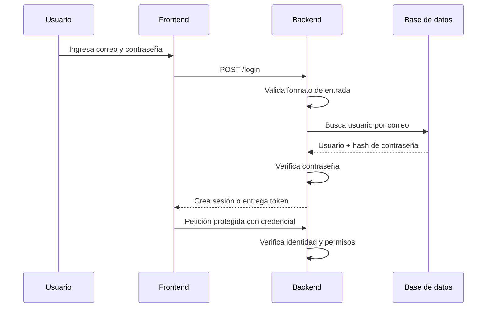

# Clase 03 - Semana 07 - Seguridad aplicada: validación de entradas, autenticación básica y manejo de errores

- **Unidad:** 02 · Frontend Moderno, APIs y Legado
- **Fecha:** Miércoles 29 de abril de 2026
- **Duración:** 3 horas (10:50 - 13:10)
- **Modalidad:** Presencial en Laboratorio PC
- **Docente:** Diego Obando

---

# Objetivos de la Clase

## Objetivo General

Al finalizar esta sesión, el estudiante será capaz de aplicar controles básicos de seguridad en una aplicación web conectada a base de datos, validando entradas, reduciendo la exposición de errores, reconociendo riesgos de inyección SQL y diferenciando autenticación básica de autorización para proteger operaciones comunes de una aplicación web.

## Objetivos Específicos

1. **Validar entradas de usuario en frontend y backend**, diferenciando entre validaciones orientadas a experiencia de usuario y controles obligatorios del servidor.
2. **Reconocer patrones básicos de inyección SQL**, identificando por qué concatenar datos de usuario dentro de consultas puede comprometer la integridad y confidencialidad de la base de datos.
3. **Aplicar criterios iniciales de autenticación y autorización**, distinguiendo identidad, sesión, permisos mínimos y acceso a recursos protegidos.
4. **Diseñar respuestas de error más seguras**, evitando filtrar detalles internos como nombres de tablas, consultas SQL, stack traces, versiones o información sensible.
5. **Usar agentes de IA como apoyo de revisión de seguridad**, solicitando auditorías, casos de prueba y mejoras, pero validando manualmente el alcance, las consultas, los permisos y los datos expuestos.

## Competencias Transversales

- **Criterio de ciberseguridad:** comprender que una aplicación funcional puede seguir siendo vulnerable si no controla entradas, permisos y errores.
- **Pensamiento defensivo:** anticipar usos incorrectos, datos malformados, abuso de formularios y exposición accidental de información.
- **Validación crítica con IA:** aprovechar agentes para detectar riesgos o generar pruebas, sin delegar la decisión técnica ni la ejecución sobre datos reales.

---

# BLOQUE 1: La entrada es la primera frontera de seguridad

- **Duración:** 35 minutos
- **Objetivo del bloque:** comprender que todo dato recibido desde un formulario, una URL, una API o un cliente externo debe considerarse no confiable hasta ser validado por el servidor.
- **Modalidad:** explicación técnica guiada, lectura de ejemplos, contraste entre validación de frontend y backend, y análisis de errores comunes.

## Desarrollo

### 1.1 Una aplicación que funciona no necesariamente es segura

Después de trabajar con SQL inicial, ya sabemos que una aplicación web puede crear, leer, actualizar y eliminar datos. El siguiente paso es entender que una operación CRUD correcta desde el punto de vista funcional puede seguir siendo peligrosa si acepta cualquier entrada sin control.

Un formulario puede parecer simple: nombre, correo, contraseña, precio, comentario o estado. Pero cada campo es también una posible puerta de entrada para datos inválidos, malformados o directamente maliciosos.

Ejemplos frecuentes:

- un campo `precio` que recibe texto en vez de número;
- un campo `correo` que no tiene formato de correo;
- un campo `comentario` con miles de caracteres innecesarios;
- un `id` negativo o inexistente enviado por URL;
- un formulario que permite cambiar el `usuario_id` desde el frontend;
- un campo oculto que el estudiante cree seguro, pero que cualquier persona puede modificar desde DevTools.

La regla profesional es directa: **el frontend puede ayudar a guiar al usuario, pero no puede ser la frontera final de seguridad**.

### 1.2 Validación de frontend vs validación de backend

La validación del frontend mejora la experiencia de usuario. Permite mostrar mensajes rápidos, evitar envíos incompletos y orientar el formato esperado. Sin embargo, el navegador pertenece al usuario: puede inspeccionarse, modificarse, automatizarse o saltarse completamente.

Por eso, una aplicación segura valida dos veces, pero con responsabilidades distintas:

| Capa | Propósito | Límite |
|------|-----------|--------|
| Frontend | Guiar al usuario y prevenir errores simples antes del envío. | No es confiable como control de seguridad definitivo. |
| Backend | Decidir si el dato puede entrar al sistema. | Debe aplicar reglas aunque el frontend falle o sea manipulado. |
| Base de datos | Rechazar datos incompatibles con el contrato estructural. | No debe ser la primera ni única defensa. |

Un ejemplo simple:

```html
<input
  type="email"
  name="correo"
  required
  maxlength="120"
/>
```

Ese HTML ayuda, pero no garantiza seguridad. Una persona puede enviar una petición manual con `curl`, Postman, DevTools o un script. Por eso el backend debe volver a validar:

```js
function validarCorreo(correo) {
  if (typeof correo !== "string") return false;
  if (correo.length > 120) return false;
  return /^[^\s@]+@[^\s@]+\.[^\s@]+$/.test(correo);
}
```

La idea no es duplicar trabajo sin sentido. La idea es separar funciones:

- el frontend mejora la interacción;
- el backend protege la aplicación;
- la base de datos preserva la integridad final.

### 1.3 Qué significa validar una entrada

Validar no es solo preguntar si un campo viene vacío. Una validación útil revisa varias dimensiones del dato:

1. **Presencia:** el campo obligatorio existe.
2. **Tipo:** el valor tiene la forma técnica esperada: texto, número, booleano, fecha.
3. **Formato:** el valor cumple una estructura: correo, teléfono, código, RUT, slug, UUID.
4. **Longitud:** el valor no es absurdamente corto ni excesivamente largo.
5. **Rango:** el número o fecha está dentro de límites razonables.
6. **Dominio permitido:** el valor pertenece a una lista válida: `pendiente`, `pagado`, `cancelado`.
7. **Regla de negocio:** el dato tiene sentido dentro del sistema: un usuario no puede editar una compra ajena.

Ejemplo aplicado a un formulario de compras:

```js
function validarCompra(input) {
  const errores = [];

  if (!Number.isInteger(input.usuarioId) || input.usuarioId <= 0) {
    errores.push("El usuario no es válido.");
  }

  if (typeof input.total !== "number" || input.total <= 0) {
    errores.push("El total debe ser un número positivo.");
  }

  if (!["pendiente", "pagado", "cancelado"].includes(input.estado)) {
    errores.push("El estado enviado no está permitido.");
  }

  return errores;
}
```

Este tipo de validación reduce errores técnicos, pero también reduce superficie de ataque. Si el sistema solo acepta estados conocidos, tipos correctos y rangos razonables, tiene menos posibilidades de procesar basura como si fuera información válida.

### 1.4 Normalizar, sanitizar y validar no son lo mismo

En seguridad aplicada conviene distinguir tres acciones que suelen mezclarse:

| Acción | Qué hace | Ejemplo |
|--------|----------|---------|
| Normalizar | Ajusta el dato a una forma consistente. | Convertir un correo a minúsculas. |
| Sanitizar | Limpia o escapa contenido peligroso según contexto. | Escapar HTML antes de mostrar un comentario. |
| Validar | Decide si el dato se acepta o se rechaza. | Rechazar un correo sin `@`. |

Ejemplo:

```js
const correoNormalizado = correo.trim().toLowerCase();
```

Eso normaliza, pero no valida. Todavía hay que comprobar si realmente parece un correo.

Otro ejemplo:

```js
const nombre = input.nombre.trim();

if (nombre.length < 2 || nombre.length > 80) {
  throw new Error("Nombre inválido.");
}
```

Eso valida longitud, pero no necesariamente sanitiza para todos los contextos. Si el nombre se va a mostrar en HTML, insertar en SQL o guardar en logs, cada contexto exige una protección distinta.

Un error común es pensar que una sola función de “limpieza” vuelve seguro todo el sistema. En realidad, la seguridad depende del contexto:

- para SQL, se usan consultas parametrizadas;
- para HTML, se escapa salida;
- para JSON, se controla estructura y tipos;
- para logs, se evita registrar secretos;
- para autenticación, se evita confiar en datos enviados por el cliente.

### 1.5 Eje de ciberseguridad: no confiar en campos del cliente

Un caso especialmente peligroso aparece cuando el backend acepta campos que no debería aceptar desde el frontend.

Ejemplo inseguro:

```json
{
  "producto_id": 10,
  "cantidad": 2,
  "usuario_id": 7,
  "estado": "pagado"
}
```

El problema no es que el JSON sea inválido. El problema es que entrega demasiado poder al cliente. Si el backend permite que el frontend decida `usuario_id` o `estado`, una persona podría intentar comprar a nombre de otro usuario o marcar una compra como pagada sin pasar por la regla real del sistema.

Una versión más segura separa datos enviados por el usuario y datos decididos por el servidor:

```json
{
  "producto_id": 10,
  "cantidad": 2
}
```

Luego el backend decide:

- quién es el usuario autenticado;
- qué precio real tiene el producto;
- qué estado inicial corresponde;
- si hay stock disponible;
- si la operación está autorizada.

La validación no consiste solo en revisar formato. También consiste en impedir que el cliente controle decisiones que pertenecen al servidor.

### 1.6 Huella metodológica IA/agentes

Un agente puede ayudar mucho en esta etapa si se usa con una especificación clara. Puede proponer validaciones, detectar campos peligrosos, generar casos de prueba y sugerir límites razonables.

Ejemplo de petición útil:

```text
Actúa como revisor de seguridad de backend. Tengo este JSON de entrada para crear una compra:

{
  "producto_id": 10,
  "cantidad": 2,
  "usuario_id": 7,
  "estado": "pagado"
}

Indica qué campos no deberían venir desde el cliente, qué validaciones mínimas debería aplicar el backend y qué errores de seguridad podrían aparecer si acepto este payload tal como está.
```

La parte que no se debe delegar es la decisión final sobre la regla de negocio. El agente puede sugerir que `usuario_id` no debería venir desde el cliente, pero el desarrollador debe comprobar cómo funciona realmente la autenticación del sistema. También debe verificar si el `estado`, el precio o el stock se calculan en backend y no en la interfaz.

Usar IA en seguridad exige una regla simple: **el agente puede ampliar la revisión, pero no reemplaza la lectura del flujo real de datos**.

## Producto o evidencia del bloque

- Identificar al menos tres campos peligrosos en un payload de creación o actualización.
- Separar qué validaciones corresponden al frontend y cuáles son obligatorias en el backend.
- Proponer una versión más segura de un JSON de entrada para una operación CRUD.

## Preguntas de chequeo

1. ¿Por qué una validación `required` en HTML no basta como control de seguridad?
2. ¿Qué diferencia hay entre validar, sanitizar y normalizar un dato?
3. ¿Por qué puede ser peligroso aceptar `usuario_id` o `estado` directamente desde el frontend?

## Puente hacia el bloque 2

Una vez entendido que la entrada del usuario no es confiable, el siguiente paso es ver el caso más clásico y peligroso: cuando esa entrada termina pegada directamente dentro de una consulta SQL. Ahí aparece la inyección SQL, un problema que no se resuelve con “revisar un poco el texto”, sino con consultas parametrizadas y límites claros entre datos e instrucciones.

---

# BLOQUE 2: Inyección SQL y consultas parametrizadas

- **Duración:** 35 minutos
- **Objetivo del bloque:** reconocer cómo aparece una inyección SQL cuando la aplicación mezcla datos del usuario con instrucciones SQL, y comprender por qué las consultas parametrizadas son una defensa básica obligatoria.
- **Modalidad:** análisis de vulnerabilidad, lectura comparada de código, demostración guiada y discusión técnica sobre impacto.

## Desarrollo

### 2.1 El problema central: tratar texto del usuario como parte del SQL

SQL no es solo texto: es un lenguaje de instrucciones para consultar, modificar o eliminar datos. El riesgo aparece cuando una aplicación construye una consulta pegando strings manualmente con datos que vienen desde el usuario.

Ejemplo vulnerable:

```js
const email = req.body.email;
const password = req.body.password;

const sql = `
  SELECT id, nombre, email
  FROM usuarios
  WHERE email = '${email}'
    AND password = '${password}'
`;
```

A primera vista parece funcionar. Si el usuario escribe un correo y una contraseña, la consulta busca una coincidencia. El problema es que `email` y `password` no están siendo tratados como datos, sino como fragmentos que pueden alterar la estructura de la consulta.

Si una entrada del usuario logra cerrar comillas, agregar condiciones o comentar parte del SQL, la base de datos puede terminar ejecutando una instrucción distinta a la que el desarrollador quería.

La idea clave del bloque es esta: **una inyección SQL ocurre cuando el dato deja de ser dato y pasa a modificar la instrucción**.

### 2.2 Un caso clásico: login vulnerable

Supongamos un login construido con concatenación:

```js
const sql =
  "SELECT id, nombre, rol FROM usuarios " +
  "WHERE email = '" + email + "' " +
  "AND password = '" + password + "'";
```

Si una persona envía como correo:

```text
' OR 1=1 --
```

La consulta podría transformarse conceptualmente en algo parecido a esto:

```sql
SELECT id, nombre, rol
FROM usuarios
WHERE email = '' OR 1=1 --'
AND password = 'cualquier-cosa';
```

La condición `OR 1=1` siempre es verdadera. El comentario `--` puede anular lo que venga después. Dependiendo del motor, configuración y consulta exacta, esto podría permitir saltarse una validación de acceso.

No es necesario que los estudiantes memoricen payloads. Lo importante es que entiendan el mecanismo:

- la aplicación esperaba un correo;
- recibió texto que altera la consulta;
- el SQL final ya no expresa la intención original;
- la base de datos ejecuta lo que recibió, no lo que el desarrollador “quería decir”.

### 2.3 Impacto real: no es solo “entrar sin clave”

La inyección SQL no afecta únicamente pantallas de login. Puede aparecer en búsquedas, filtros, ordenamientos, rutas con `id`, formularios de contacto, reportes administrativos o endpoints internos.

Según el lugar donde ocurra, el impacto puede ser distinto:

| Zona afectada | Riesgo posible |
|---------------|----------------|
| Login | Saltarse autenticación o enumerar usuarios. |
| Buscador | Extraer datos no autorizados. |
| Perfil de usuario | Leer o modificar datos de otra persona. |
| Panel administrativo | Alterar estados, precios, roles o permisos. |
| Endpoint de eliminación | Borrar registros fuera del alcance esperado. |
| Mensajes de error | Revelar estructura interna de tablas o columnas. |

Con lo visto en la clase anterior, el riesgo se entiende mejor:

- un `SELECT` mal construido puede filtrar datos sensibles;
- un `UPDATE` sin alcance correcto puede modificar demasiadas filas;
- un `DELETE` mal protegido puede destruir evidencia;
- un usuario de base de datos con demasiados permisos amplifica el daño;
- un error SQL mostrado en pantalla entrega pistas al atacante.

La inyección SQL no es solo un problema de “hackers”. Es una falla de diseño en la frontera entre entrada de usuario, backend y base de datos.

### 2.4 La defensa principal: consultas parametrizadas

La solución profesional no es intentar borrar palabras peligrosas una por una. Esa estrategia es frágil, incompleta y depende de adivinar todos los ataques posibles.

La defensa básica correcta es usar consultas parametrizadas, también llamadas *prepared statements*. En ellas, la instrucción SQL y los valores del usuario viajan separados.

Ejemplo inseguro:

```js
const sql = `
  SELECT id, nombre, email
  FROM usuarios
  WHERE email = '${email}'
`;
```

Ejemplo parametrizado:

```js
const sql = `
  SELECT id, nombre, email
  FROM usuarios
  WHERE email = ?
`;

const params = [email];
```

En este segundo caso, el motor de base de datos recibe una plantilla de consulta y una lista de valores. El valor de `email` ya no puede transformarse en parte de la instrucción SQL. Aunque contenga comillas, espacios, símbolos o palabras raras, se interpreta como dato.

La separación mental es fundamental:

| Elemento | Quién lo define | Puede venir del usuario |
|----------|-----------------|-------------------------|
| Estructura SQL | Desarrollador | No |
| Nombre de tabla | Desarrollador | No |
| Nombre de columna | Desarrollador | No |
| Operador lógico | Desarrollador | No |
| Valor filtrado | Usuario, validado por backend | Sí, como parámetro |

Si el usuario puede elegir libremente columnas, tablas u operadores, la aplicación no está solo recibiendo datos: está dejando que el cliente escriba parte de la consulta.

### 2.5 Validar no reemplaza parametrizar

Una confusión frecuente es pensar que si ya validamos el dato, entonces no necesitamos consultas parametrizadas. Eso es incorrecto.

La validación reduce el rango de entradas aceptables. La parametrización impide que una entrada aceptada modifique la instrucción SQL. Son defensas distintas y complementarias.

Ejemplo:

```js
function validarId(id) {
  return Number.isInteger(id) && id > 0;
}
```

Esta validación ayuda a rechazar IDs inválidos. Pero si el sistema igualmente construye SQL por concatenación, seguirá teniendo una mala práctica estructural.

La regla segura es:

- validar entradas antes de procesarlas;
- usar parámetros al consultar la base de datos;
- limitar permisos del usuario de base de datos;
- no mostrar errores internos al cliente;
- registrar el error real en un log controlado.

Esto se conoce como defensa en profundidad: no depender de una sola barrera, sino de varias capas coordinadas.

### 2.6 Ordenamientos, filtros dinámicos y el problema de columnas

Hay casos donde no basta con parametrizar valores. Por ejemplo, si una tabla permite ordenar por columna:

```text
/productos?orden=precio
```

Un error común sería construir algo así:

```js
const orden = req.query.orden;

const sql = `
  SELECT id, nombre, precio
  FROM productos
  ORDER BY ${orden}
`;
```

El problema es que los nombres de columna no se manejan igual que los valores. No se debería permitir que el usuario escriba libremente el `ORDER BY`. La defensa correcta es usar una lista blanca:

```js
const columnasPermitidas = {
  precio: "precio",
  nombre: "nombre",
  creado: "creado_en",
};

const ordenSeguro = columnasPermitidas[req.query.orden] ?? "creado_en";

const sql = `
  SELECT id, nombre, precio
  FROM productos
  ORDER BY ${ordenSeguro}
  LIMIT ?
`;

const params = [20];
```

Aquí el usuario no elige una columna arbitraria. Solo elige una clave conocida que el backend traduce a una columna permitida. Esto evita que el cliente controle directamente la estructura SQL.

Esta distinción es importante para proyectos reales:

- los valores se parametrizan;
- las opciones estructurales se controlan con listas blancas;
- lo que no está permitido explícitamente se rechaza o se reemplaza por un valor seguro.

### 2.7 Eje de ciberseguridad: menor privilegio y daño acotado

Aunque se usen parámetros, una aplicación debe asumir que puede existir otro error en alguna parte del sistema. Por eso el usuario de base de datos que usa el backend no debería tener poder ilimitado.

Ejemplo de mala práctica:

```text
Backend conectado como root/admin.
```

Si existe una vulnerabilidad, el daño posible es enorme:

- borrar tablas;
- alterar estructura;
- leer datos internos;
- crear usuarios;
- ejecutar operaciones fuera del flujo normal.

Una aplicación web común debería usar un usuario con permisos acotados. Por ejemplo:

```text
web_app:
- SELECT sobre tablas necesarias
- INSERT en tablas permitidas
- UPDATE solo donde corresponde
- sin DROP
- sin TRUNCATE
- sin permisos administrativos
```

La seguridad no consiste solo en “evitar el ataque”. También consiste en reducir el daño si una capa falla.

### 2.8 Huella metodológica IA/agentes

Un agente puede ser útil para auditar consultas SQL y detectar patrones peligrosos. Puede revisar si hay concatenación, si falta parametrización, si se usa `SELECT *`, si el `WHERE` es débil o si una columna dinámica viene directamente desde el usuario.

Ejemplo de petición útil:

```text
Actúa como auditor de seguridad SQL. Revisa este fragmento de backend:

const orden = req.query.orden;
const email = req.body.email;

const sql = `
  SELECT *
  FROM usuarios
  WHERE email = '${email}'
  ORDER BY ${orden}
`;

Indica todos los riesgos de inyección SQL, exposición de datos o malas prácticas, y reescribe la consulta usando parámetros, columnas explícitas y una lista blanca para el ordenamiento.
```

Pero hay un límite claro: el agente puede proponer una versión más segura, pero el desarrollador debe verificarla contra el esquema real, las columnas existentes, los índices, los permisos y las reglas de negocio. En seguridad, una respuesta que “se ve bien” no basta.

La revisión humana mínima debe comprobar:

- si la consulta usa parámetros para valores;
- si los nombres de columna vienen de lista blanca;
- si el `SELECT` evita campos sensibles;
- si el `WHERE` reduce correctamente el alcance;
- si el usuario de base de datos tiene permisos mínimos;
- si la consulta se probó con entradas inválidas.

## Producto o evidencia del bloque

- Identificar en un fragmento de backend dónde ocurre la concatenación peligrosa.
- Reescribir una consulta vulnerable usando parámetros.
- Diseñar una lista blanca simple para un `ORDER BY` controlado.
- Explicar por qué validación y parametrización no son lo mismo.

## Preguntas de chequeo

1. ¿Qué significa que un dato del usuario pase a modificar la instrucción SQL?
2. ¿Por qué una consulta parametrizada protege mejor que “limpiar palabras peligrosas”?
3. ¿Qué riesgo aparece cuando el cliente puede elegir directamente el nombre de una columna para ordenar?

## Puente hacia el bloque 3

La inyección SQL muestra que no basta con recibir datos y consultarlos bien. También necesitamos saber quién está haciendo la operación y qué permisos tiene. El siguiente bloque conecta seguridad de datos con autenticación básica, sesiones, tokens y autorización mínima.

---

# BLOQUE 3: Autenticación básica, autorización y control de acceso

- **Duración:** 35 minutos
- **Objetivo del bloque:** diferenciar autenticación, autorización y sesión, comprendiendo cómo una aplicación decide quién es el usuario, qué puede hacer y qué datos puede ver o modificar.
- **Modalidad:** explicación técnica guiada, análisis de flujo de login, lectura de pseudocódigo y revisión de errores comunes.

## Desarrollo

### 3.1 Autenticación no es lo mismo que autorización

En aplicaciones web, dos preguntas se confunden con frecuencia:

1. **¿Quién eres?**
2. **¿Qué tienes permiso para hacer?**

La primera corresponde a autenticación. La segunda corresponde a autorización.

| Concepto | Pregunta que responde | Ejemplo |
|----------|-----------------------|---------|
| Autenticación | ¿Quién es el usuario? | Validar correo y contraseña. |
| Sesión o token | ¿Cómo recordamos esa identidad entre peticiones? | Cookie de sesión o token firmado. |
| Autorización | ¿Qué puede hacer ese usuario? | Ver sus compras, pero no las de otro usuario. |

Un login correcto solo resuelve una parte del problema. Saber que el usuario es `ana@correo.cl` no significa que pueda editar cualquier compra, cambiar roles o ver datos administrativos.

La idea central es simple: **autenticarse abre la puerta; autorizar decide a qué habitaciones se puede entrar**.

### 3.2 Flujo básico de login

Un flujo de autenticación básico tiene varias etapas. Cada una puede fallar si se implementa sin criterio:

1. El usuario envía identificador y contraseña.
2. El backend valida formato mínimo de entrada.
3. El backend busca al usuario por identificador.
4. El backend compara la contraseña enviada contra una versión protegida almacenada.
5. Si la identidad es válida, el servidor crea una sesión o emite un token.
6. En las siguientes peticiones, el cliente envía esa sesión o token.
7. El backend verifica la identidad antes de permitir operaciones protegidas.

Flujo conceptual:



Este flujo muestra algo importante: la base de datos no debería recibir una contraseña en texto plano para compararla directamente. El backend debe aplicar una estrategia segura de verificación.

### 3.3 Contraseñas: nunca texto plano

Guardar contraseñas como texto plano es una de las fallas más graves en una aplicación. Si la base de datos se filtra, todas las cuentas quedan expuestas inmediatamente.

Mala práctica:

```text
usuarios
- id
- email
- password = "123456"
```

Mejor enfoque conceptual:

```text
usuarios
- id
- email
- password_hash
```

El sistema no necesita saber la contraseña original. Necesita poder verificar si la contraseña enviada produce el mismo resultado protegido que se guardó al crear la cuenta.

Para esta etapa del curso no es necesario profundizar en algoritmos específicos, pero sí instalar criterios mínimos:

- nunca guardar contraseñas en texto plano;
- nunca mostrar contraseñas en respuestas JSON;
- nunca registrar contraseñas en logs;
- nunca enviarlas por URL;
- usar HTTPS en sistemas reales;
- usar librerías confiables para hashing, no funciones caseras.

Error típico:

```js
console.log("Login recibido:", email, password);
```

Ese `console.log` parece útil para depurar, pero termina dejando secretos en la consola, en archivos de log o en servicios de monitoreo. En seguridad, depurar no justifica exponer credenciales.

### 3.4 Sesiones y tokens: recordar identidad sin volver a pedir clave

HTTP es un protocolo sin memoria por defecto. Cada petición llega separada. Si una persona inicia sesión y luego entra a `/mis-compras`, el servidor necesita alguna forma de reconocerla.

Dos mecanismos comunes:

| Mecanismo | Idea general | Riesgo si se usa mal |
|-----------|--------------|----------------------|
| Sesión con cookie | El servidor guarda estado de sesión y el navegador envía una cookie. | Cookies sin protección, sesiones eternas o robo de sesión. |
| Token | El servidor entrega una credencial que el cliente envía en cada petición. | Token expuesto en frontend, almacenamiento inseguro o sin expiración. |

Independiente del mecanismo, el principio es el mismo:

- el cliente no debe inventar su identidad;
- el servidor debe verificar la credencial;
- la credencial debe tener expiración o control de revocación;
- las rutas sensibles deben exigir identidad válida;
- los permisos deben revisarse en cada operación crítica.

Ejemplo inseguro:

```json
{
  "usuario_id": 15,
  "accion": "ver_compras"
}
```

Si el backend cree ciegamente ese `usuario_id`, cualquier persona podría cambiarlo y pedir datos de otro usuario.

Ejemplo más seguro:

```text
GET /mis-compras
Cookie: session_id=...
```

El backend no pregunta “¿qué usuario dices ser?”, sino que resuelve la identidad a partir de una sesión o token válido.

### 3.5 Autorización: el usuario correcto para el recurso correcto

Incluso después de autenticar, hay que autorizar. Una aplicación puede saber que el usuario es válido y aun así permitirle hacer algo indebido.

Ejemplo:

```text
PATCH /compras/77
```

El backend debe comprobar:

- que la compra `77` existe;
- que pertenece al usuario autenticado o que el usuario tiene rol autorizado;
- que el estado actual permite cambios;
- que los campos enviados pueden modificarse;
- que la operación queda registrada si corresponde.

Consulta conceptual:

```sql
UPDATE compras
SET estado = ?
WHERE id = ?
  AND usuario_id = ?
  AND estado = 'pendiente';
```

Ese `WHERE` no solo filtra por `id`. También aplica autorización y regla de negocio. Esto conecta con lo visto en SQL inicial: el alcance de una operación no debe depender de una sola condición débil.

Una autorización débil suele verse así:

```js
// Malo: solo pregunta si existe la compra.
const compra = await buscarCompraPorId(req.params.id);

// Luego actualiza sin comprobar dueño.
await actualizarCompra(req.params.id, datos);
```

Una versión más segura incorpora identidad:

```js
const usuarioId = req.session.userId;

const compra = await buscarCompraDelUsuario({
  compraId: req.params.id,
  usuarioId,
});

if (!compra) {
  return res.status(404).json({ error: "Recurso no disponible." });
}
```

El mensaje `Recurso no disponible` evita revelar si la compra existe pero pertenece a otra persona. En algunos contextos, eso reduce enumeración de recursos.

### 3.6 Roles, permisos y menor privilegio en la aplicación

No todos los usuarios necesitan el mismo poder. Un sistema simple puede comenzar con roles básicos:

| Rol | Puede hacer | No debería poder hacer |
|-----|-------------|------------------------|
| Visitante | Ver contenido público. | Crear, editar o borrar datos privados. |
| Usuario | Gestionar sus propios recursos. | Ver recursos ajenos o cambiar roles. |
| Operador | Revisar registros asignados. | Administrar usuarios del sistema. |
| Administrador | Gestionar configuración crítica. | Saltarse auditoría o trazabilidad. |

La autorización debe implementarse en backend. Ocultar botones en frontend ayuda a la interfaz, pero no protege rutas.

Ejemplo de falsa seguridad:

```js
if (usuario.rol !== "admin") {
  ocultarBotonEliminar();
}
```

Eso mejora la experiencia, pero una persona puede llamar al endpoint manualmente. El backend debe validar:

```js
if (usuario.rol !== "admin") {
  return res.status(403).json({ error: "Operación no permitida." });
}
```

Diferencia relevante:

- `401 Unauthorized`: no hay identidad válida o falta iniciar sesión.
- `403 Forbidden`: hay identidad, pero no tiene permiso para esa acción.

Usar bien estos estados ayuda al frontend, pero también ordena la seguridad del backend.

### 3.7 Errores comunes en autenticación y autorización

Errores que aparecen con frecuencia en proyectos iniciales:

1. **Guardar contraseñas en texto plano.**
2. **Enviar contraseñas o tokens en la URL.**
3. **Confiar en `usuario_id` enviado desde el frontend.**
4. **Ocultar botones pero dejar endpoints abiertos.**
5. **Usar el mismo mensaje interno para usuario y atacante.**
6. **No verificar dueño del recurso antes de editar o borrar.**
7. **Dejar sesiones o tokens sin expiración.**
8. **Registrar secretos en consola o logs.**
9. **Usar rol `admin` para todo porque “funciona más rápido”.**
10. **Permitir que un agente genere login sin revisar almacenamiento, errores y permisos.**

Estos errores no siempre rompen la aplicación durante una demo. Muchas veces la aplicación “funciona”, pero queda vulnerable.

La meta profesional no es solo pasar el caso feliz. Es resistir usos incorrectos.

### 3.8 Huella metodológica IA/agentes

Un agente puede ayudar a revisar un flujo de autenticación, proponer casos de prueba y detectar rutas donde falta autorización. Pero es especialmente peligroso aceptar código de login generado sin leerlo.

Ejemplo de petición útil:

```text
Actúa como revisor de seguridad de autenticación. Tengo este flujo:

- POST /login recibe email y password.
- Si son correctos, devuelve user_id y rol al frontend.
- Luego el frontend envía user_id en cada petición para consultar compras.
- El backend busca compras usando ese user_id.

Identifica riesgos de seguridad, explica por qué confiar en user_id enviado por el cliente es peligroso y propón un flujo más seguro usando sesión o token verificado por el backend.
```

El agente puede señalar problemas, pero el desarrollador debe revisar:

- dónde se guarda realmente la sesión o token;
- si la contraseña se almacena como hash;
- si las rutas protegidas verifican identidad;
- si se revisa el dueño del recurso;
- si los errores no revelan más información de la necesaria;
- si los permisos coinciden con el rol real del usuario.

En autenticación, una implementación que “parece razonable” puede tener fallas graves. Por eso el agente debe usarse como apoyo de auditoría, no como autoridad final.

## Producto o evidencia del bloque

- Dibujar el flujo mínimo de login de una aplicación web.
- Diferenciar autenticación, sesión/token y autorización con un ejemplo propio.
- Identificar por qué no se debe confiar en `usuario_id` enviado desde el frontend.
- Proponer una condición de autorización para actualizar o eliminar un recurso.

## Preguntas de chequeo

1. ¿Qué diferencia hay entre autenticación y autorización?
2. ¿Por qué ocultar un botón en el frontend no protege realmente una operación?
3. ¿Qué debería comprobar el backend antes de permitir `PATCH /compras/:id`?

## Puente hacia el bloque 4

Ya tenemos tres capas defensivas: validar entradas, parametrizar SQL y verificar identidad/permisos. Falta una cuarta pieza: cómo responde la aplicación cuando algo sale mal. El siguiente bloque aborda manejo de errores, logs y respuestas seguras para evitar que un fallo entregue información útil a un atacante.

---

# BLOQUE 4: Manejo de errores, logs y hardening mínimo

- **Duración:** 35 minutos
- **Objetivo del bloque:** diseñar respuestas de error y registros internos que ayuden a diagnosticar problemas sin exponer información sensible al usuario final o a un atacante.
- **Modalidad:** análisis de errores reales, comparación entre respuesta insegura y respuesta segura, construcción de checklist y revisión asistida por IA.

## Desarrollo

### 4.1 Un error también comunica información

Cuando una aplicación falla, siempre comunica algo. Puede comunicar solo lo necesario para que el usuario entienda qué ocurrió, o puede filtrar detalles internos del sistema: nombres de tablas, columnas, rutas del servidor, stack traces, versiones de librerías, fragmentos SQL o incluso datos sensibles.

Ejemplo de error peligroso mostrado al cliente:

```text
Error: Unknown column 'password_hash' in 'field list'
Query: SELECT id, email, password_hash FROM usuarios WHERE email = 'ana@correo.cl'
File: /var/www/app/src/controllers/auth.js:42
Database: MySQL 8.0.36
```

Ese mensaje puede parecer útil para depurar, pero desde seguridad entrega demasiadas pistas:

- confirma que existe una tabla relacionada con usuarios;
- revela una columna sensible;
- muestra parte de la consulta;
- expone ruta interna del servidor;
- informa motor y versión de base de datos;
- ayuda a preparar ataques más precisos.

Una respuesta más segura al cliente sería:

```json
{
  "error": "No fue posible procesar la solicitud."
}
```

El detalle técnico no desaparece. Debe quedar en logs internos controlados, no en la respuesta pública.

### 4.2 Separar mensaje para usuario y log técnico

Una aplicación profesional distingue dos audiencias:

| Audiencia | Necesita saber | No debería recibir |
|-----------|----------------|--------------------|
| Usuario o cliente externo | Qué puede hacer ahora: corregir, reintentar o esperar. | SQL, stack traces, rutas internas, secretos, estructura de BD. |
| Equipo técnico | Qué falló, dónde ocurrió y cómo reproducirlo. | Contraseñas, tokens, datos personales innecesarios. |

Ejemplo de patrón seguro:

```js
try {
  const usuario = await buscarUsuarioPorEmail(email);

  if (!usuario) {
    return res.status(401).json({
      error: "Credenciales inválidas."
    });
  }

  // verificación de contraseña...
} catch (error) {
  logger.error("Error controlado en login", {
    route: "POST /login",
    code: "AUTH_LOGIN_FAILURE",
    reason: error.message,
  });

  return res.status(500).json({
    error: "No fue posible procesar la solicitud."
  });
}
```

El cliente recibe un mensaje genérico. El equipo técnico conserva una pista interna. Pero incluso el log debe evitar secretos:

```js
// Mala práctica
logger.error("Login falló", { email, password, token });

// Mejor
logger.error("Login falló", {
  email,
  code: "AUTH_INVALID_CREDENTIALS",
});
```

Registrar el correo puede ser aceptable o no según contexto y política de privacidad. Registrar contraseña o token nunca es aceptable.

### 4.3 Códigos HTTP y errores seguros

Los códigos HTTP ayudan a comunicar el tipo de problema sin entregar detalles internos.

| Código | Uso esperado | Ejemplo seguro |
|--------|--------------|----------------|
| `400 Bad Request` | La solicitud tiene datos inválidos. | “Datos de entrada inválidos.” |
| `401 Unauthorized` | Falta autenticación o credencial válida. | “Credenciales inválidas.” |
| `403 Forbidden` | Usuario autenticado sin permiso. | “Operación no permitida.” |
| `404 Not Found` | Recurso inexistente o no disponible. | “Recurso no encontrado.” |
| `409 Conflict` | Conflicto con estado actual del recurso. | “El recurso ya existe o no puede modificarse en su estado actual.” |
| `422 Unprocessable Entity` | Estructura válida, contenido no procesable. | “El formato de algunos campos no es válido.” |
| `500 Internal Server Error` | Error inesperado del servidor. | “No fue posible procesar la solicitud.” |

Un error común es usar siempre `500`. Eso oculta la causa real para el frontend y vuelve difícil distinguir entre una entrada mala, una falta de permiso o una caída interna.

Otro error común es entregar demasiada precisión al atacante:

```json
{
  "error": "El email existe, pero la contraseña es incorrecta."
}
```

En login suele ser más seguro responder:

```json
{
  "error": "Credenciales inválidas."
}
```

Así no se confirma si el correo existe.

### 4.4 Errores de base de datos y exposición de estructura

Los errores SQL son especialmente sensibles porque pueden revelar la forma interna del sistema. Si una consulta falla y el backend devuelve el error crudo, el atacante aprende cómo está construida la base de datos.

Respuesta insegura:

```json
{
  "error": "Duplicate entry 'ana@correo.cl' for key 'usuarios.email_unique'"
}
```

Respuesta más segura:

```json
{
  "error": "No fue posible registrar el usuario con los datos entregados."
}
```

En el log interno sí puede quedar un código técnico:

```js
logger.warn("Conflicto al crear usuario", {
  code: "USER_EMAIL_DUPLICATED",
  route: "POST /usuarios",
});
```

La aplicación debe traducir errores técnicos a respuestas seguras. No se trata de ocultar todo al equipo técnico, sino de controlar qué sale hacia el cliente.

Conexión con SQL inicial:

- si una restricción `UNIQUE` falla, el cliente no necesita conocer el nombre del índice;
- si un `CHECK` falla, el cliente necesita una explicación comprensible, no la definición interna;
- si una consulta tiene error de sintaxis, el cliente no debe ver la query;
- si una conexión a base de datos falla, el cliente no debe ver host, puerto, usuario ni motor.

### 4.5 Checklist de hardening mínimo para una aplicación CRUD

Al cerrar esta semana, un proyecto web básico debería pasar al menos por esta revisión:

1. **Entradas:** los campos obligatorios, tipos, formatos, rangos y longitudes se validan en backend.
2. **SQL:** las consultas usan parámetros para valores de usuario.
3. **Columnas dinámicas:** `ORDER BY`, filtros o campos seleccionables usan listas blancas.
4. **Autenticación:** el usuario se identifica mediante sesión o token verificado por el backend.
5. **Autorización:** cada operación crítica revisa dueño del recurso, rol o permiso.
6. **Contraseñas:** no se guardan, muestran ni registran en texto plano.
7. **Errores:** el cliente recibe mensajes seguros y el detalle queda en logs internos.
8. **Datos sensibles:** las respuestas no incluyen `password_hash`, tokens, secretos o campos internos.
9. **Menor privilegio:** la cuenta de base de datos usada por la aplicación no tiene permisos administrativos.
10. **IA/agentes:** todo código o consulta sugerida por IA se revisa antes de ejecutarse.

Este checklist no vuelve invulnerable una aplicación, pero instala una base mínima de criterio profesional. Para el nivel del módulo, el objetivo es que el estudiante deje de pensar “si funciona, está listo” y empiece a pensar “si funciona, ahora debo verificar cómo falla”.

### 4.6 Pruebas negativas: probar lo que no debería funcionar

Una prueba positiva confirma que el caso feliz funciona. Una prueba negativa confirma que el sistema rechaza lo que debe rechazar.

Ejemplos de pruebas negativas:

- enviar un correo sin formato válido;
- enviar un `id` negativo;
- enviar `usuario_id` manualmente desde el cliente;
- intentar editar un recurso de otro usuario;
- intentar usar `SELECT *` en una revisión de consulta;
- enviar un texto demasiado largo;
- enviar un payload con campos extra;
- probar una contraseña incorrecta;
- provocar un error de base de datos y revisar si se filtra al cliente.

Ejemplo con `curl`:

```bash
curl -X POST http://localhost:3000/compras \
  -H "Content-Type: application/json" \
  -d '{"producto_id":10,"cantidad":2,"usuario_id":99,"estado":"pagado"}'
```

El sistema seguro no debería aceptar ciegamente ese payload. Debería ignorar o rechazar campos que el cliente no debe controlar.

Las pruebas negativas son valiosas porque se parecen más al mundo real. Los usuarios se equivocan, los bots automatizan formularios y los atacantes buscan justamente lo que el sistema no debería permitir.

### 4.7 Huella metodológica IA/agentes

Un agente puede acelerar mucho el cierre de seguridad si se usa como revisor, no como ejecutor ciego.

Ejemplo de petición útil:

```text
Actúa como auditor de seguridad para una aplicación CRUD inicial.

Revisa este flujo:
- POST /compras recibe producto_id y cantidad.
- El backend obtiene usuario_id desde la sesión.
- La consulta SQL usa parámetros.
- La respuesta devuelve id, total y estado.
- Los errores se responden con mensajes genéricos.

Genera:
1. una lista de riesgos que todavía debería revisar;
2. cinco pruebas negativas;
3. recomendaciones para no filtrar datos sensibles;
4. una advertencia sobre qué no debo delegar a la IA antes de ejecutar cambios en base de datos.
```

El valor del agente está en ampliar la mirada. Puede recordar pruebas que el estudiante olvidó, sugerir nombres de casos, detectar mensajes demasiado específicos o notar que un endpoint no valida permisos.

Pero la revisión final sigue siendo humana:

- ejecutar pruebas reales;
- leer la respuesta de la API;
- revisar consola y logs;
- confirmar que la base de datos no cambió indebidamente;
- verificar que el usuario usado tenga permisos acotados;
- decidir si el comportamiento cumple la regla de negocio.

En seguridad, no basta con que el agente diga “se ve seguro”. Hay que comprobarlo.

## Producto o evidencia del bloque

- Transformar una respuesta de error insegura en una respuesta segura para cliente y un log técnico controlado.
- Elegir el código HTTP más adecuado para tres fallos comunes: entrada inválida, falta de sesión y recurso ajeno.
- Diseñar tres pruebas negativas para una operación CRUD.
- Aplicar el checklist de hardening mínimo a un flujo de compra, comentario o perfil de usuario.

## Preguntas de chequeo

1. ¿Por qué un stack trace o una query SQL no deberían mostrarse al usuario final?
2. ¿Qué diferencia hay entre registrar un error en logs y exponerlo en la respuesta HTTP?
3. ¿Por qué las pruebas negativas son tan importantes como probar el caso feliz?

## Puente hacia el cierre

La clase comenzó con una idea: una aplicación que funciona no necesariamente es segura. Ahora podemos cerrar con una lectura más completa: validar entradas, parametrizar SQL, autenticar, autorizar y manejar errores son capas de un mismo criterio defensivo.

---

# Cierre de la Clase

## Síntesis Final

En esta sesión conectamos lo aprendido sobre SQL inicial con seguridad aplicada en aplicaciones web. El foco no estuvo en memorizar ataques, sino en comprender dónde aparecen las fronteras de riesgo y qué controles mínimos debe aplicar un desarrollador.

Ideas centrales:

- **La entrada no es confiable:** todo dato que viene desde formularios, URLs, APIs o clientes externos debe validarse en backend.
- **Validar no reemplaza parametrizar:** las consultas SQL deben separar instrucciones y valores para evitar inyección.
- **Autenticación no es autorización:** saber quién es el usuario no basta; también hay que verificar qué puede hacer.
- **El cliente no decide identidad ni permisos:** `usuario_id`, roles, estados críticos y precios deben resolverse o verificarse en backend.
- **Los errores también son superficie de ataque:** una respuesta insegura puede revelar estructura interna, consultas, rutas o datos sensibles.
- **La IA ayuda a revisar, no a delegar criterio:** un agente puede sugerir pruebas, detectar riesgos y reescribir fragmentos, pero la validación final exige leer, ejecutar y comprobar.

## Checklist de Seguridad Mínima

Antes de considerar terminado un flujo CRUD básico, revisar:

1. ¿Los datos obligatorios se validan en backend?
2. ¿Los tipos, formatos, rangos y longitudes están controlados?
3. ¿Las consultas SQL usan parámetros?
4. ¿Las columnas dinámicas usan listas blancas?
5. ¿La identidad se obtiene desde sesión o token verificado?
6. ¿Cada operación revisa dueño del recurso, rol o permiso?
7. ¿Las contraseñas no se guardan ni registran en texto plano?
8. ¿Los errores públicos no muestran stack traces, SQL ni detalles internos?
9. ¿Las respuestas omiten campos sensibles?
10. ¿Se probaron casos inválidos, no solo el caso feliz?

## Preguntas de Salida

1. ¿Cuál es la diferencia práctica entre una validación de frontend y una validación obligatoria de backend?
2. ¿Por qué una consulta parametrizada es más segura que una consulta armada con concatenación de strings?
3. Si un usuario autenticado intenta editar un recurso que no le pertenece, ¿qué debería comprobar el backend antes de responder?
4. ¿Qué información nunca debería aparecer en una respuesta de error pública?
5. ¿Cómo puede ayudarte un agente a revisar seguridad sin reemplazar tu criterio técnico?

## Próximo Paso

La próxima semana se retoma SQL desde una mirada más estructural y potente: joins, agregaciones, normalización ligera y conexión entre aplicación y base de datos. Lo visto hoy será la base defensiva para que esas consultas no solo funcionen, sino que respeten límites de acceso, exposición mínima y control de errores.
